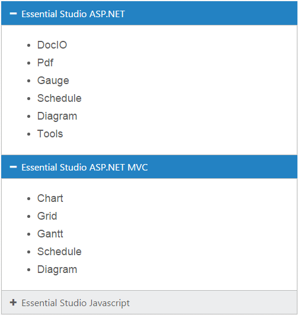
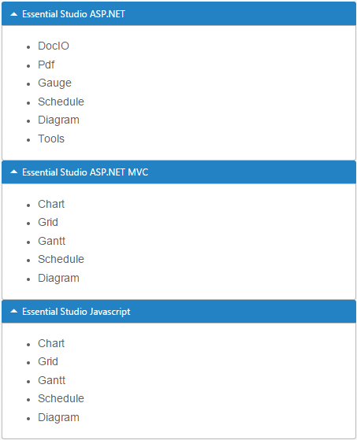

# Getting started

This section explains briefly about how to create an **Accordion** in your application with **Angular**.

## Configure Accordion

This section encompasses the details on how you can configure the **Accordion** control in your application and customize it with various properties such as multiple open, rounded corner and icons for the **Accordion** header according to your requirement.

The following screenshot illustrates you the usage of **Accordion** control in listing the controls under the Essential Studio products. 

 

The usage of **Accordion** control is described in the following sections.

## Create a Simple Accordion in Angular

Create an HTML page and add the scripts references in the order mentioned in the following code example.



     <!DOCTYPE html>
     <html>
     <head> 
     <link href="//cdn.syncfusion.com/14.3.0.49/js/web/flat-azure/ej.web.all.min.css" rel="stylesheet" />
     
     
     
     
     
     
     
     
     </head>
     <body>
     <ej-app>Loading...</ej-app>
     </body>
     </html>



N> In the above code, `ej.web.all.min.js`script reference has been added for demonstration purpose. It is not recommended to use this for deployment purpose, as its file size is larger since it contains all the widgets. Instead, you can use [`CSG`](http://csg.syncfusion.com "CSG") utility to generate a custom script file with the required widgets for deployment purpose.

In the `Accordion` component HTML file add the below given code to render Accordion control



    <ej-accordion>
    
    <h3>
        <a href="#">Essential Studio ASP.NET</a>
    </h3>
    
     

       <ul>
            <li>
                <h4>DocIO</h4>
            </li>
            <li>
                <h4>Pdf  </h4>
            </li>
            <li>
                <h4>Gauge  </h4>
            </li>
            <li>
                <h4>Schedule  </h4>
            </li>
            <li>
                <h4>Diagram  </h4>
            </li>
            <li>
                <h4>Tools </h4>
            </li>
        </ul>

       

       <h3>
        <a href="#">Essential Studio ASP.NET MVC</a>
       </h3>
       

        <ul>
            <li>
                <h4>Chart </h4>
            </li>
            <li>
                <h4>Grid  </h4>
            </li>
            <li>
                <h4>Gantt  </h4>
            </li>
            <li>
                <h4>Schedule  </h4>
            </li>
            <li>
                <h4>Diagram  </h4>
            </li>
        </ul>
       

       <h3>
        <a href="#">Essential Studio Javascript</a>
       </h3>
      

       <ul>
            <li>
                <h4>Chart </h4>
            </li>
            <li>
                <h4>Grid  </h4>
            </li>
            <li>
                <h4>Gantt  </h4>
            </li>
            <li>
                <h4>Schedule  </h4>
            </li>
            <li>
                <h4>Diagram  </h4>
            </li>
        </ul>
     

    </ej-accordion>



Create the Accordion control as follows.


  
     import {Component} from '@angular/core';

    @Component({
     selector: 'sd-home',
     templateUrl: 'app/components/accordion/accordion.component.html'  //give the path file for accordion component html file.
      })
     export class AccordionComponent {
	 }



You can execute the above code example to display the Accordion control with simple control list.

 

You can customize the Accordion control using various properties. The Accordion control properties and its default values are described in the following section.

## Configure Multiple Open

You can have multiple **Accordion** tabs opened to view all products at a time. To achieve this set the **enableMultipleOpen** property of the **Accordion** control to true.

N> enableMultipleOpen property is false by default.

You can also open all the panels during initialization using the **selectedItems** property of the **Accordion** control. The following code sample illustrates the opening of multiple tabs by passing the tab index values of tab.



    <ej-accordion enableMultipleOpen="true"  [(selectedItems)]="selecteditems">
    <h3>
        <a href="#">Essential Studio ASP.NET</a>
    </h3>
    

       <ul>
            <li>
                <h4>DocIO</h4>
            </li>
            <li>
                <h4>Pdf  </h4>
            </li>
            <li>
                <h4>Gauge  </h4>
            </li>
            <li>
                <h4>Schedule  </h4>
            </li>
            <li>
                <h4>Diagram  </h4>
            </li>
            <li>
                <h4>Tools </h4>
            </li>
        </ul>

    

    <h3>
        <a href="#">Essential Studio ASP.NET MVC</a>
    </h3>
    

        <ul>
            <li>
                <h4>Chart </h4>
            </li>
            <li>
                <h4>Grid  </h4>
            </li>
            <li>
                <h4>Gantt  </h4>
            </li>
            <li>
                <h4>Schedule  </h4>
            </li>
            <li>
                <h4>Diagram  </h4>
            </li>
        </ul>
      

      <h3>
        <a href="#">Essential Studio Javascript</a>
      </h3>
      

       <ul>
            <li>
                <h4>Chart </h4>
            </li>
            <li>
                <h4>Grid  </h4>
            </li>
            <li>
                <h4>Gantt  </h4>
            </li>
            <li>
                <h4>Schedule  </h4>
            </li>
            <li>
                <h4>Diagram  </h4>
            </li>
        </ul>
     

    </ej-accordion> 





    import {Component} from '@angular/core';

    @Component({
     selector: 'sd-home',
     templateUrl: 'app/components/accordion/accordion.component.html'
      })
     export class AccordionComponent {
	 
	 selecteditems:int;
     constructor()
     {
     this.selecteditems=[0,1,2];
      }
    
     }
	 


**Accordion** control with **enableMultipleOpen** property is illustrated in the following screen shot.

 

### Setting rounded corner

**Accordion** control, by default, is rendered in a regular rectangle. You can modify the regular rectangles with rounded corners by setting the **showRoundedCorner** property to **True**.

N> showRoundedCorner property is False by default.



    <ej-accordion enableMultipleOpen="true" showRoundedCorner="true" [(selectedItems)]="selecteditems">
    <h3>
        <a href="#">Essential Studio ASP.NET</a>
    </h3>
    

       <ul>
            <li>
                <h4>DocIO</h4>
            </li>
            <li>
                <h4>Pdf  </h4>
            </li>
            <li>
                <h4>Gauge  </h4>
            </li>
            <li>
                <h4>Schedule  </h4>
            </li>
            <li>
                <h4>Diagram  </h4>
            </li>
            <li>
                <h4>Tools </h4>
            </li>
        </ul>
     

     <h3>
        <a href="#">Essential Studio ASP.NET MVC</a>
     </h3>
     

        <ul>
            <li>
                <h4>Chart </h4>
            </li>
            <li>
                <h4>Grid  </h4>
            </li>
            <li>
                <h4>Gantt  </h4>
            </li>
            <li>
                <h4>Schedule  </h4>
            </li>
            <li>
                <h4>Diagram  </h4>
            </li>
        </ul>
     

     <h3>
        <a href="#">Essential Studio Javascript</a>
     </h3>
     

     <ul>
            <li>
                <h4>Chart </h4>
            </li>
            <li>
                <h4>Grid  </h4>
            </li>
            <li>
                <h4>Gantt  </h4>
            </li>
            <li>
                <h4>Schedule  </h4>
            </li>
            <li>
                <h4>Diagram  </h4>
            </li>
        </ul>
    

    </ej-accordion>



The following screenshot illustrates the **Accordion** control with rounded corners.

 

## Customize Icon

You can customize the **Header** icon using **customIcon** property. This property has two features such as **header** and **selectedHeader**. By default, the classes of **header** and **selectedHeader** are **e-collapse** and **e-expand** respectively**.**

You can change the + and - symbols in the **Accordion** header, that are the default icons with Up or Down arrow icons. 

Up or Down arrow icons are available in **e-arrowheadup** and **e-arrowheaddown** classes respectively in the ej.widgets.core.min.css stylesheets from the sample. 

You can set the Up or Down arrow icon to **Accordion** header, by adding **e-arrowheadup** and **e-arrowheaddown** class to **selectedHeader** and **header** properties respectively.



     <ej-accordion enableMultipleOpen="true" showRoundedCorner="true" [(selectedItems)]="selecteditems" customIcon.header="e-arrowheaddown" customIcon.selectedHeader="e-arrowheadup">
     <h3>
        <a href="#">Essential Studio ASP.NET</a>
     </h3>
     

       <ul>
            <li>
                <h4>DocIO</h4>
            </li>
            <li>
                <h4>Pdf  </h4>
            </li>
            <li>
                <h4>Gauge  </h4>
            </li>
            <li>
                <h4>Schedule  </h4>
            </li>
            <li>
                <h4>Diagram  </h4>
            </li>
            <li>
                <h4>Tools </h4>
            </li>
        </ul>

    

    <h3>
        <a href="#">Essential Studio ASP.NET MVC</a>
    </h3>
    

        <ul>
            <li>
                <h4>Chart </h4>
            </li>
            <li>
                <h4>Grid  </h4>
            </li>
            <li>
                <h4>Gantt  </h4>
            </li>
            <li>
                <h4>Schedule  </h4>
            </li>
            <li>
                <h4>Diagram  </h4>
            </li>
        </ul>
        

        <h3>
        <a href="#">Essential Studio Javascript</a>
        </h3>
        

        <ul>
            <li>
                <h4>Chart </h4>
            </li>
            <li>
                <h4>Grid  </h4>
            </li>
            <li>
                <h4>Gantt  </h4>
            </li>
            <li>
                <h4>Schedule  </h4>
            </li>
            <li>
                <h4>Diagram  </h4>
            </li>
        </ul>
       

       </ej-accordion>



The following screenshot illustrates the customization of **selectedHeader** and **header** of the **Accordion** control.

 

