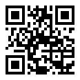

# Getting Started

This section explains briefly about how to integrate a **Barcode** control in your application with **Angular**.

## Script and CSS Reference

Create a HTML page and add the scripts and CSS references in the order mentioned in the following code example.



    <!DOCTYPE html>
    <html>
    <head> 
        <link href="//cdn.syncfusion.com/14.3.0.49/js/web/flat-azure/ej.web.all.min.css" rel="stylesheet" />
        
        
        
        
        
        
        
        
        
        
    </head>
    <body>
    <ej-app>Loading...</ej-app>
    </body>
    </html>



In the above code, `ej.web.all.min.js`script reference has been added for demonstration purpose. It is not recommended to use it during deployment, as it contains all the widgets, which results in deploying large script file. Instead, you can use[CSG](http://csg.syncfusion.com/# "") utility to generate a custom script file with the required widgets for deployment purpose.

## Initialize and configure the control

The code example for defining Barcode control in Angular is as follows,



    <ej-barcode text="http://www.syncfusion.com" id="barcode1" xDimension="8">
    </ej-barcode>





import { Component } from '@angular/core';

@Component({
  selector: 'ej-app',
  templateUrl: 'app/components/barcode/default.component.html'
})
export class DefaultComponent {
  constructor(public northwindService: NorthwindService) { }
}
    


The above code will produce the Barcode as shown in the below figure.

