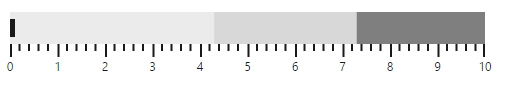
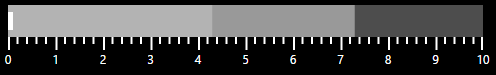
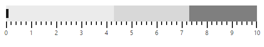

# Bullet Graph Dimensions

This section explains you on how to change the dimensions of the **Bullet Graph**. You can change various dimensions and properties of **Bullet Graph** like width, height, quantitative scale length, qualitative range size etc. By default, **Bullet Graph** uses 595 pixel width and 90 pixel height. You can customize width and height of a **Bullet Graph** using **width** and **height** properties of **Bullet Graph** respectively.

## Size



<ej-bulletgraph id="bullet1" [height]=100 [width]=500>         
          
</ej-bulletgraph>



In the above code example, width is set as 500 pixel and height is set as 100 pixel. The output of the above code example with dimension 500 * 100 is as follows.

 

## Value for performance bar

The feature measure bar value is customized using the **value** property. Default value of this property is 0.



<ej-bulletgraph id="bullet1" [value]=5>         
          
</ej-bulletgraph>
   


The following screenshot displays **Bullet Graph** with a performance measure value of 5.

## Comparative measure value

The **Comparative measure value** is set using **comparativeMeasureValue** property. The default value of this property is 0.



<ej-bulletgraph id="bullet1" [comparativeMeasureValue]=5>         
          
</ej-bulletgraph>



The following screenshot displays **Bullet Graph** with comparative measure value of 5.

## Theme

**Bullet Graph Theme** is customized using **theme** property. Default value is **FlatLight. Bullet Graph** supports **FlatLight** and **FlatDark** themes. **FlatDark** theme improves **Bullet Graph** appearance when background of **Bullet Graph** container uses dark color like black.



<ej-bulletgraph id="bullet1" theme="FlatDark">         
          
</ej-bulletgraph>
   


The following screenshot displays **Bullet Graph** with **FlatDark** theme

## Orientation

Bullet Graph is oriented either horizontally or vertically using orientation property. Default value of this property is horizontal.



<ej-bulletgraph id="bullet1" [height]=550 [width]=100 orientation="vertical" flowDirection="backward">         
          
</ej-bulletgraph>



## Flow direction

The Flow direction of Bullet Graph is customized using flowDirection property. Default value of this property is forward. Setting forward renders Bullet Graph left to right and backward renders from right to left.



<ej-bulletgraph id="bullet1" [comparativeMeasureValue]=2 flowDirection="backward">         
          
</ej-bulletgraph>



The following screenshot displays **Bullet Graph** in a backward direction.

 

## Qualitative range size

Size of the Qualitative range is customized using qualitativeRangeSize property. Default value of this property is 32.



<ej-bulletgraph id="bullet1" [qualitativeRangeSize]=50>         
          
</ej-bulletgraph>



The following screenshot displays **Bullet Graph** with Qualitative range of size 50

 

## Quantitative scale length

Length of the **Quantitative****scale** is customized using **quantitativeScaleLength** property. Default value of this property is 475.



<ej-bulletgraph id="bullet1" [quantitativeScaleLength]=500>         
          
</ej-bulletgraph>



The following screenshot displays **Bullet Graph** with Quantitative scale length of 500.

 

