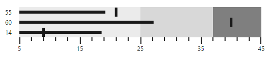

# Data Binding

**Bullet Graph** supports binding JSON data from a remote server or data created in client-side. You can use the **fields** property to customize the data bound with **Bullet Graph**.

## Local Data

Data available in client-side (local data) can be bound with **Bullet Graph** using **fields** property. This property provides option to specify data source, fields representing progress measure bar value, comparative measure value and category value.



this.localData = [
   {
       value: 9.5, comparativeMeasureValue: 7.5,
       category: 2001
   },
   {
       value: 9.5, comparativeMeasureValue: 5,
       category: 2002
   }];

this.bulletFields = {
    dataSource: localData, category: "category",
    featureMeasures: "value",
    comparativeMeasure: "comparativeMeasureValue"
};





<ej-bulletgraph id="bullet1" [height]=120 [qualitativeRangeSize]=60 [fields]="bulletFields"
       [quantitativeScaleSettings.location.x]=50 [quantitativeScaleSettings.location.y]=20>         
          
</ej-bulletgraph>



The following screenshot displays **Bullet Graph** with local data generated using JavaScript

 

## Remote Data

**Bullet Graph** provides option to bind data from a remote server using **ejDataManager** as data source in **fields** property. A query object should also be passed to **query** property when using data manager as data source.



               //Creating data manager instance
                var dataManger = new ej.DataManager({
                    url: "http://mvc.syncfusion.com/Services/Northwnd.svc/"
                });

                // Query creation
                var query = ej.Query().from("Order_Details").take(3).where("UnitPrice", ej.FilterOperators.greaterThan, 18, false)
                    .where("UnitPrice", ej.FilterOperators.lessThanOrEqual, 40, false)
                    .where("Quantity", ej.FilterOperators.greaterThan, 5, false)
                    .where("Quantity", ej.FilterOperators.lessThanOrEqual, 45, false);

                    this.bulletFields= {
                        dataSource: dataManger,
                        query: query,
                        category: "ProductID",
                        featureMeasures: "UnitPrice",
                        comparativeMeasure: "Quantity"
                    };

                    qualitativeRanges: [{ rangeEnd: 25 }, { rangeEnd: 37 }, { rangeEnd: 45 }],





   <ej-bulletgraph id="bullet1" [qualitativeRangeSize]=60 [fields]="bulletFields" 
     [quantitativeScaleSettings.location.x]=50 [quantitativeScaleSettings.location.y]=20
     [quantitativeScaleSettings.minimum]=5 [quantitativeScaleSettings.maximum]=45 
                                              [quantitativeScaleSettings.interval]=10>
    <e-qualitativeranges>
         <e-qualitativerange rangeEnd="25">
         </e-qualitativerange>
         <e-qualitativerange rangeEnd="37">
         </e-qualitativerange>
         <e-qualitativerange rangeEnd="45">
         </e-qualitativerange>
     </e-qualitativeranges>                                                              
          
   </ej-bulletgraph>



The following screenshot displays a Bullet Graph bounded with data from a remote server

 

