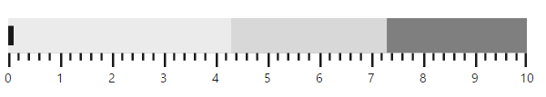

# Getting Started

Before we start with the BulletGraph, please refer [this page](https://help.syncfusion.com/angular-2/overview) for general information regarding integrating Syncfusion widget’s.

## Adding JavaScript and CSS Reference

To render the BulletGraph control, the following list of external dependencies are needed, 

* [jQuery](http://jquery.com) - 1.7.1 and later versions
* [jsRender](https://github.com/borismoore/jsrender) - to render the templates
* [Angular](https://angular.io/) - Angular latest versions

The other required internal dependencies are tabulated below,

<table>
   <tr>
      <th>
         <b>Files</b>
      </th>
      <th>
         <b>Description/Usage </b>
      </th>
   </tr>
   <tr>
      <td>
         ej.core.min.js
      </td>
      <td>
        It is referred always before using all the JS controls.
      </td>
   </tr>
   <tr>
      <td>
         ej.data.min.js
      </td>
      <td>
         Used to handle data operation and is used while binding data to the JS controls.
      </td>
   </tr>
   <tr>
      <td>
        ej.bulletgraph.min.js
      </td>
      <td>
        BulletGraph core script file which includes BulletGraph related scripts files.
      </td>
   </tr>
</table>

## Preparing HTML document

Create an HTML page and add the scripts references in the order mentioned in the following code example.



    <html>
    <head>
    <title>Angular BulletGraph</title>

    <!-- Essential Studio for JavaScript  theme reference -->
    <link rel="stylesheet" href="http://cdn.syncfusion.com/{{ site.releaseversion }}/js/web/flat-azure/ej.web.all.min.css" />

    <!-- Angular related script references -->
    <!-- 1. Load libraries -->
         <!-- Polyfill(s) for older browsers -->
       
    
    
    

    <!-- Essential Studio for JavaScript  script references -->
    
     
    
    
    <!-- 2. Configure SystemJS -->
    
    

    </head>
    <!-- 3. Display the application -->
    <body>
       <ej-app> 
		

		    
Angular Syncfusion Components App

		    

		 

	   </ej-app>
    </body>
    </html>



N> Uncompressed version of library files are also available which is used for development or debugging purpose and can be generated from the custom script [here](http://csg.syncfusion.com).

## Control Initialization

* Copy BulletGraph Syncfusion Angular source component(s) from the below build location and add it in `src/ej` folder (For ex., consider the `BulletGraph` component).


(Installed Location)\Syncfusion\Essential Studio\14.3.0.49\JavaScript\assets-src\angular2\ 


N> `core.ts` file is mandatory for all Syncfusion JavaScript Angular components. The repository having the source file from Essential Studio for JavaScript v14.3.0.49.

* Create `BulletGraph` folder inside `src` folder.

* Create `BulletGraph.component.html` view file inside `src/BulletGraph` folder and render ejBulletGraph Angular component using the below code example. 


<ej-bulletgraph id="defaultbulletgraph">
</ej-bulletgraph>


* Create `BulletGraph.component.ts` model file inside the folder `src/BulletGraph` and create sample component using the below code example.



import { Component, ViewEncapsulation } from '@angular/core';

@Component({
  selector: 'ej-app',
  templateUrl: 'src/BulletGraph/BulletGraph.component.html'
})
export class BulletgraphComponent {

}


## Configure the routes for the Router

Before adding router configuration for above created ejBulletGraph component, we recommend you to go through the [Angular Routing](https://angular.io/docs/ts/latest/guide/router.html) configuration to get the deeper knowledge about Angular routing. 

* Now, we are going to configure the route navigation link for created bullet graph sample in `src/app.component.html` file.



	<ul class="nav navbar-nav">
		<li>
		    <a data-toggle="collapse" data-target="#skeleton-navigation-navbar-collapse.in" 
		       href="#BulletGraph" [routerLink]="['/BulletGraph']">BulletGraph </a>
		</li>
	</ul>

<main>
	<router-outlet></router-outlet>
</main>


* Import the ejBulletGraph sample component and define the route in `src/app.routes.ts` file.


import { Routes } from '@angular/router';
. . . . 
import { BulletGraphComponent } from './BulletGraph/BulletGraph.component';

export const rootRouterConfig: Routes = [
    { path: '', redirectTo: 'home', pathMatch: 'full' },
    . . . . 
    { path: 'BulletGraph', component: BulletGraphComponent }
];


* Import and declare the Syncfusion source component and ejBulletGraph sample component into `app.module.ts` like the below code snippet.


import { NgModule, enableProdMode, ErrorHandler } from '@angular/core';
. . . . . 
import { EJ_BULLETGRAPH_COMPONENTS } from './ej/BulletGraph.component';
import { BulletGraphComponent } from './BulletGraph/BulletGraph.component';

import { rootRouterConfig } from './app.routes';
. . . . 
@NgModule({
  imports: [BrowserModule, FormsModule, HttpModule, RouterModule.forRoot(rootRouterConfig, { useHash: true })],
  declarations: [. . . . , EJ_BULLETGRAPH_COMPONENTS, BulletgraphComponent],
  bootstrap: [AppComponent]
})
export class AppModule { }


## Running the application

* To run the application, execute below command.


npm start


* Browse to [http://localhost:3000](http://localhost:3000) to see the application. And navigate to bullet graph tab. The component is rendered as like the below screenshot. You can make changes in the code found under src folder and the browser should auto-refresh itself while you save files. 

 

##Provide Required Data

You can customize the values of feature and comparative measure bars in a **BulletGraph**, either locally or remotely. The category data is optional, and is used to display label values in parallel to the measure bars. 

Assign the data in **fieldData** property to the **dataSource** property of **BulletGraph** as shown in the following code example.



 

    <ej-bulletgraph id="bulletgraph"  [fields.dataSource]="fieldData">
    </ej-bulletgraph>
 

    




import {Component} from '@angular/core';
import { DataService} from '../service/data.service'

@Component({
    selector:'ej-app',
    templateUrl:'src/BulletGraph/BulletGraph.component.html',
    providers:[DataService]
})
export class BulletgraphComponent{
    fieldData:Object;
    constructor(dataService:DataService){
        this.fieldData= dataService.bulletGraphData()
    }
}



Create a folder service and add file data.service.ts for serving data to  bullet graph component file. Refer the below code snippet.


export class DataService{
bulletGraphData():Array<any>{
        return[
               {
                   value: 90, comparativeMeasureValue: 100,
                   category: 2013
               },
               {
                   value: 93, comparativeMeasureValue: 99,
                   category: 2012
               },
               {
                   value: 98, comparativeMeasureValue: 96,
                   category: 2011
               },
               {
                   value: 102, comparativeMeasureValue: 98,
                   category: 2010
               },
               {
                   value: 77, comparativeMeasureValue: 96,
                   category: 2009
               },
               {
                   value: 99, comparativeMeasureValue: 99,
                   category: 2008
               },
               {
                   value: 106, comparativeMeasureValue: 94,
                   category: 2007
               },
               {
                   value: 105, comparativeMeasureValue: 95,
                   category: 2006
               },
               {
                   value: 98, comparativeMeasureValue: 98,
                   category: 2005
               },
               {
                   value: 87, comparativeMeasureValue: 100,
                   category: 2004
               },
               {
                   value: 105, comparativeMeasureValue: 98,
                   category: 2003
               },
               {
                   value: 84, comparativeMeasureValue: 101,
                   category: 2002
               },
               {
                   value: 93, comparativeMeasureValue: 98,
                   category: 2001
               },
               {
                   value: 90, comparativeMeasureValue: 96,
                   category: 2000
               },
               {
                   value: 95, comparativeMeasureValue: 107,
                   category: 1999
               },
               {
                   value: 104, comparativeMeasureValue: 98,
                   category: 1998
               },
               {
                   value: 102, comparativeMeasureValue: 92,
                   category: 1997
               },
               {
                   value: 103, comparativeMeasureValue: 98,
                   category: 1996
               },
               {
                   value: 100, comparativeMeasureValue: 96,
                   category: 1995
               },
               {
                   value: 110, comparativeMeasureValue: 92,
                   category: 1994
               },
               {
                   value: 100, comparativeMeasureValue: 103,
                   category: 1993
               },
               {
                   value: 94, comparativeMeasureValue: 93,
                   category: 1992
               },
               {
                   value: 91, comparativeMeasureValue: 95,
                   category: 1991
               },
               {
                   value: 107, comparativeMeasureValue: 103,
                   category: 1990
               },
               {
                   value: 101, comparativeMeasureValue: 102,
                   category: 1989
               },
               {
                   value: 119, comparativeMeasureValue: 112,
                   category: 1988
               }
        ];
    }
}


Once the **dataSource** property is assigned with the required values, you can bind the variable names used in the **JSON** data to the corresponding fields of the **BulletGraph** as shown in the following code sample.



<ej-bulletgraph id="bulletgraph"  [fields.dataSource]="fieldData" fields.category="category"
        fields.featureMeasures="value" fields.comparativeMeasure="comparativeMeasureValue">
</ej-bulletgraph>



**Set Default and Scale Values**

You can plot more number of measure bars within the **BulletGraph**, the height and width of the control should be increased to locate all the measure bars within the graph.The **qualitativeRangeSize** and **quantitativeScaleLength** property needs to be set accordingly as shown in the following code example.

By default, the **BulletGraph** is rendered in the Horizontal orientation with its flow direction set to **Forward.** 

**Minimum**, **maximum** and **interval** values for the **quantitativeScale** of the **bullet graph** should be set, as shown in the following code example.



<ej-bulletgraph id="bulletgraph" 
    [height]="540" [width]="850"
    [qualitativeRangeSize]="700" [quantitativeScaleLength]="420"
    orientation="vertical" flowDirection="backward" [quantitativeScaleSettings.interval]="10"
    [quantitativeScaleSettings.minimum]="70" [quantitativeScaleSettings.maximum]="130" 
    quantitativeScaleSettings.tickPosition="far"
    [fields.dataSource]="fieldData" fields.category="category"
    fields.featureMeasures="value" fields.comparativeMeasure="comparativeMeasureValue">
</ej-bulletgraph>



As you can see in the image above, the bullet graph without any ranges is displayed in the background. The steps to add the **qualitativeRanges** are described in the next section.

**Add Qualitative Ranges**

By default, 3 ranges are displayed in the **BulletGraph** control during the initial rendering of the control with its default values. In order to customize it, you need to set appropriate values for the **rangeEnd** and its **rangeStroke** properties.  Any number of **qualitativeRanges** can be added to the control. 



<ej-bulletgraph>
     <e-qualitativeranges>
         <e-qualitativerange rangeEnd="90">
         </e-qualitativerange>
         <e-qualitativerange rangeEnd="110">
         </e-qualitativerange>
         <e-qualitativerange rangeEnd="130" rangeStroke="#CDC9C9">
         </e-qualitativerange>
     </e-qualitativeranges> 
</ej-bulletgraph>



After adding **qualitativeRanges** to the **BulletGraph**, the control will be rendered as follows.

 

**Ticks and Measure Bars Customization**

You have to do the following code changes in the quantitative scale in order to customize the tick size, the colors of the feature bar and comparative measure symbols. 



 <ej-bulletgraph [quantitativeScaleSettings.majorTickSettings.width]="1" 
        [quantitativeScaleSettings.majorTickSettings.size]="13" 
        quantitativeScaleSettings.majorTickSettings.stroke="gray"
        [quantitativeScaleSettings.minorTickSettings.width]="1" 
        [quantitativeScaleSettings.minorTickSettings.size]="5"
        quantitativeScaleSettings.minorTickSettings.stroke="gray" 
        quantitativeScaleSettings.comparativeMeasureSettings.stroke="#507786" 
        quantitativeScaleSettings.featuredMeasureSettings.stroke="#169DD8">
</ej-bulletgraph>



When customization of ticks and measure bars is done, **BulletGraph** looks as follows

  

**Add Caption**

You can display an appropriate Caption in the **BulletGraph** by adding the following code example.



<ej-bulletgraph  captionSettings.textPosition='top' captionSettings.textAlignment='center'
  captionSettings.textAnchor='middle'captionSettings.text="Monsoon Rainfall - Actual vs Forecast" 
   captionSettings.font.fontFamily="segoe ui" captionSettings.font.fontStyle="normal" 
   captionSettings.font.size="12px" captionSettings.font.fontWeight="regular"
 [captionSettings.font.opacity]="1">
</ej-bulletgraph>



The following screenshot displays a **BulletGraph** in the caption and title in the **BulletGraph**.

**Show Tooltip**

You can use a Tooltip in your application to display any information. The tooltip is enabled by setting the **visible** property in tooltip to **true**. 



<ej-bulletgraph  [tooltipSettings.visible]="true">
</ej-bulletgraph>

     
  

By using the customization options discussed in this section, the **BulletGraph** is rendered as displayed on the following screenshot.

 

