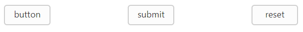

# Button Type

**Button** is used as normal click able button, submitting form data, resetting the form data to its initial value. According to the usage of button, you can render the button in three types. Using the **type** property, you can easily render the button in following types.

List of Button types

<table>
   <tr>
      <th>Button Types</th>
      <th>Description</th>
   </tr>
   <tr>
      <td>
         button
      </td>
      <td>
         The button is a click able button
      </td>
   </tr>
   <tr>
      <td>
         submit
      </td>
      <td>
         The button is a submit button (submits form-data)
      </td>
   </tr>
   <tr>
      <td>
         reset    
      </td>
      <td>
         The button is a reset button (resets the form-data to its initial values)
      </td>
   </tr>
</table>

The following steps explains you the details about rendering the Button with above mentioned button types.

In the HTML page, add the following button elements to configure Button widget.



    <table width="500px">
    <tr>
        <td>
            <input id="buttonType_button" size="mini" contentType="imageonly" type="button" ej-button text="button"/> 
    <td>
            <input id="buttonType_submit" size="mini" contentType="imageonly" type="submit" ej-button text="submit"/> 
    <td>
            <input id="buttonType_reset" size="mini" contentType="imageonly" type="reset" ej-button text="reset"/> 
  
    </tr>
    </table>





import {Component} from '@angular/core';
@Component({
    selector: 'ej-app',
    templateUrl: './default.component.html',
})
export class DefaultComponent {
    checkstatus: boolean;
    constructor() {
        this.checkstatus = true;
    }
}



Execute the above code to render the following output.

 

