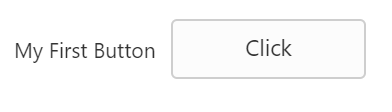

# Getting Started

This section explains the details on how to render and configure a **Button** component in an **Angular** application.

## Create a simple Button in Angular

To get started, you need to refer the basic prerequisites and system configuration to be done from the given [Getting started](https://help.syncfusion.com/angular-2/gettingstarted/overview) document.

Create the HTML file app.component.html and add the below given code to render **Button** control.



    <table>
       <tr>
         <td >My First Button</td>
         <td><input type="button" ej-button id="button" value="Button" /></td>
      </tr>
    </table>



Create the TS file app.component.ts like below to render the component in corresponding app.component.html file.



        import { Component, ViewEncapsulation} from '@angular/core';
        @Component({
            selector: 'ej-app',
            templateUrl: 'app/app.component.html',
        })
        export class AppComponent {
            constructor() {}
        }



## Configuring Button

This section encompasses the details on how you can configure the **Button** control in your application and customize it with various properties such as various size based on your requirement.
To modify the size of the Button and rename the button, add the following snippet in your app.component.html file.

 

    <table>
        <tr>
            <td >My First Button</td>
            <td><input type="button" ej-button id="button" [value]="text" [size]="large" /></td>
        </tr>
    </table>



To render the text and size properties add the following snippet in your TS file.



        export class AppComponent {
            text: string;
        constructor() {
            this.text = "Click";
            this.size = "large";
         }



Browse the port where your application is hosted and navigate to Button tab to see the output. 

