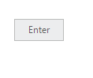
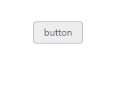

# Miscellaneous

## Text

You can display the user defined text for **Button**. Using **text** property, you can easily set text content for button. This text property overwrites the text that is provided on input button element.

The following steps explains you the details about rendering the button with specified text.

In the **HTML** page, add the following button elements to configure **Button** widget.



    <table>
    <tr>
        <td>
            <input id="button_text" size="mini" type="button"  text="Enter" ej-button/> 

    </tr>
    </table>





 import {Component} from '@angular/core';
 @Component({
    selector: 'ej-app',
    templateUrl: './default.component.html',
 })
 export class DefaultComponent {
    constructor() {
    }
 }



In the above code, the content of button “button” is replaced by the text value “Enter” that is given using text property.

Execute the above code to render the following output.

 

## Show Rounded Corner

Specifies the corner of button in round shape. By default button doesn’t have rounded corner. To set rounded corner, you can enable **showRoundedCorner** property**.**

The following steps explains you the details about rendering the button with rounded corner.

In the **HTML** page, add the following button elements to configure **Button** widget.



    <table>
    <tr>
        <td>
            <input id="button_roundedCorner" [showRoundedCorner]="true" size="mini" text="button "type="button" ej-button/> 

    </tr>
    </table>





 import {Component} from '@angular/core';
 @Component({
    selector: 'ej-app',
    templateUrl: './default.component.html',
 })
 export class DefaultComponent {
    constructor() {
    }
 }



Execute the above code to render the following output.

 

