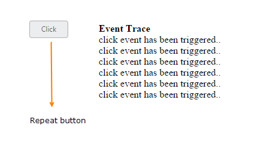

# Repeat Button

When you press button continuously, click event is raised at each specific time interval. This type of button is called **Repeat Button**. This functionality repeatedly raises the click event of button in both button click and from button in pressed state to the released state. **timeInterval** property is used to specify the time Interval for triggering click event, when the button is in pressed state. **repeatButton** property is used to set the button in repeat mode.

The following steps explains you the details about rendering the **Repeat Button.**

In the **HTML** page, add the following button elements to configure **Button** widget.



    <table>
    <tr>
        <td>
            <input id="button_repeat" (ejclick)="buttonClick($event)" [showRoundedCorner]="true" timeInterval="200" [repeatButton]="true" size="mini" text="Click "type="button" ej-button/> 

    </tr>
	 

            
<b>Event Trace</b>

            

        

    </table>
    





   import {Component} from '@angular/core';
@Component({
    selector: 'ej-app',
    templateUrl: './default.component.html',
})
export class DefaultComponent {
    constructor() {
    }
	 buttonClick(e) {
       $(".eventTrace").html("click event has been triggered.. " + $(".eventTrace").html());
    }
}



Execute the above code to render the following output.

 

