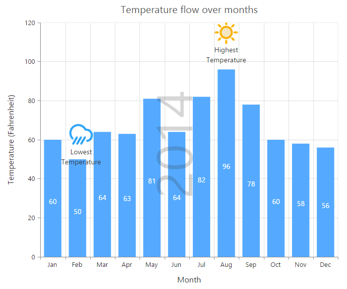

# Annotations

annotations are used to mark the specific area of interest in the chart area with texts, shapes or images. 

You can add annotations to the chart by using the `annotations` option. By using the `content` option of annotation object, you can specify the id of the element that needs to be displayed in the chart area.



2014

<ej-chart id="chartcontainer">
  	<e-annotations>
	   <e-annotation [visible]="true" content="watermark" [opacity]=0.2 region="series">
	   </e-annotation>
	</e-annotations>
</ej-chart>



## Rotate the annotation template

To rotate the annotation template, you can use the `angle` property of the annotations. 



<ej-chart id="chartcontainer">
  	<e-annotations>
	   <e-annotation [visible]="true" content="watermark" [opacity]=0.2 
	                             region="series" [angle]="270">
	   </e-annotation>
	</e-annotations>
</ej-chart>



## Positioning Annotation

You can position annotations either by using the coordinates (`x` and `y` options) or by using the alignment options (`horizontalAlignment` and `verticalAlignment`).

By using the `coordinateUnit` option, you can specify whether the value provided in the `x` and `y` options are relative to the chart or axis.

* If the coordinateUnit is set to none, the annotations are placed relative to the chart/plot area by using the `horizontalAlignment` and `verticalAlignment` options.

* If the coordinateUnit is set to points, the x and y values of the annotation are the coordinates relative to the axis and annotation is positioned relative to the axis. By default, the x and y values are associated with the [`primaryXAxis`] and [`primaryYAxis`]. In case, when the chart contains multiple axis and you want to associate the annotation with a particular axis, you can specify the `xAxisName` and `yAxisName` options of the annotation object.

* If the coordinateUnit is set to pixels, the x and y values are coordinates relative to the top-left corner of the chart/plot area.   

N> By using the `region` option, you can specify whether the annotation is placed relative to the entire chart or plot area.



<ej-chart id="chartcontainer">
	<e-annotations>
	   <!--Change coordinateUnit type to pixels-->
	   <e-annotation [visible]="true" content="lowtemp" coordinateUnit="pixels"
	                                                       [x]="170" [y]="350">
	   </e-annotation>
	</e-annotations>
</ej-chart>



## Annotation alignments

When the coordinateUnit is set to pixels or points, you can align the annotation relative to the coordinates by using the [`horizontalAlignment`](../api/ejchart#members:annotations-horizontalalignment) and [`verticalAlignment`] options. 



<ej-chart id="chartcontainer">
	<e-annotations>
	   <!--Change alignment of annotation template-->
	   <e-annotation [visible]="true" content="lowtemp" verticalAlignment="middle"
	                                 horizontalAlignment="far" margin-right="40">
	   </e-annotation>
	</e-annotations>
</ej-chart>



