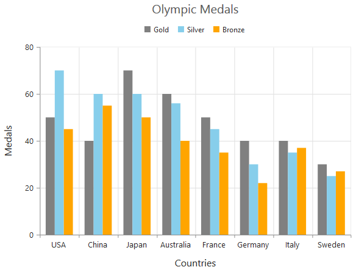
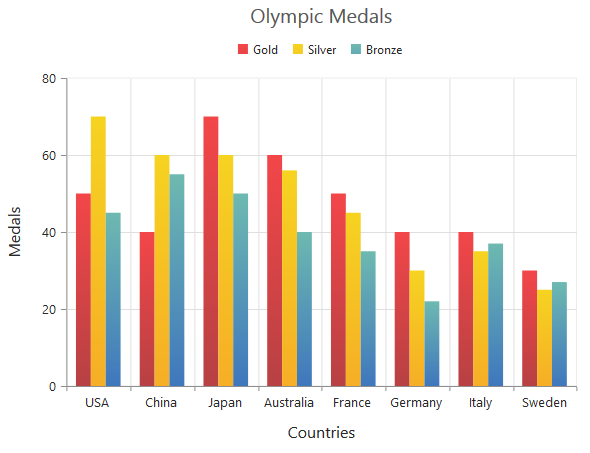
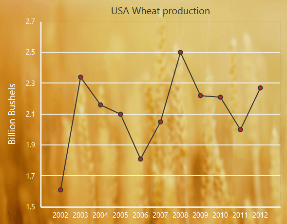

# Appearance

## Custom Color Palette

The Chart displays different series in different colors by default. You can customize the color of each series by providing a custom color palette of your choice by using the [`palette`] property. 



   <ej-chart id="chartcontainer" [palette]="[ 'yellow', 'skyblue', 'orange', 
                                 'yellow', 'cyan', 'lightBlue', '#ff0ade']" >
   
   </ej-chart>



N> The Color palette is applied to the points in accumulation type series

## Built-in Themes

Following are the built-in themes available in the Chart

* flatLight
* flatDark
* gradientLight
* gradientDark
* azure
* azureDark
* lime
* limeDark
* saffron
* saffronDark
* gradient-azure
* gradient-azureDark
* gradient-lime
* gradient-limeDark
* gradient-saffron
* gradient-saffronDark

You can set your desired theme by using the `theme` property. Flat light is the default theme used in the Chart.



   <ej-chart id="chartcontainer" theme="gradientlight">
   
   </ej-chart>



## Point level customization

Marker, data label and fill color of each point in a series can be customized individually by using the **points** collection.



<ej-chart id="chartcontainer">
    <e-seriescollection>
        <e-series>
		 <e-points>
		   <e-point x="10" [y]="50" fill="#E27F2D" [marker.visible]="true">
           </e-point>
         </e-points>
		</e-series>
    </e-seriescollection>
</ej-chart>



## Series border customization

To customize the series border color, width and dashArray, you can use `series.border` option. 

N> Series border can be applied to all the series (except Line, Spline, HiLo, HiLoOpenClose and StepLine series).



<ej-chart id="chartcontainer">
    <e-seriescollection>
        <e-series>
		 <e-points>
		   <e-point x="20" [y]="80"  border.color="blue" [border.width]= 2
                                                  border.dashArray= "5,3" >
           </e-point>
         </e-points>
		</e-series>
    </e-seriescollection>
	
</ej-chart>



## Chart area customization

### Customize chart background

The Chart background can be customized by using the `background` property of the Chart. To customize the chart border, use `border` option of the chart. 



<ej-chart id="chartcontainer"  background="skyblue"  [border.width]="2" 
                                               [border.opacity]="0.35" >
   
</ej-chart>

 

**Chart Margin**

The Chart [`margin`] property is used to add the margin to the chart area at the left, right, top and bottom position.



<ej-chart id="chartcontainer"  margin.left="80" margin.right="80" margin.top="40"
                                                             margin.bottom="80">
    
</ej-chart>

 

**Setting background image**

Background image can be added to the chart by using the [`backGroundImageUrl`] property.



<ej-chart id="chartcontainer"  backGroundImageUrl="wheat.png">
    
</ej-chart>

 

**Chart area background**

The Chart area background can be customized by using the [`background`] property in the chart area. 



<ej-chart id="chartcontainer"  chartArea.background="skyblue">
    
</ej-chart>

 

### Customize chart area grid bands

You can provide different color for alternate grid rows and columns formed by the grid lines in the chart area by using the [`alternateGridBand`] property of the axis. The properties [`odd`] and [`even`] are used to customize the grid bands at odd and even positions respectively. 



<ej-chart id="chartcontainer"  [primaryYAxis.alternateGridBand]="{even: {fill: '#A7A9AB',opacity: 0.1}">
    
</ej-chart>

 

### Animation

You can enable animation by using the [`enableAnimation`] property of the series. This animates the chart series on two occasions – when the chart is loaded for the first time or whenever you change the series type by using the type property.



<ej-chart id="chartContainer">
    <e-seriescollection>
        <e-series [enableAnimation]="true">
		<-- Add points here-->
		</e-series>
    </e-seriescollection>
	
</ej-chart>



However, you can force the chart to animate series by calling the **animate** method as illustrated in the following code example,



<ej-chart id="chartContainer">
    <e-seriescollection>
        <e-series [enableAnimation]="true">
		<-- Add points here-->
		</e-series>
    </e-seriescollection>
	
</ej-chart>





//Dynamically animating Chart
function animateChart(){

    //Calling the animate method for dynamic animation
    $("#chartContainer").ejChart("animate");      
        
}



### Control the Speed of animation

To control the speed of animation, you can use the [`animationDuration`](../api/ejchart#members:series-animationduration) property in the series. 



<ej-chart id="chartcontainer">
    <e-seriescollection>
        <e-series [enableAnimation]="true" [animationDuration]="2000">
		<-- Add points here-->
		</e-series>
    </e-seriescollection>
	
</ej-chart>



