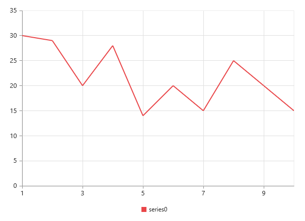
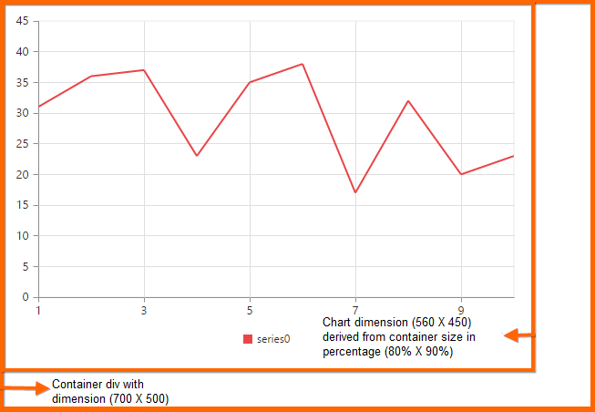

# Chart Dimensions

You can set the size of the chart directly on the chart or to the container of the chart. When you do not specify the size, it takes 450px as the height and window size as its width, by default. 

## Set size for the parent container

You can customize the chart dimension by setting the width and height for the container element. 



<body>
        <ej-chart id="chartcontainer" style="width:620px; height:300px;">
        </ej-chart>
</body>



## Set size in pixels

You can also set the chart dimension by using the `size` property of the chart. 



<ej-chart id="chartcontainer" size.width="600" size.height="450">
</ej-chart>



## Setting size relative to the container size

You can specify the chart size in percentage by using the `size` property. The chart gets its dimension with respect to its container.

N> Chart is using custom tag for rendering. For custom tag, default display style attribute will not be applied. So, you need to specify chart container display style as `block` to get the actual size.



<ej-chart id="chartcontainer" style="display:block; width:700px; height:500px" size.width="80%" size.height="90%">
</ej-chart>



## Responsive chart

To resize the Chart when the browser or the chart container is resized, set the `isResponsive` property to **true**, where the chart adapts to the changes in size of the container.



<ej-chart id="chartcontainer" [isResponsive]="true">
</ej-chart>

 
