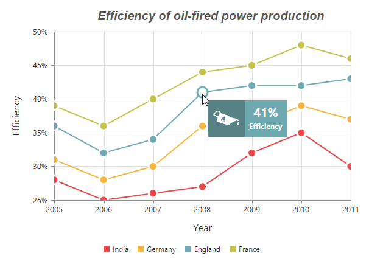

# Chart Series

## Multiple Series

In EjChart, you can add multiple series object in the `series` options. The series are rendered in the order it is added to the `series` option, by default. You can change this order by using the `zOrder` option.  



<ej-chart id="chartcontainer">

 <!-- Write series code here-->
    <e-seriescollection>
        <e-series type="column">
		 <e-points>
		 <!-- Add points here-->
		 
         </e-points>
	  </e-series>
	  <e-series type="column">
	    <e-points>
		 <!-- Add points here-->
		 
         </e-points>
	  </e-series>
   </e-seriescollection>
</ej-chart>



### Customizing all series together

By using the `commonSeriesOptions`, you can customize the series options for all the series commonly, instead of setting the options directly on each series object. 

N> The inline properties of the series has the first priority and override the commonSeriesOptions.

The following code example explains on how to enable marker, tooltip and animation for the chart series by using the commonSeriesOptions.



this.marker = {
    shape: 'circle',
    size:
    {
        height: 10, width: 10
    },
    visible: true
};





<ej-chart id="chartcontainer" style="display: block" commonSeriesOptions.type="line" [commonSeriesOptions.enableAnimation]="true" [commonSeriesOptions.tooltip.visible]="true" [commonSeriesOptions.marker]="marker" [border.width]=2>              
      <e-seriescollection>
          <!-- Write series code here-->
      </e-seriescollection>
</ej-chart>

 

## Combination Series

EjChart allows you to render the combination of different series in the chart. 



<ej-chart id="chartcontainer">

 <!-- Write series code here-->
    <e-seriescollection>
        <e-series type="column">
		 <e-points>
		 <!-- Add points here-->
         </e-points>
	  </e-series>
	  <e-series type="line">
	    <e-points>
		 <!-- Add points here-->
         </e-points>
	  </e-series>
   </e-seriescollection>
</ej-chart>



### Limitation of combination chart

* `Bar`, `StackingBar`, and `StackingBar100` cannot be combined with the other Cartesian type series.

* Cartesian type series cannot be combined with the accumulation series (`pie`, `doughnut`, `funnel`, and `pyramid`).

* `Polar` and `Radar` series cannot be combined with the accumulation and Cartesian type series.

When the combination of Cartesian and accumulation series types are added to the series option, the series that are similar to the first series are rendered and other series are ignored. The following code example illustrates this,  



<ej-chart id="chartcontainer">
    <e-seriescollection>
      <!--Add line series-->
        <e-series type="line">
		 <e-points>
		 <!-- Add points here-->		 
         </e-points>
	  </e-series>
      <!--Add pie series-->
	  <e-series type="pie">
	     <e-points>
		 <!-- Add points here-->
         </e-points>
	  </e-series>
   </e-seriescollection>
</ej-chart>



