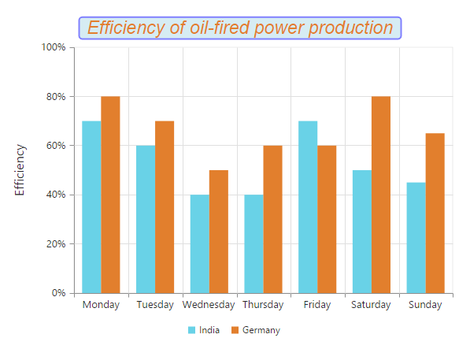

# Chart Title & Subtitle

## Title

By using the title option, you can add the `text` as well as customize its `border`,  `background` color and `font`.



//Customize title font style
this.titleFont = {
    opacity: 1,
    fontFamily: "Arial",
    fontStyle: 'italic',
    fontWeight: 'regular',
    color: "#E27F2D",
    size: '23px'
};





<ej-chart id="chartcontainer" title.text="Efficiency of oil-fired power production"
  title.background="lightblue" title.border.color="blue" [title.border.width]=2
    [title.border.opacity]=0.5 [title.border.cornerRadius]=4 [title.font]="titleFont">

</ej-chart>



We can trim, wrap and wrapAndTrim to the chart title using textOverflow property. The original text will be displayed as tooltip on mouse hover.



<ej-chart id="chartcontainer" [title.enableTrim]="true" [title.maximumWidth]=150
                                                     title.textOverflow="trim">

</ej-chart>



### Title Alignment

You can change the title alignment to *center*, *far* and *near* by using the `textAlignment` property of the chart title. 



<ej-chart id="chartcontainer" title.textAlignment="near">

</ej-chart>

 

## Add Subtitle to the chart

By using the subTitle option, you can add the `subTitle` to the chart title and customize its `border`,  `background`. 



this.subTitle = {
    //Add subtitle to chart title 
    text: "( in a week )",
    //Change the title text background color
    background: "lightblue",
    //Customizing Chart subtitle border
    border: {
        color: "blue",
        width: 2,
        opacity: 0.2,
        cornerRadius: 4
    },

    //Customizing Chart subtitle font 
    font: {
        opacity: 1,
        fontFamily: "Arial",
        fontStyle: 'italic',
        fontWeight: 'regular',
        color: "#E27F2D",
        size: '12px'
    },
};





<ej-chart id="chartcontainer" [title.subTitle]="subTitle">

</ej-chart>

 

We can trim, wrap and wrapAndTrim to the chart subtitle using textOverflow property. The original text will be displayed as tooltip on mouse hover.



this.subTitle = {
    //...
    //Add subtitle to chart title 
    text: "( in a week )",
    //To enable the sub-title trim, wrap and wrap and trim
    enableTrim: true,
    //Setting maximum width to the sub-title
    maximumWidth: 50,
    //To trim the sub-title
    textOverflow: "wrap"
};





<ej-chart id="chartcontainer" [title.subTitle]="subTitle">

</ej-chart>

 

### Subtitle Alignment

You can change the subtitle alignment to *center*, *far* and *near* by using the `textAlignment` property of the subTitle.



this.subTitle = {
    //...
    //Change subtitle to text aligment
    textAlignment: "center"
};





<ej-chart id="chartcontainer" [title.subTitle]="subTitle">

</ej-chart>

 

