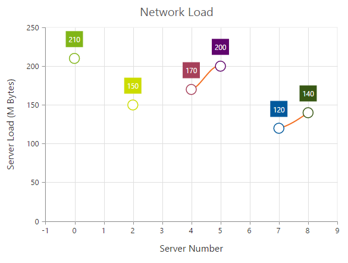
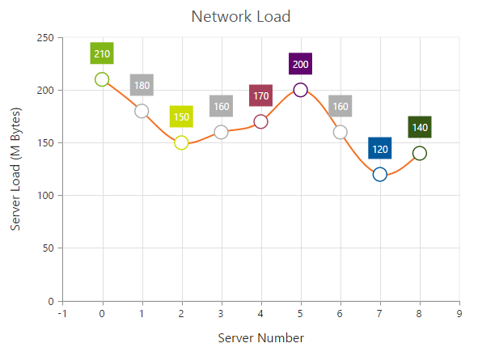
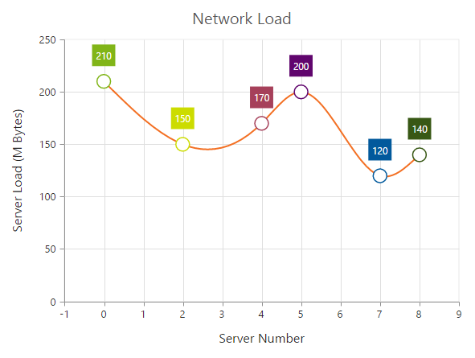
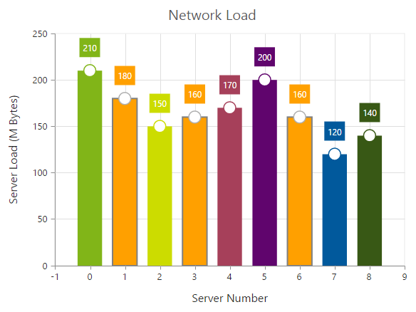

# Empty Points 

The Data points that uses the **null** or **undefined** as value are considered as empty points. Empty data points are ignored and not plotted in the Chart. When the data is provided by using the `points` property, you can set the **isEmpty** to true to specify that the particular point is an empty point.



  <ej-chart id="chartcontainer">
    <e-seriescollection>
        <e-series type="spline">
		      <e-points>
		         <e-point x="0" [y]="210"></e-point>
		         <e-point x="1" [y]="null"></e-point>
		         <e-point x="2" [y]="150"></e-point>
		         <e-point x="3" [y]="180" [isEmpty]="true"></e-point>
		         <e-point x="4" [y]="170"></e-point>
		         <e-point x="5" [y]="200"></e-point>
		         <e-point x="6" [y]="140" [isEmpty]="true"></e-point>
		         <e-point x="7" [y]="120"></e-point>
         </e-points>
	  </e-series>
   </e-seriescollection>
</ej-chart>



## EmptyPointSettings

You can customize the empty points visibility and change its `displayMode` *(gap, zero and average)* using `emptyPointSettings` option.



  <ej-chart id="chartcontainer">
    <e-seriescollection>
        <e-series [emptyPointSettings.visible]="true" emptyPointSettings.displayMode="average">
	      </e-series>
   </e-seriescollection>
</ej-chart>



If the `visible` property of `emptyPointSettings` is *false*, then the empty points has been dropped and chart will be rendered without empty points.

## Customizing Styles

Empty points color and border can be customized using `style` property of `emptyPointSettings`.



this.emptyStyle = {
    color: "#ffa000",
    border: {
        color: "gray",
        width: 2
    }
};





<ej-chart id="chartcontainer">
    <e-seriescollection>
        <e-series [emptyPointSettings.visible]="true" [emptyPointSettings.style]="emptyStyle">
    	  </e-series>
   </e-seriescollection>
</ej-chart>



