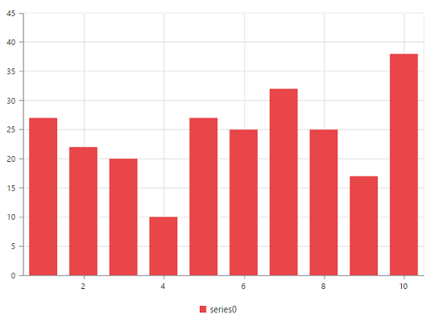
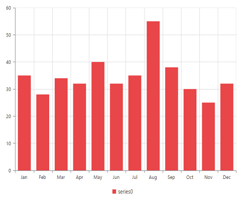
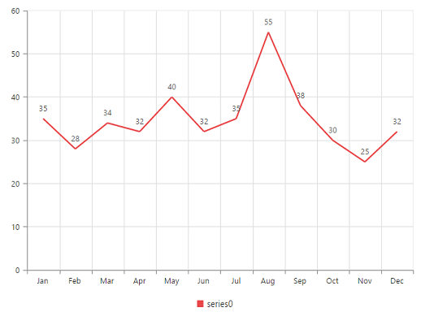
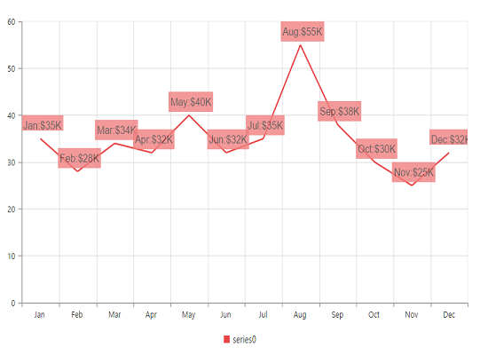
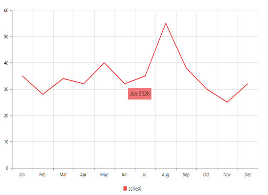
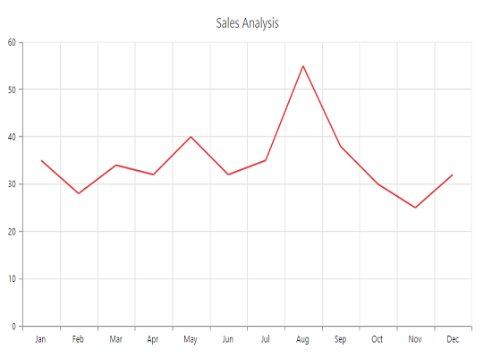

# Getting Started

To get start with how to use the Chart component within Angular-2 platform, refer the basic requisites and the configurations needs to be done on the system from [here](/angular-2/overview).

Once the configurations are done, Create an angular seed application by referring [here](/angular-2/gettingstarted/overview).

## Adding JavaScript and CSS Reference

To render the Chart control, the following list of external dependencies are needed,

* [jQuery](http://jquery.com) - 1.7.1 and later versions
* [Angular](https://angular.io/) - Angular latest versions

The other required internal dependencies are tabulated below,

<table>
   <tr>
      <th>
         <b>Files</b>
      </th>
      <th>
         <b>Description/Usage </b>
      </th>
   </tr>
   <tr>
      <td>
         ej.core.min.js
      </td>
      <td>
        It is referred always before using all the JS controls.
      </td>
   </tr>
   <tr>
      <td>
         ej.data.min.js
      </td>
      <td>
         Used to handle data operation and is used while binding data to the JS controls.
      </td>
   </tr>
   <tr>
      <td>
        ej.chart.min.js
      </td>
      <td>
        Chart core script file which includes Chart related scripts files.
      </td>
   </tr>
   <tr>
      <td>
        ej.globalize.min.js
      </td>
      <td>
       It is referred when using localization in Chart.
      </td>
   </tr>
   <tr>
      <td>
         ej.scroller.min.js
      </td>
      <td>
         It is referred when scrolling is used in the Chart.
      </td>
   </tr>
</table>

N> Chart uses one or more script files, therefore refer the `ej.web.all.min.js` (which encapsulates all the `ej` controls and frameworks in a single file) in the application instead of referring all the above specified internal dependencies.

To get the real appearance of the Chart, the dependent CSS file `ej.web.all.min.css` (which includes styles of all the widgets) should also needs to be referred.

## Preparing HTML document

Create an HTML page and add the scripts references in the order mentioned in the following code example.



    <html>
    <head>
    <title>Angular Chart</title>

    <!-- Essential Studio for JavaScript  theme reference -->
    <link rel="stylesheet" href="http://cdn.syncfusion.com/{{ site.releaseversion }}/js/web/flat-azure/ej.web.all.min.css" />

    <!-- Angular related script references -->
    <!-- 1. Load libraries -->
         <!-- Polyfill(s) for older browsers -->
    
    
    
    

    <!-- Essential Studio for JavaScript  script references -->
     

    <!-- 2. Configure SystemJS -->
    
    

    </head>
    <!-- 3. Display the application -->
    <body>
    <ej-app>
		    

			      
Angular Syncfusion Components App

			      

		    

	  </ej-app>
    </body>
    </html>



N> If you are using the Essential Studio below 13.4.0.53 version, then you need to refer **jQuery.globalize.js** script file along with the above references to render the Chart control.
N> Uncompressed version of library files are also available which is used for development or debugging purpose and can be generated from the custom script [here](http://csg.syncfusion.com).

## Control Initialization

To render the Chart component, please follow the below steps.

* Create `chart` folder inside `src` folder.

* Create `chart.component.html` view file inside `src/chart` folder and render ejChart Angular component using the below code example. 


	<ej-chart id="defaultchart">
	</ej-chart>


* Create `chart.component.ts` model file inside the folder `src/chart` and create sample component using the below code example.



import { Component, ViewEncapsulation } from '@angular/core';

@Component({
  selector: 'ej-app',
  templateUrl: 'src/chart/chart.component.html'
})
export class ChartComponent {

}


## Configure the routes for the Router

Before adding router configuration for above created ejChart component, we recommend you to go through the [Angular Routing](https://angular.io/docs/ts/latest/guide/router.html) configuration to get the deeper knowledge about Angular routing. 

* Now, we are going to configure the route navigation link for created chart sample in `src/app.component.html` file.



	<ul class="nav navbar-nav">
		<li><a data-toggle="collapse" data-target="#skeleton-navigation-navbar-collapse.in"
             href="#chart" [routerLink]="['/chart']">chart </a></li>
	</ul>

<main>
	<router-outlet></router-outlet>
</main>


* Import the ejChart sample component and define the route in `src/app.routes.ts` file.


import { Routes } from '@angular/router';
. . . . 
import { ChartComponent } from './chart/chart.component';

export const rootRouterConfig: Routes = [
    { path: '', redirectTo: 'home', pathMatch: 'full' },
    . . . . 
    { path: 'chart', component: ChartComponent }
];


* Import and declare the Syncfusion source component and ejChart sample component into `app.module.ts` like the below code snippet.


import { NgModule, enableProdMode, ErrorHandler } from '@angular/core';
. . . . . 
//import chart module from node module package
import { EJ_CHART_COMPONENTS } from 'ej2-angular2';
import { ChartComponent } from './chart/chart.component';

import { rootRouterConfig } from './app.routes';
. . . . 
@NgModule({
  imports: [BrowserModule, FormsModule, HttpModule, RouterModule.forRoot(rootRouterConfig, { useHash: true })],
  declarations: [. . . . , EJ_CHART_COMPONENTS, ChartComponent],
  bootstrap: [AppComponent]
})
export class AppModule { }


## Running the application

* To run the application, execute below command.


npm start


* Browse to [http://localhost:3000](http://localhost:3000) to see the application. And navigate to chart tab. The component is rendered as like the below screenshot. You can make changes in the code found under src folder and the browser should auto-refresh itself while you save files. 

## Data Binding

Typically, you will assign data directly to chart using [`dataSource`](../api/ejchart#members:series-datasource) property of the series. In Angular-2, you need to bind the variable, which contains data in the Angular-2 class variable, to the dataSource property as illustrated in the following code example,

I> Essential JS includes Angular-2 directives for all controls in the **ej.angular2.min** script file. 



<ej-chart id="DataBindingChart">
    <e-seriescollection>
        <e-series [dataSource]=dataSource xName="month" yName="sales">
        </e-series>
    </e-seriescollection>
</ej-chart>





import { Component} from '@angular/core';
import { DataService } from '../service/data.service';

@Component({
    selector:'ej-app',
    templateUrl:'src/chart/chart.component.html',
    providers:[DataService]
})
export class ChartComponent{
    dataSource:Array<any>;
    constructor(dataService:DataService){
        this.dataSource=dataService.chartData();
    }
}



Create a folder service and add file data.service.ts for serving data to  chart component file. Refer the below code snippet.



export class DataService{
    chartData():Array<any>{
        return[  
            { month: 'Jan', sales: 35 },
            { month: 'Feb', sales: 28 },
            { month: 'Mar', sales: 34 },
            { month: 'Apr', sales: 32 },
            { month: 'May', sales: 40 },
            { month: 'Jun', sales: 32 },
            { month: 'Jul', sales: 35 },
            { month: 'Aug', sales: 55 },
            { month: 'Sep', sales: 38 },
            { month: 'Oct', sales: 30 },
            { month: 'Nov', sales: 25 },
            { month: 'Dec', sales: 32 }
        ];
    }
}


## Add Data Labels

You can add data labels to improve the readability of the chart. This can be achieved by enabling the [`visible`](../api/ejchart#members:series-marker-datalabel-visible) option in the [`marker-dataLabel`](../api/ejchart#members:series-marker-datalabel    ) option. Now, the data labels are rendered at the top of all the data points.

The following code example illustrates this,



<ej-chart id="chart" size.height="500px" size.width="1050px">
    <e-seriescollection>
        <e-series type="line" [marker.dataLabel.visible]="true">
        </e-series>
    </e-seriescollection>
</ej-chart>



There are situations where the default label content is not sufficient to the user. In this case, you can use the [`template`](../api/ejchart#members:series-marker-datalabel-template) option to format the label content with some additional information.



<ej-chart id="chart">
    <e-seriescollection>
        <e-series marker.dataLabel.template="dataLabelTemplate">
        </e-series>
    </e-seriescollection>
</ej-chart>

    
#point.x#:$#point.y#K



The above HTML template is used as a template for each data label. Here, "point.x" and "point.y" are the placeholder text used to display the corresponding data point’s x & y value.

The following code example shows how to set the id of the above template to [`template`](../api/ejchart#members:series-marker-datalabel-template) option,

## Enable Tooltip

The Tooltip is useful when you cannot display information by using the [`Data Labels`](data-markers.html#adding-labels) due to the space constraints. You can enable tooltip by using the [`visible`](../api/ejchart#members:series-tooltip-visible) option of the [`tooltip`](../api/ejchart#members:series-tooltip) in the specific series.

The following code example illustrates this,



<ej-chart id="chart">
    <e-seriescollection>
        <e-series [tooltip.visible]="true" tooltip.template="Template">
        </e-series>
    </e-seriescollection>
</ej-chart>

    
#point.x#:$#point.y#K



## Add Chart Title

You need to add a title to the chart to provide quick information to the user about the data being plotted in the chart. You can add it by using the [`text`](../api/ejchart#members:title-text) option of the [`title`](../api/ejchart#members:title).



<ej-chart id="chart" title.text="Sales Analysis">
</ej-chart>



