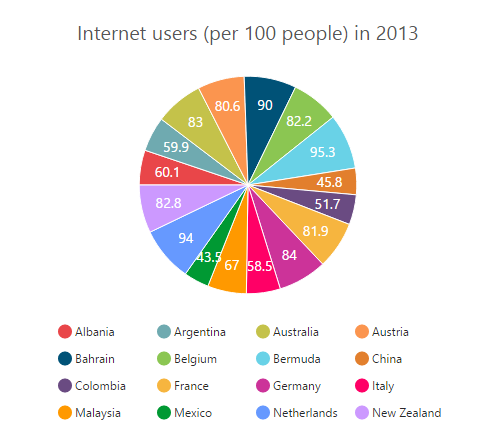
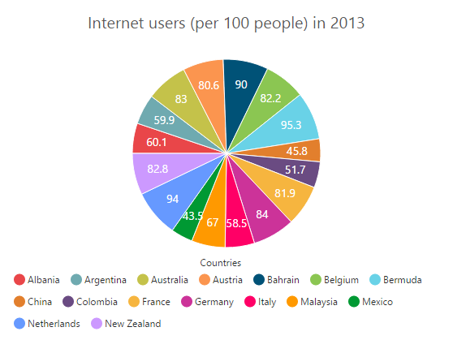
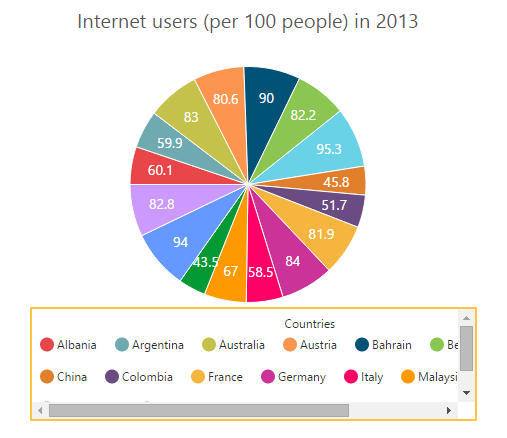
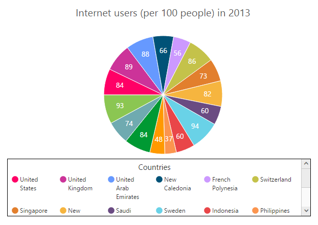
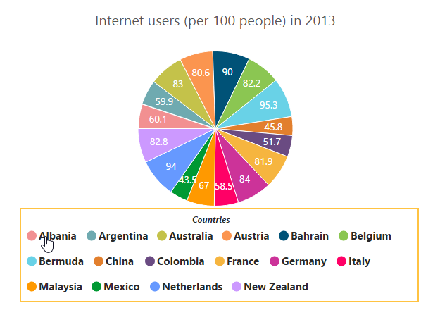

# Legend

The legend contains the list of chart series and Trendlines that appear in a chart. 

## Legend Visibility

By default, the legend is enabled in the chart. You can enable or disable it by using the `visible` option of the legend.



<ej-chart id="chartcontainer" [legend.visible]="true">
</ej-chart>



## Legend title

To add the title to the legend, you have to specify the `legend.title.text` option.



<ej-chart id="chartcontainer" legend.title.text="Countries">
</ej-chart>



## Position and Align the Legend

By using the `position` option, you can position the legend at *left*, *right*, *top* or *bottom* of the chart. The legend is positioned at the **bottom** of the chart, by default.



<ej-chart id="chartcontainer" legend.position="top">
</ej-chart>



**Legend Alignment**

You can align the legend to the *center*, *far* or *near* based on its position by using the `alignment` option.



<ej-chart id="chartcontainer" legend.position="top" legend.alignment="far">
</ej-chart>



## Arrange legend items in the rows and columns

You can arrange the legend items horizontally and vertically by using the `rowCount`and `columnCount` options of the legend.

* When only the `rowCount` is specified, the legend items are arranged according to the `rowCount` and number of columns may vary based on the number of legend items.

* When only the `columnCount` is specified, the legend items are arranged according to the `columnCount` and number of rows may vary based on the number of legend items.

* When both the options are specified, then the one which has higher value is given preference. For example, when the `rowCount` is 4 and `columnCount` is 3, legend items are arranged in 4 rows.

* When both the options are specified and have the same value, the preference is given to the `columnCount` when it is positioned at the top/bottom position. The preference is given to the `rowCount` when it is positioned at the left/right position.
 



<ej-chart id="chartcontainer" [legend.rowCount]=4 [legend.columnCount]=4>
</ej-chart>



## Customization

### Legend shape

To change the legend icon shape, you have to specify the shape in the `shape` property of the legend. When you want the legend icon to display the prototype of the series, you have to set the **seriesType** as shape.



<ej-chart id="chartcontainer"  legend.shape="seriesType">
</ej-chart>



### Legend items size and border

You can change the size of the legend items by using the `itemStyle.width` and `itemStyle.height` options. To change the legend item border, use `border` option of the legend itemStyle.



<ej-chart id="chartcontainer"  [legend.itemStyle]="{width: 13, height: 13, 
                                 border: { color: '#FF0000', width: 1 } }">
</ej-chart>



### Legend size

By default, legend takes 20% of the **height** horizontally when it was placed on the top or bottom position and 20% of the **width** vertically while placing on the left or right position of the chart. You can change this default legend size by using the **size** option of the legend.  



<ej-chart id="chartcontainer"  legend.size.width="550" legend.size.height="100" > 
</ej-chart>



### Legend Item Padding

You can control the spacing between the legend items by using the `itemPadding` option of the legend.  The default value is 10. 



<ej-chart id="chartcontainer"  [legend.itemPadding]=15> 
</ej-chart>



### Legend border

You can customize the legend border by using the `border` option in the legend. 



<ej-chart id="chartcontainer" [legend.border.width]=2 legend.border.color="#FFC342"> 
</ej-chart>



### Scrollbar for legend

You can enable or disable the legend scrollbar by using the `enableScrollbar` option of the legend. When you disable the scrollbar option, the legend does not consider the `default size` and chart draws in the remaining space. If you have specified the `size` to the legend with the scrollbar disabled, then the legends beyond this limit will get clipped. The default value of `enableScrollbar` option is **true**.  



<ej-chart id="chartcontainer" [legend.enableScrollbar]="true" legend.size.width="430" 
                                                             legend.size.height="80"> 
</ej-chart>



### Customize the legend text

To customize the legend item text and title you can use the `legend.font` and `legend.title` options. You can change the legend title alignment by using the `textAlignment` option of the legend title.



this.legendFont= { fontFamily: 'Segoe UI', fontStyle: 'Normal', fontWeight: 'Bold', size: '15px' };
this.titleFont= { fontFamily: 'Segoe UI', fontStyle: 'Italic', 
                                        fontWeight: 'Bold', size: '12px' };




<ej-chart id="chartcontainer" legend.title.text="Countries" [legend.font]="legendFont"
                     legend.title.textAlignment="center" [legend.title.font]="titleFont"> 
</ej-chart>



### LegendItems Text Overflow

**Trim**

You can trim the legend item text when its width exceeds the `legend.textWidth`, by specifying `textOverflow` as **"trim"**. The original text will be displayed on mouse hover.



<ej-chart id="chartcontainer" legend.textOverflow="trim" [legend.textWidth]=34> 
</ej-chart>



 

**Wrap**

By specifying `textOverflow` as **"wrap"**, you can wrap the legend text by word.

**WrapAndTrim**

You can wrap and trim the legend text by specifying `textOverflow` as **"wrapAndTrim"**. The original text will be displayed on mouse hover.

   

## Handle the legend item clicked

You can get the legend item details such as *index*, *bounds*, *shape* and *series* by subscribing the `legendItemClick` event on the chart. When the legend item is clicked, it triggers the event and returns the `legend information`. 



<ej-chart id="chartcontainer" (legendItemClick)="onLegendClicked($event)"> 
</ej-chart>
 
  



## Series selection on legend item click

You can select a specific series or point while clicking on the corresponding legend item through disabling the `toggleSeriesVisibility` option of the legend. The default value of toggleSeriesVisibility option is **true**. To customize the series selection refer to the series `selection`.



<ej-chart id="chartcontainer" [legend.toggleSeriesVisibility]="false"> 
</ej-chart>



## Collapsing legend item

You can collapse the specific series/point legend item displaying in the chart, by setting the `visibleOnLegend` as *"hidden"* in the point or series.



<ej-chart id="chartcontainer" [legend.visible]="true"> 
    <e-seriescollection>
        <e-series type="pie">
    		 <e-points>
		        <e-point x="New Zealand" [y]="82.8210"  visibleOnLegend='hidden'></e-point>
            <!-- Add points here-->
         </e-points>
	  </e-series>
   </e-seriescollection>
</ej-chart>
   


