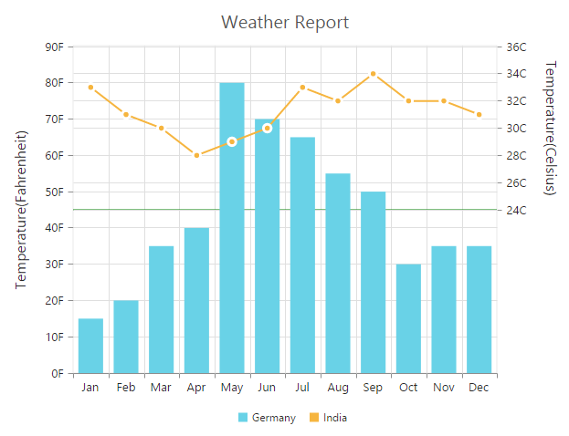
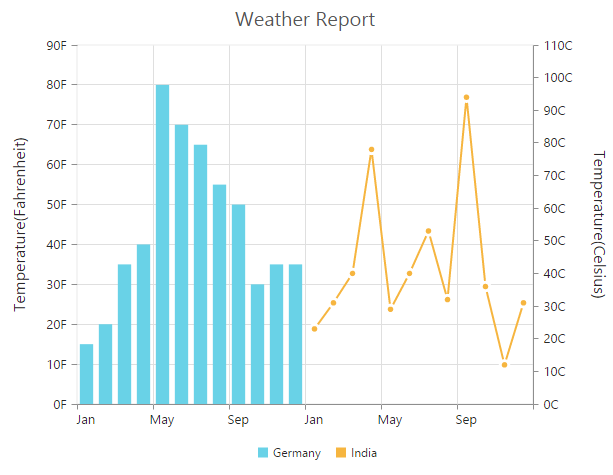

# Multiple panes

Chart area can be divided into multiple panes using the `rowDefinitions` and `columnDefinitions` properties.

### Row Definitions

To split the chart area vertically into a number of rows, use `rowDefinitions` of the chart. 

* You can allocate space for each row by using the `unit` option that determines whether the chart area should be split by *percentage* or *pixels* for the given `rowHeight` value of the rowDefinitions.
 
* To associate a vertical axis to a row, specify the rowDefinitions **index** value to the `rowIndex` property of the chart axis.

* To customize each row’s horizontal line, use `lineColor` and `lineWidth` property.



this.rowDefinitions = [{
    //  Split first row of the chart area
    unit: 'percentage',
    lineColor: 'Gray',
    rowHeight: 50,
    linewidth: 0
}, {
    //  Split second row of the chart area
    unit: 'percentage',
    lineColor: 'green',
    rowHeight: 50,
    linewidth: 0
}];
this.axes = [{
    //Create secondary axis and bind it to second row of chart area
    name: "yAxis1",
    rowIndex: 1
}];





<ej-chart id="chartcontainer" [rowDefinitions]="rowDefinitions" [axes]="axes">
       <e-seriescollection>
          <!--Binding vertical axis name-->
          <e-series yAxisName="yAxis1">
          </e-series>
      </e-seriescollection>
</ej-chart>  



**Row Span**

For spanning the vertical axis along multiple panes vertically, you can use `rowSpan` property of axis. 



<ej-chart id="chartcontainer" [rowDefinitions]="rowDefinitions" [axes]="axes" [primaryYAxis.rows]=2>
       <e-seriescollection>
          <!--Binding vertical axis name-->
          <e-series yAxisName="yAxis1">
          </e-series>
      </e-seriescollection>
</ej-chart> 



## Column Definitions

To split the chart area horizontally into a number of columns, use `columnDefinitions` of the chart.

* You can allocate space for each column by using the `unit` option that determines whether the chart area should be split by *percentage* or *pixels* for the given `columnWidth` value of the columnDefinitions.
 
* To associate a horizontal axis to a column, specify the columnDefinitions **index** value to the `columnIndex` property of the chart axis.
 


 
//  Splitting chart area into multiple columns
this.columnDefinitions = [{
    //  Split first column of the chart area
    unit: 'percentage',
    columnWidth: 50,
}, {
    //  Split second column of the chart area
    unit: 'percentage',
    columnWidth: 50,
}];

this.axes = [{
    //Create secondary axis and bind it to second column of chart area 
    name: "xAxis1",
    columnIndex: 1
}];   





<ej-chart id="chartcontainer" [columnDefinitions]="columnDefinitions" [axes]="axes">
       <e-seriescollection>
          <!--Binding horizontal axis name-->
          <e-series xAxisName="xAxis1">
          </e-series>
      </e-seriescollection>
</ej-chart> 



**Column Span**

For spanning the horizontal axis along multiple panes horizontally, you can use `columnSpan` property of axis. 



<ej-chart id="chartcontainer" [columnDefinitions]="columnDefinitions" [axes]="axes" [primaryXAxis.columnSpan]=2>
       <e-seriescollection>
          <!--Binding horizontal axis name-->
          <e-series xAxisName="xAxis1">
          </e-series>
      </e-seriescollection>
</ej-chart>



