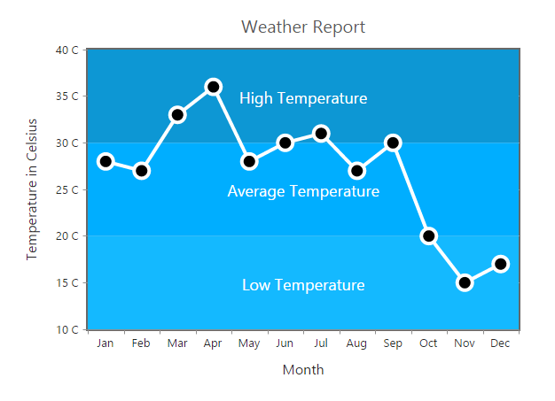
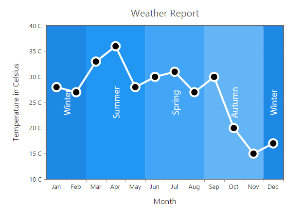
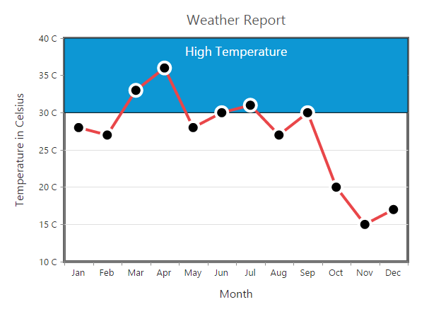

# Striplines

EjChart supports horizontal and vertical striplines. 

## Horizontal Stripline

You can create horizontal stripline by adding the `stripline` in the **vertical axis** and set `visible` option to **true**. Striplines are rendered in the specified **start** to **end** range and you can add more than one stripline for an axis.



this.stripLine = [
    //Create horizontal Stripline using vertical Axis
    {
        //Enable Stripline
        visible: true,
        start: 30,
        end: 40,
    },
           // ...
];





<ej-chart id="chartcontainer" [primaryYAxis.stripLine]="stripLine">
</ej-chart> 



## Vertical Stripline

You can create vertical stripline by adding the `stripline` in the **horizontal axis** and set `visible` option to **true**.  



this.stripLine = [
          //Create vertical Stripline using vertical Axis
          {
              //Enable Stripline
              visible: true,
              start: 3,
              end: 7,
          },
           // ...
];





<ej-chart id="chartcontainer" [primaryXAxis.stripLine]="stripLine">
</ej-chart> 



## Customize the Text

To customize the stripLine text, use the `text` and `font` options. 



this.stripLine = [
          //Create horizontal Stripline using vertical Axis
          {
              //Customize the stripLine text and font styles
              text: 'High Temperature',
              font: { size: '18px', color: 'white' }
              // ...  
     }];





<ej-chart id="chartcontainer" [primaryYAxis.stripLine]="stripLine">
</ej-chart> 



	

**Text Alignment**

Stripline text can be aligned by using the `textAlignment` property.  



this.stripLine = [{
    //Set stripLine text alignment to top position
    textAlignment: 'middletop',
    // ...                         
}];





<ej-chart id="chartcontainer" [primaryYAxis.stripLine]="stripLine">
</ej-chart> 



## Customize the Stripline

To customize the stripLine styles, use the `color`, `opacity`, `borderWidth` and `borderColor` properties. 



this.stripLine = [{
    //Customize the StripLine rectangle
    color: '#33CCFF',
    borderWidth: 2,
    opacity: 0.5,
    borderColor: 'red',
    // ...
}];





<ej-chart id="chartcontainer" [primaryYAxis.stripLine]="stripLine">
</ej-chart> 



## Change the Z-order of the stripline

Stripline `zIndex` property is used to display the stripLine either behind or over the series.  



this.stripLine = [{
    //Change stripLine zIndex
    zindex: 'over',
    // ...
}];





<ej-chart id="chartcontainer" [primaryYAxis.stripLine]="stripLine">
</ej-chart> 



