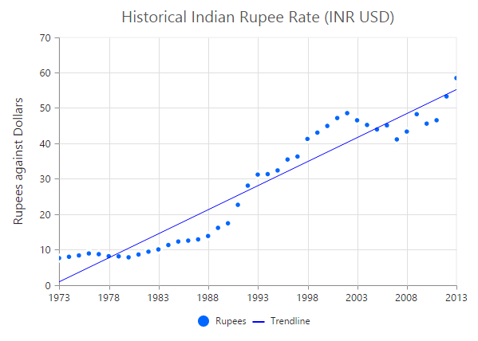
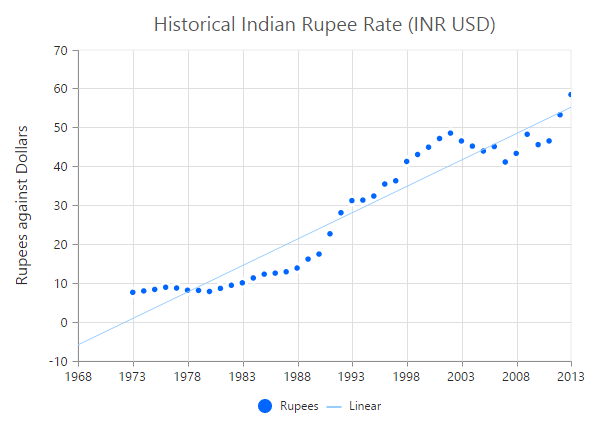

# Trendlines

EjChart can generate Trendlines for Cartesian type series *(Line, Column, Scatter, Area, Candle, HiLo etc.)* except bar type series. You can add more than one trendline object to the [`trendlines`](../api/ejchart#members:series-trendlines) option.



this.ChartTrendlines= [{
     //Enable Trendline to chart series
     visibility: "visible", type: "linear"
   }];





<ej-chart id="chartcontainer">
    <e-seriescollection>
        <e-series [trendlines]="ChartTrendlines"> 		
		</e-series>		
    </e-seriescollection>
</ej-chart>



## Customize the trendline styles

A trendline can be customized by using the properties such as `fill`, `width`, **dashArray** and **opacity**. The default type of trendline is **"linear"**.



this.ChartTrendlines = [{
    //...
    //Customize the Trendline styles
    fill: '#99CCFF', width: 3, opacity: 1, dashArray: '2,3'
}];





<ej-chart id="chartcontainer">
    <e-seriescollection>
        <e-series [trendlines]="ChartTrendlines"> 		
		</e-series>		
    </e-seriescollection>
</ej-chart>



## Types of Trendline

EjChart supports the following type of Trendlines.

* Linear
* Exponential
* Logarithmic
* Power 
* Polynomial
* MovingAverage

### Linear

To render Linear Trendline, you have to set the `type` as **"linear"**. 



this.ChartTrendlines = [{
    //Change Trendline type
    type: "linear"
}];





<ej-chart id="chartcontainer">
    <e-seriescollection>
        <e-series [trendlines]="ChartTrendlines"> 		
		</e-series>		
    </e-seriescollection>
</ej-chart>



### Exponential

Exponential Trendline can be rendered by setting the `type` as **"exponential"**. 



this.ChartTrendlines = [{
    //Change Trendline type
    type: "exponential"
}];





<ej-chart id="chartcontainer">
    <e-seriescollection>
        <e-series [trendlines]="ChartTrendlines"> 		
		</e-series>		
    </e-seriescollection>
</ej-chart>



### Logarithmic

Logarithmic Trendline can be rendered by setting the `type` as **"Logarithmic"**.  



this.ChartTrendlines = [{
    //Change Trendline type
    type: "logarithmic"
}];





<ej-chart id="chartcontainer">
    <e-seriescollection>
        <e-series [trendlines]="ChartTrendlines"> 		
		</e-series>		
    </e-seriescollection>
</ej-chart>



### Power

Power Trendline can be rendered by setting the `type` of the trendline as **"power"**. 



this.ChartTrendlines = [{
    //Change Trendline type
    type: "power"
}];





<ej-chart id="chartcontainer">
    <e-seriescollection>
        <e-series [trendlines]="ChartTrendlines"> 		
		</e-series>		
    </e-seriescollection>
</ej-chart>



### Polynomial

Polynomial Trendline can be rendered by setting the trendline `type` as **"polynomial"**.  You can change the polynomial order by using the **polynomialOrder** of the trendlines. It ranges from 2 to 6.



this.ChartTrendlines = [{
    //Change Trendline type
    type: "polynomial"
}];





<ej-chart id="chartcontainer">
    <e-seriescollection>
        <e-series [trendlines]="ChartTrendlines"> 		
		</e-series>		
    </e-seriescollection>
</ej-chart>



### MovingAverage

MovingAverage Trendline can be rendered by setting the `type` of the trendline as **"movingAverage"**. 



this.ChartTrendlines = [{
    //Change Trendline type and set period for moving average
    type: "movingAverage", period: 3
}];





<ej-chart id="chartcontainer">
    <e-seriescollection>
        <e-series [trendlines]="ChartTrendlines"> 		
		</e-series>		
    </e-seriescollection>
</ej-chart>



## Forecasting

**Trendline forecasting** is the prediction of future/past situations.  **Forecasting** can be classified into two types as follows.

  * Forward Forecasting
  * Backward Forecasting

### Forward Forecasting

The value set for `forwardForecast` is used to determine the distance moving towards the future trend.



this.ChartTrendlines = [{
    //...
    //Set forward forecasting value
    forwardForecast: 5
}];





<ej-chart id="chartcontainer">
    <e-seriescollection>
        <e-series [trendlines]="ChartTrendlines"> 		
		</e-series>		
    </e-seriescollection>
</ej-chart>



### Backward Forecasting

The value set for the `backwardForecast` is used to determine the past trends.



this.ChartTrendlines = [{
    //...
    //Set forward forecasting value
    backwardForecast: 5
}];





<ej-chart id="chartcontainer">
    <e-seriescollection>
        <e-series [trendlines]="ChartTrendlines"> 		
		</e-series>		
    </e-seriescollection>
</ej-chart>



## Trendlines Legend

To display the legend item for trendline, use the `name` property. You can interact with the trendline legends similar to the series legends *(show/hide trendlines on legend click)*.  



this.ChartTrendlines = [{
    //...
    //Set Trendline name to display in the legend
    name: 'Linear'
}];





<ej-chart id="chartcontainer">
    <e-seriescollection>
        <e-series [trendlines]="ChartTrendlines"> 		
		</e-series>		
    </e-seriescollection>
</ej-chart>



