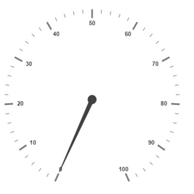
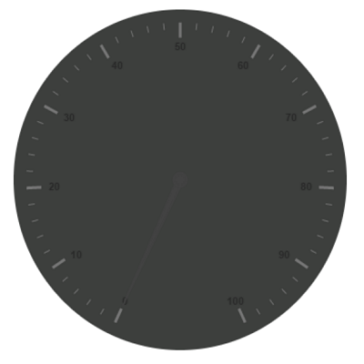
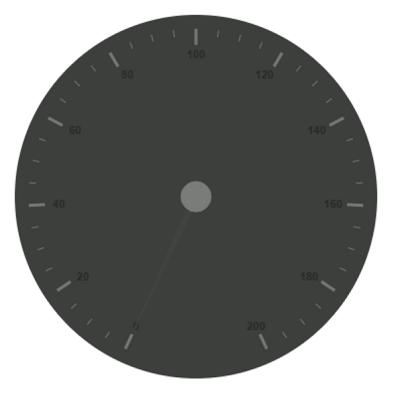
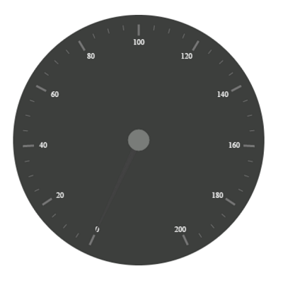
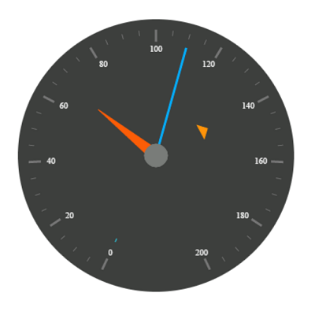
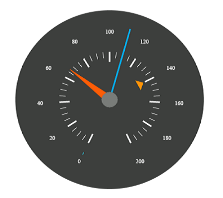
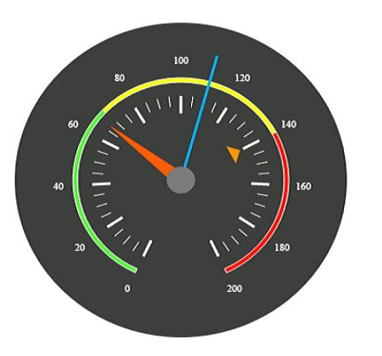

#Getting Started

Before we start with the CircularGauge, please refer [this page](https://help.syncfusion.com/angular-2/overview) for general information regarding integrating Syncfusion widget’s.

## Adding JavaScript and CSS Reference

To render the CircularGauge control, the following list of external dependencies are needed, 

* [jQuery](http://jquery.com) - 1.7.1 and later versions
* [jsRender](https://github.com/borismoore/jsrender) - to render the templates
* [Angular](https://angular.io/) - Angular latest versions

The other required internal dependencies are tabulated below,

<table>
   <tr>
      <th>
         <b>Files</b>
      </th>
      <th>
         <b>Description/Usage </b>
      </th>
   </tr>
   <tr>
      <td>
         ej.core.min.js
      </td>
      <td>
        It is referred always before using all the JS controls.
      </td>
   </tr>
   <tr>
      <td>
         ej.data.min.js
      </td>
      <td>
         Used to handle data operation and is used while binding data to the JS controls.
      </td>
   </tr>
   <tr>
      <td>
        ej.circulargauge.min.js
      </td>
      <td>
        CircularGauge core script file which includes CircularGauge related scripts files.
      </td>
   </tr>
   <tr>
      <td>
        excanvas.min.js
      </td>
      <td>
        
      </td>
   </tr>
</table>

## Preparing HTML document

Create an HTML page and add the scripts references in the order mentioned in the following code example.



    <html>
    <head>
    <title>Angular CircularGauge</title>

    <!-- Essential Studio for JavaScript  theme reference -->
    <link rel="stylesheet" href="http://cdn.syncfusion.com/{{ site.releaseversion }}/js/web/flat-azure/ej.web.all.min.css" />

    <!-- Angular related script references -->
    <!-- 1. Load libraries -->
         <!-- Polyfill(s) for older browsers -->
       
    
    
    

    <!-- Essential Studio for JavaScript  script references -->
    
    
     
    
    
    <!-- 2. Configure SystemJS -->
    
    

    </head>
    <!-- 3. Display the application -->
    <body>
     <ej-app>  
		

	      
Angular Syncfusion Components App

	      

	   

	 </ej-app>
   </body>
</html>



N> Uncompressed version of library files are also available which is used for development or debugging purpose and can be generated from the custom script [here](http://csg.syncfusion.com).

## Control Initialization

* Copy CircularGauge Syncfusion Angular source component(s) from the below build location and add it in `src/ej` folder (For ex., consider the `circularGauge` component).


(Installed Location)\Syncfusion\Essential Studio\14.3.0.49\JavaScript\assets-src\angular2\ 


N> `core.ts` file is mandatory for all Syncfusion JavaScript Angular components. The repository having the source file from Essential Studio for JavaScript v14.3.0.49.

* Create `circularGauge` folder inside `src` folder.

* Create `circularGauge.component.html` view file inside `src/circularGauge` folder and render ejCircularGauge Angular component using the below code example. 


<ej-circularGauge id="defaultcircularGauge">
</ej-circularGauge>


* Create `circularGauge.component.ts` model file inside the folder `src/circularGauge` and create sample component using the below code example.



import { Component, ViewEncapsulation } from '@angular/core';

@Component({
  selector: 'ej-app',
  templateUrl: 'src/circularGauge/circularGauge.component.html'
})
export class CircularGaugeComponent {

}


## Configure the routes for the Router

Before adding router configuration for above created ejCircularGauge component, we recommend you to go through the [Angular Routing](https://angular.io/docs/ts/latest/guide/router.html) configuration to get the deeper knowledge about Angular routing. 

* Now, we are going to configure the route navigation link for created circularGauge sample in `src/app.component.html` file.



	<ul class="nav navbar-nav">
		<!--Added some content ....-->
		<li>
          <a data-toggle="collapse" data-target="#skeleton-navigation-navbar-collapse.in" 
          href="#circularGauge" [routerLink]="['/circularGauge']">circularGauge </a>
        </li>
	</ul>

<main>
	<router-outlet></router-outlet>
</main>


* Import the ejCircularGauge sample component and define the route in `src/app.routes.ts` file.


import { Routes } from '@angular/router';
. . . . 
import { CircularGaugeComponent } from './circularGauge/circularGauge.component';

export const rootRouterConfig: Routes = [
    { path: '', redirectTo: 'home', pathMatch: 'full' },
    . . . . 
    { path: 'circularGauge', component: CircularGaugeComponent }
];


* Import and declare the Syncfusion source component and ejCircularGauge sample component into `app.module.ts` like the below code snippet.


import { NgModule, enableProdMode, ErrorHandler } from '@angular/core';
. . . . . 
import { EJ_CIRCULARGAUGE_COMPONENTS } from './ej/circularGauge.component';
import { CircularGaugeComponent } from './circularGauge/circularGauge.component';

import { rootRouterConfig } from './app.routes';
. . . . 
@NgModule({
  imports: [BrowserModule, FormsModule, HttpModule, RouterModule.forRoot(rootRouterConfig, { useHash: true })],
  declarations: [. . . . , EJ_CIRCULARGAUGE_COMPONENTS, CircularGaugeComponent],
  bootstrap: [AppComponent]
})
export class AppModule { }


## Running the application

* To run the application, execute below command.


npm start


* Browse to [http://localhost:3000](http://localhost:3000) to see the application. And navigate to circularGauge tab. The component is rendered as like the below screenshot. You can make changes in the code found under src folder and the browser should auto-refresh itself while you save files. 

 

## Set Background Color

You can draw the speedometer with dark background and to vary the speed of the pointer, set the **readOnly** option as **false** for user interaction. 



 <ej-CircularGauge e-height="500" e-width="500" e-backgroundcolor="##3D3F3D" e-readonly="false">
 </ej-CircularGauge>



The above code example renders a **Gauge** as shown in the following screen shot.

## Provide scale values

* You can customize the pointer cap using the following options- Cap radius, Cap border color, cap background color, pointer cap border width. 

* Set the maximum speed limit in the **Gauge** as 200KmpH.

* Major Ticks and Minor Ticks have the interval values 20 and 5 respectively. Show ranges and show indicators are used to display the ranges and indicators in their respective positions.



 <ej-CircularGauge [height]="500" [width]="500" backgroundColor="#3D3F3D" [readOnly]="false">
     <e-scales>
          <e-scale showRanges="true" showIndicators="true" maximum="200" majorIntervalValue="20" 
               minorIntervalValue="5" pointerCap.radius="15" pointerCap.borderWidth="0" 
               pointerCap.backgroundColor="#797C79" pointerCap.borderColor="#797C79">
          </e-scale>
       </e-scales>
  </ej-CircularGauge>



On executing the above code, sample renders a **Circular Gauge** with customized labels as follows.

## Add Label Customization

To display the values in the **Gauge**, scale labels are used. You can customize the label color.  



<ej-CircularGauge>
    <e-scales>
       <e-scale>
            <e-labels>
                <e-label color="#ffffff"></e-label>
            </e-labels>
       </e-scale>
     </e-scales>
</ej-CircularGauge>



On executing the above code, sample renders a default **Circular Gauge** with customized labels as follows.

## Add pointer data

You can use three pointers that denote kilometer value, rotation per minute value and torque value.The torque value pointer should not be similar to other two pointers. Set the torque pointer as marker pointer. You can set other attributes for pointer such as background color, border color, Length, width and distance from scale.



<ej-CircularGauge>
    <e-scales>
        <e-scale>
            <e-pointers>
               <e-pointer [value]="140" [distanceFromScale]="60" [showBackNeedle]="false" 
                          [length]="20" type="marker" markerType="triangle"
                          [width]="10" backgroundColor="#FF940A" border.color="#FF940A">
                </e-pointer>
                <e-pointer [value]="110" [showBackNeedle]="false" [length]="150" [width]="2" 
                      needleType="rectangle" backgroundColor="#05AFFF" border.color="#05AFFF">
                </e-pointer>
                <e-pointer [value]="67" [showBackNeedle]="false" [length]="100" [width]="15" 
                           backgroundColor="#FC5D07" border.color="#FC5D07">
                </e-pointer>
             </e-pointers>
        </e-scale>
     </e-scales>
</ej-CircularGauge>



On executing the above code, sample renders a customized **Circular Gauge** as follows.

## Add Tick Details

You can display the tick value with customization as given in the following code example. You can set width and height of the Major ticks greater than the Minor ticks. You can set dark background for tick Color to have a better visibility.



<ej-CircularGauge>
    <e-scales>
        <e-scale>
             <e-ticks>
                <e-tick type="major" [distanceFromScale]="70" [height]="20" 
                                     [width]="3" color="#ffffff"></e-tick>
                <e-tick type="minor" [distanceFromScale]="70" [height]="12" 
                                     [width]="1" color="#ffffff"></e-tick>
             </e-ticks>
        </e-scale>
     </e-scales>
</ej-CircularGauge>



On executing the above code, sample renders a **Circular Gauge** with customized labels as follows.

## Add Range Values

Ranges denote the property of scale value in the speedometer. The color values of the ranges specify the speed variation. Set **showRanges** property to **true** to show the ranges in the **Circular Gauge**. Select safe zone for low speed, caution zone for moderate speed and high zone for high speed. You can customize the range with the properties such as start value, end value, start width, end width,  background color , border color, etc.,



 <ej-CircularGauge e-height="500" e-width="500" e-backgroundcolor="#3D3F3D" e-readonly="false">
    <e-scales>
        <e-scale>
             <e-ranges>
                <e-range [distanceFromScale]="30" [startValue]="0" [endValue]="70" 
                    backgroundColor="#5DF243" border.color="#FFFFFF"></e-range>
                <e-range [distanceFromScale]="30" [startValue]="70" [endValue]="140" 
                    backgroundColor="#F6FF0A" border.color="#FFFFFF"></e-range>
                <e-range [distanceFromScale]="30" [startValue]="140" [endValue]="200" 
                    backgroundColor="#FF1807" border.color="#FFFFFF"></e-range>
            </e-ranges>
        </e-scale>
     </e-scales>
</ej-CircularGauge>



On executing the above code, sample renders a **Circular Gauge** with customized range as follows.

