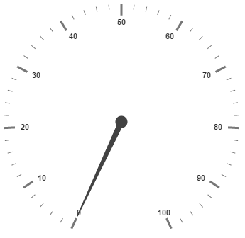

# Interaction and Animation

**Interaction**

**Circular Gauge** control contains **Interaction** feature. You can use this interaction feature to change the pointer values manually. You can achieve this by clicking and dragging the pointer over the **Gauge** and you can see the value of pointer changes dynamically while dragging. To Enable/Disable the user interaction you can use the Boolean property called **readOnly**. The user interaction option is enabled when you set the value as false for the property **readOnly**.By default it holds the true value.That is by default it does not support interaction. 



<ej-CircularGauge id="circularGauge1" [readOnly]="false" >
</ej-CircularGauge>



Execute the above code to render the following output.

**Animations**

**Circular Gauge** contains an attractive concept called **Animation**. The animation option enables the pointer to rotate from the minimum value to the current value with animation effects. By using this animation you can change the pointer value dynamically.You can apply the animation on  pointer either by clockwise or counterclockwise based on the scale direction. You can enable / disable it using the property **enableAnimation.** Animation is enabled when you set **enableAnimation** as ‘true’. By default it holds the true value. You can control the speed of the pointer during animating by using the property **animationSpeed**. It is a numerical value that holds the time in milliseconds. That is when the value is given as 1000, it is considered as 1 second.



<ej-CircularGauge id="circularGauge1" [enableAnimation]="true" [animationSpeed]=1000 >
</ej-CircularGauge>



Execute the above code to render the following output.

## Gradient

You can change the interior gradient of **Circular Gauge** by using `InteriorGradient` property. The `isRadialGradient` property is used to check whether the gradient is circular or not.  



<ej-CircularGauge id="circularGauge1" [isRadialGradient]="true" >
    
    <% Code %>

    <% Code %>
    
</ej-CircularGauge>
    


## Distance From Corner

You can display the circular gauge from distance apart from the corner by specifying value for `distanceFromCorner` property. 



<ej-CircularGauge id="circularGauge1" [distanceFromCorner]="5" >
        
</ej-CircularGauge>



## Resize

Circular gauge can be responsive while resizing by specifying `enableResize` property as true. 



<ej-CircularGauge id="circularGauge1" [enableResize]="true" >
        
</ej-CircularGauge>



## Localization

The circular gauge can be localized based on name of culture specified in `Locale` property.



<ej-CircularGauge id="circularGauge1" locale="en-fr" >
        
</ej-CircularGauge>



## Themes

**CircularGauge** `Theme` is a set of pre-defined options that are applied to the control before **CircularGauge** is instantiated. Following predefined themes are available in JavaScript **CircularGauge**.

1. FlatLight
2. FlatDark
3. GradientLight 
4. GradientDark 
5. Azure                      
6. AzureDark               
7. Lime 
8. LimeDark
9. Saffron
10. SaffronDark
11. GradientAzure
12. GradientAzureDark
13. GradientLime
14. GradientLimeDark
15. GradientSaffron
16. GradientSaffronDark

The theme for circular gauge can be specified using `Theme` property.



<ej-CircularGauge id="circularGauge1" theme="saffron" >
        
</ej-CircularGauge>



## Circular Gauge Values 

The `minimum`, `maximum`, `radius` and `value` attributes of circular gauge are used to render the circular gauge with specified location. 



<ej-CircularGauge id="circularGauge1" [minimum]="10"  [maximum]="100" [radius]="50" [value]="30">
        
</ej-CircularGauge>



