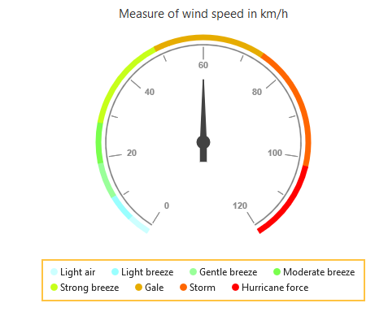
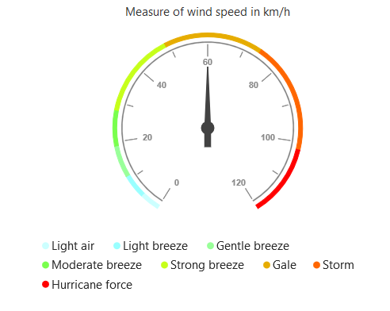

# Legend

The legend contains the list of the ranges that appear in the circular gauge  

## Legend Visibility

By default, the legend  the legend will not be displayed in the circular gauge. You can enable or disable it by using the **visible** property of the legend.



<ej-CircularGauge id="circularGauge1" [legend.visible]="true" >
</ej-CircularGauge>



[Click](http://ng2jq.syncfusion.com/#/circulargauge/legend) here to view the online demo sample for legend .

### Legend Text

The text displayed in the legend can be customized by using the `legendText` property present in the `ranges` of the circular gauge. When the legendText is not specified in the ranges, then the legend item for that particular range will not displayed. By default the legendText value is null . 



<ej-CircularGauge id="circularGauge1" >
 <e-scales>
 <e-scale >
 <e-ranges>
 <e-range legendText="Light air"></e-range>
 </e-ranges>
 </e-scale>
 </e-scales>
 </ej-CircularGauge>



### Legend Fill and Opacity

You can change the opacity and fill color of legend text using `Opacity` and `Fill` property of legend. 



<ej-CircularGauge id="circularGauge1" legend.fill="blue" [legend.opacity]="0.5" >
</ej-CircularGauge>



## Position and Align the Legend

By using the `position` property, you can position the legend at *left*, *right*, *top* or *bottom* of the CircularGauge. The legend is positioned at the **bottom** of the circular gauge, by default.



<ej-CircularGauge id="circularGauge1" legend.position="top">
</ej-CircularGauge>



### Legend Alignment

You can align the legend to the *center*, *far* or *near* based on its position by using the `alignment` property.



<ej-CircularGauge id="circularGauge1" legend.position="top" legend.alignment="far">
</ej-CircularGauge>



## Customization

### Legend shape

To change the legend item, shape, you have to specify the desired shape in the `shape` property of the legend. By default the legend shape is **circle**.It also supports rectangle,diamond,triangle,slider,line,pentagon,trapezoid and wedge shapes.



<ej-CircularGauge id="circularGauge1"  legend.shape="slider">
</ej-CircularGauge>



### Legend Item Size and Border

You can change the size of the legend items by using the `width` and `height` properties in the `itemStyle`. To change the legend item border, use `border` property of the legend itemStyle.



<ej-CircularGauge id="circularGauge1"  [legend.itemStyle]="{width: 13, height: 13, 
                                 border: { color: '#FF0000', width: 2 } }">
</ej-CircularGauge>



### Legend size

You can change the default legend size by using the `size` property of the legend.  



<ej-CircularGauge id="circularGauge1"  legend.size.width="350" legend.size.height="100" > 
</ej-CircularGauge>



### Legend Item Padding

You can control the spacing between the legend items by using the `itemPadding` option of the legend.  The default value is 20. 



<ej-CircularGauge id="circularGauge1"  [legend.itemPadding]=30> 
</ej-CircularGauge>



### Legend border

You can customize the legend border by using the `border` option in the legend. 



<ej-CircularGauge id="circularGauge1" [legend.border.width]=2 legend.border.color="#FFC342"> 
</ej-CircularGauge>



### Font of the legend text

The font of the legend item text can be customized by using the `font` property in legend.



this.legendFont= { fontFamily: 'Segoe UI', fontStyle: 'Normal', fontWeight: 'Bold', size: '15px' };





<ej-CircularGauge id="circularGauge1"  [legend.font]="legendFont">
                      
</ej-CircularGauge>



## Events

### Legend Item Render

`legendItemRender` event triggers before rendering the legend items. This event is triggered for each legend item in Circular gauge. You can use this event to customize legend item shape or add custom text to legend item.



<ej-CircularGauge id="circularGauge1" (legendItemRender)="onLegendItemRender($event)"> 
</ej-CircularGauge>
 



### Legend Item Click

You can get the legend item details such as *RangeIndex*, *bounds*, *shape* and *series* by subscribing the `legendItemClick` event on the circular gauge. When the legend item is clicked, it triggers the event and returns the legend information. 



<ej-CircularGauge id="circularGauge1" (legendItemClick)="onLegendClicked($event)"> 
</ej-CircularGauge>
 
  



