# Pointers

**Pointer** value points out the actual value set in the **Circular Gauge**. You can customize the pointers to improve the appearance of **Gauge**.

## Adding Pointer Collection

**Pointer collection** is directly added to the scale object. To add pointer collection in a **Gauge** control refer the following code example.  



 <ej-CircularGauge id="circularGauge1" >
     <e-scales>
          <e-scale>
          	<e-pointers>
                <e-pointer [value]=30>
                </e-pointer>
            </e-pointers>
          </e-scale>
       </e-scales>
  </ej-CircularGauge>



Execute the above code to render the following output.

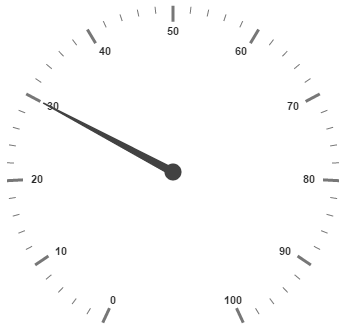

## Adding Pointer Value

**Pointer value** is the important element in the **Circular Gauge** that indicates the **Gauge** value. Real purpose of the **Circular Gauge** is based on the pointer value. You can set the pointer value either directly during rendering the control or it can be achieved by public method too.



 <ej-CircularGauge id="circularGauge1" >
     <e-scales>
          <e-scale [showRanges]="true" [showScaleBar]="true" [radius]=150 [size]=2 >
          	<e-pointers>
                <e-pointer [value]=30>
                </e-pointer>
            </e-pointers>
             <e-ranges>
                <e-range [startValue]='0' [endValue]='80' backgroundColor="Green">
                </e-range>
            </e-ranges>
          </e-scale>
       </e-scales>
  </ej-CircularGauge>



Execute the above code to render the following output.

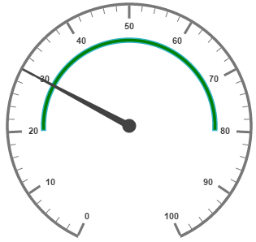

## Pointer Styles

**Colors and Border**

The Pointers border is modified with the object called **border** as in scales. It has two border property called **color** and **width** which are used to customize the border color of the pointer and border width of the pointer. You can set the background color to improve the look of the **Circular Gauge** and you can customize the background color of the scale using **backgroundColor**.



 <ej-CircularGauge id="circularGauge1" >
     <e-scales>
          <e-scale [showRanges]="true" [showScaleBar]="true" [radius]=150 [width]=10 >
          	<e-pointers>
                <e-pointer [value]=45 [length]=100 backgroundColor="yellow" [width]=16 [opacity]=0.6
                 [border]="{ color: 'green', width: 2 }" >
                </e-pointer>
            </e-pointers>
          </e-scale>
       </e-scales>
  </ej-CircularGauge>



Execute the above code to render the following output.

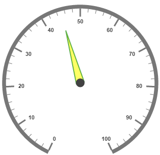

**Appearance**

Based on the value, the**pointer** point out the label value. You can set the pointer length and width using **length** and **width** property respectively. And you can also adjust the opacity of the pointer using the property **opacity** which holds the value between 0 and 1. You can add the gradient effects to the pointer using **gradient** object.



 <ej-CircularGauge id="circularGauge1" >
     <e-scales>
          <e-scale [border]="{ width: 2, color: 'Red' }" [showScaleBar]="true" [radius]=150 [width]=10 >
          	<e-pointers>
                <e-pointer [value]=45 [length]=100 backgroundColor="orange" [width]=16 [opacity]=0.6
                 [border]="{ color: 'red', width: 2 }" >
                </e-pointer>
            </e-pointers>
          </e-scale>
       </e-scales>
  </ej-CircularGauge>



Execute the above code to render the following output.

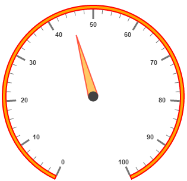

**Position the pointer**

Pointer can be positioned with the help of two properties such as **distanceFromScale** and **placement**. **distanceFromScale** property defines the distance between the scale and pointer.  **Placement** property is used to locate the pointer with respect to scale either inside the scale or outside the scale or along the scale. It is an enumerable data type. Both the property is applied only if pointer type is marker. For needle type marker, it renders with default position that is unchangeable.



 <ej-CircularGauge id="circularGauge1" >
     <e-scales>
        <e-scale [border]="{ width: 2, color: 'Red' }" [showScaleBar]="true" [radius]=150 [width]=10>
            <e-pointers>
              <e-pointer type="marker" markerType="triangle" placement="near" [distanceFromScale]=20 >
            </e-pointer>
          </e-pointers>
       </e-scale>
   </e-scales>
</ej-CircularGauge>



Execute the above code to render the following output.

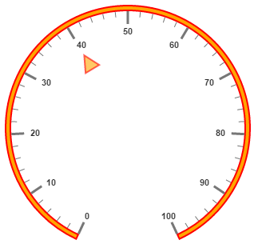

**Types**

* Circular gauge pointer has two types such as,

  * Needle

  * Marker

* Needle type pointers are the default pointers that cannot be positioned and that is located at the center of the gauge. There are four different shapes of needle pointers such as 

  * Rectangle

  * Triangle

  * Trapezoid 

  * Arrow
 
  * Image

* For marker pointer, the available dimensions are 

  * Rectangle
 
  * Triangle

  * Ellipse

  * Diamond

  * Pentagon

  * Circle 

  * Slider

  * Pointer

  * Wedge

  * Trapezoid

  * Rounded Rectangle
 
  * Image
 
## Pointer Images

In Angular circular gauge, it is possible to replace the pointer with images. We can use image instead of rendering the pointer.

**Image with URL**

* To implement the pointer image we need to give the API called ImageUrl. It is a string data type. 
* Image type pointer is applicable for both marker as well as needle type pointers and it is possible with combine the normal marker pointer type wit image type. The three possibilities are
 
  * Needle Image
 
  * Marker Image
 
  * Marker pointer with Image
 
**Needle Image**

In this type, needle pointer is completely replaced by image. We can implement it with the help of following snippet. 
 


 <ej-CircularGauge id="circularGauge1" frame.frameType="halfcircle" >
     <e-scales>
          <e-scale [showRanges]="true" [showLabels]="false" [startAngle=]=180 [sweepAngle]=180
                  [showScaleBar]="false" [radius]=130 [width]=10 >
          	<e-pointers>
                <e-pointer type="needle" needleType="image" ImageUrl="nib.png" [value]=60 
                [length]=30 [width]=100 ></e-pointer>
            </e-pointers>
            <e-ticks>
                <e-tick [height]='0' [width]='0'>
                </e-tick>
            </e-ticks>
             <e-ranges>
                <e-range [distanceFromScale]='-30' [startValue]='0' [endValue]='70' [size]=40>
                </e-range>
                <e-range [distanceFromScale]='-30' [startValue]='70' [endValue]='110' [size]=40 
                         backgroundColor='#fc0606' border.color='#fc0606'></e-range>
            </e-ranges>
          </e-scale>
       </e-scales>
  </ej-CircularGauge>



Execute the above code to render the following output.

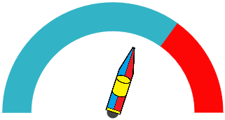

**Marker Image**

In this type, marker pointer is completely replaced by image. We can implement it with the help of following snippet.



 <ej-CircularGauge id="circularGauge1" frame.frameType="halfcircle" >
     <e-scales>
          <e-scale [showRanges]="true" [showLabels]="false" [startAngle=]=180 [sweepAngle]=180 
                   [showScaleBar]="false" [radius]=130 [width]=10 >
          	<e-pointers>
                <e-pointer type="marker" markerType="image" ImageUrl="ball.png" [value]=60 [length]=30 
                [width]=100></e-pointer>
            </e-pointers>
            <!--Add range and ticks here-->
          </e-scale>
       </e-scales>
  </ej-CircularGauge>



Execute the above code to render the following output.

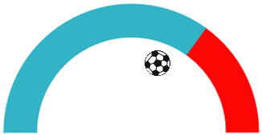

**Marker Pointer with Image**

In this type, marker pointer is drawn first and then image also loaded. We can implement it with the help of following snippet.



 <ej-CircularGauge id="circularGauge1" frame.frameType="halfcircle" >
     <e-scales>
          <e-scale [showRanges]="true" [showLabels]="false" [startAngle=]=180 [sweepAngle]=180
           [showScaleBar]="false" [radius]=130 [width]=10 >
          	<e-pointers>
                <e-pointer type="marker" markerType="rectangle" ImageUrl="ball.png" [value]=60
                 [length]=30 [width]=100 [border]="{ color: 'Black', width: 3 }">
                </e-pointer>
            </e-pointers>
            <!--Add range and ticks here-->
          </e-scale>
       </e-scales>
  </ej-CircularGauge>



Execute the above code to render the following output.

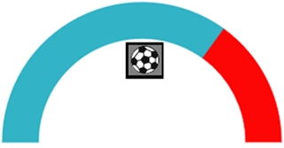

## Multiple Pointers

**Circular Gauge** can have multiple pointers on it. You can use any combination and any number of pointers in a **Gauge**. That is, a Gauge can contain any number of marker pointer and any number of needle pointers. Refer the following code example containing two pointers.



 <ej-CircularGauge id="circularGauge1">
     <e-scales>
          <e-scale [showScaleBar]="true" [showScaleBar]="true" [radius]=150 [width]=10
           [border]="{ width: 2, color: 'Green' }" >
          	<e-pointers>
              <e-pointer [border]="{ width: 2, color: 'Green' }" backgroundColor="#DCEBF9"
                 [value]=4060 [length]=100 [width]=16 [opacity]=0.6 >
                </e-pointer>
              <e-pointer type="marker" markerType="triangle" placement="near" [value]=60 [length]=20
                 [width]=20 backgroundColor="#DCEBF9" [border]="{ color: 'Green', width: 3 }">
                </e-pointer>
            </e-pointers>
            <!--Add range and ticks here-->
          </e-scale>
       </e-scales>
  </ej-CircularGauge>



Execute the above code to render the following output.

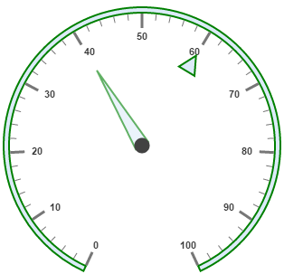

## Pointer Value Text

Gauge **Pointer value** **text** is used to display the current value of the pointer in the **Circular Gauge** control.

**Positioning the text**

You can position the **Circular Gauge** pointer value with the gauge as center by using the **API** called **distance**. You can Disable/ Enable these pointers value by using the API **showValue.**



 <ej-CircularGauge id="circularGauge1" [radius]=100 [value]=55 backgroundColor="transparent">
     <e-scales>
          <e-scale [showRanges]="true" [showScaleBar]="true" [radius]=150 [width]=10
           [border]="{ width: 2, color: 'Green' }" >
          	<e-ranges>
                <e-range [size]=40 [startValue]='0' [endValue]='50' backgroundColor='#1B4279'
                 border.color='#1B4279'></e-range>
                <e-range [size]=40 [startValue]='50' [endValue]='100' backgroundColor='#91B8F3'
                 border.color='#91B8F3'></e-range>
            </e-ranges>
            <e-pointers>
                <e-pointer [pointerValueText]="{showValue: true,distance: 0,color: '#8c8c8c' }">
                </e-pointer>
            </e-pointers>
          </e-scale>
       </e-scales>
  </ej-CircularGauge>



Run the above code to render the output as follows.

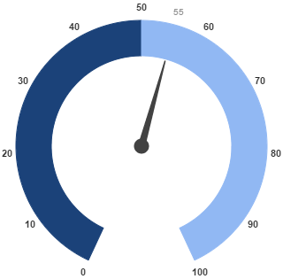

## Appearance

Appearance of the **Circular Gauge****pointer value text** is adjusted by using four properties. Such as **color, angle, autoAngle** and **opacity**.

* **Color** property is used to set the color of the pointer value text.

* **Angle** property is used to set the angle in which the text is displayed.

* **Auto Angle** is used to display the text in certain angle based on pointer position angle.

* **Opacity** is used to customize the brightness of the text. 



 <ej-CircularGauge id="circularGauge1" [radius]=100 [value]=55 backgroundColor="transparent" >
     <e-scales>
          <e-scale [showRanges]="true" [showScaleBar]="true" [radius]=150 [width]=10 
          [border]="{ width: 2, color: 'Green' }" >
          	<e-ranges>
                <e-range [size]=40 [startValue]='0' [endValue]='50' backgroundColor='#1B4279' 
                border.color='#1B4279' >
                </e-range>
                <e-range [size]=40 [startValue]='50' [endValue]='100' backgroundColor='#91B8F3' 
                border.color='#91B8F3'>
                </e-range>
            </e-ranges>
            <e-pointers>
                <e-pointer [pointerValueText]="{showValue: true,distance: 0,color: 'red',
                                                                 opacity: 0.7, angle: 20 }" >
                </e-pointer>
            </e-pointers>
          </e-scale>
       </e-scales>
  </ej-CircularGauge>



Run the above code to render the output as follows.

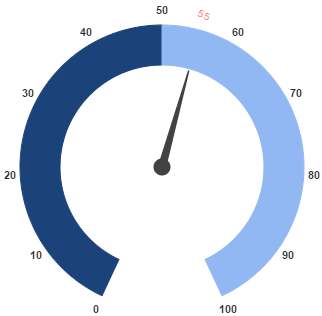

## Font Options

Similar to other collection, font option is also available in this pointer value text such as size, fontFamily and fontStyle.



 <ej-CircularGauge id="circularGauge1" [radius]=100 [value]=55 backgroundColor="transparent" >
     <e-scales>
          <e-scale [showRanges]="true" [showScaleBar]="true" [radius]=150 [width]=10 [border]="{ 
                                                                    width: 2, color: 'Green' }" >
          	<e-ranges>
                <e-range [size]=40 [startValue]='0' [endValue]='50' backgroundColor='#1B4279'
                                                         border.color='#1B4279' ></e-range>
                <e-range [size]=40 [startValue]='50' [endValue]='100' backgroundColor='#91B8F3'
                                                          border.color='#91B8F3'></e-range>
            </e-ranges>
            <e-pointers>
                <e-pointer [pointerValueText]="{showValue: true,distance: 0,color: 'red',
                        opacity: 0.7, angle: 20, font: { size: '15px', fontStyle: 'Normal', 
                        fontFamily: 'Arial'} }" >
                </e-pointer>
            </e-pointers>
          </e-scale>
       </e-scales>
  </ej-CircularGauge>



Run the above code to render the output as follows.

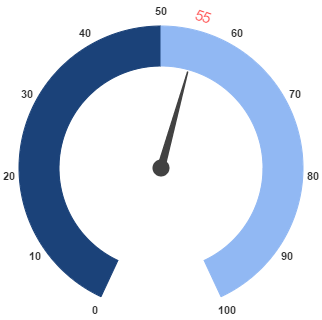

