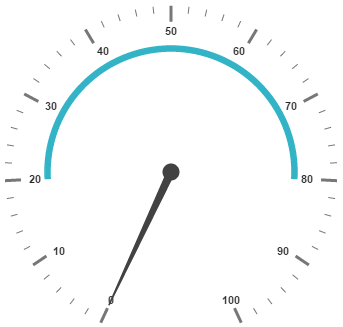
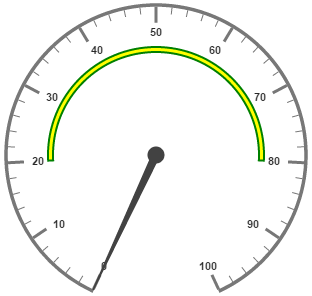
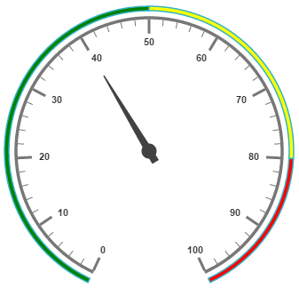
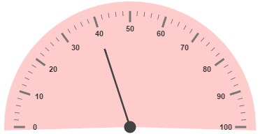

# Ranges and Frames

Ranges are used to specify or group the scale values. By using ranges, you can describe the values in the pointers. 

## Adding Range Collection

Range collection is directly added to the scale object. Refer the following code example to add range collection in a **Gauge** control. 



 <ej-CircularGauge id="circularGauge1">
     <e-scales>
          <e-scale [showRanges]="true">
          	<e-ranges>
                <e-range [startValue]='20' [endValue]='80'>
                </e-range>
            </e-ranges>
          </e-scale>
       </e-scales>
  </ej-CircularGauge>



## Range Customization

**Appearance**

The API **size** is used to specify the width of the ranges.  The major attributes for ranges are **startValue** and **endValue**. **startValue** defines the start position of the ranges and **endValue** defines the end position of the ranges.

**StartWidth** and **endWidth** are used to specify the range width at the starting and ending position of the ranges. You can add the gradient effects to the ranges by using **gradient** object.



 <ej-CircularGauge id="circularGauge1">
     <e-scales>
          <e-scale [showRanges]="true" [showScaleBar]="true" [radius]=150 [size]=2 >
          	<e-ranges>
                <e-range [startValue]='20' [endValue]='80' backgroundColor="green">
                </e-range>
            </e-ranges>
          </e-scale>
       </e-scales>
  </ej-CircularGauge>



Execute the above code to render the following output.

## Colors and Border

By customizing the ranges, the appearance of the **Gauge** can be improved. The range border is modified with the object called **border**. It has two border property such as **color** and **width.** These are used to customize the border color of the ranges and border width of the ranges. 

You can set the background color to improve the look and feel of the **Circular Gauge**. For customizing the background color of the ranges, **backgroundColor** is used.



 <ej-CircularGauge id="circularGauge1">
     <e-scales>
          <e-scale [showRanges]="true" [showScaleBar]="true" [radius]=150 [size]=2 >
          	<e-ranges>
                <e-range [startValue]='20' [endValue]='80' backgroundColor="green" 
                [border]="{ color: 'green', width: 2 }" ></e-range>
            </e-ranges>
          </e-scale>
       </e-scales>
  </ej-CircularGauge>



Execute the above code to render the following output.

## Positioning the ranges

You can position ranges using two properties such as **distanceFromScale** and **placement**. **distanceFromScale** property defines the distance between the scale and range. **Placement** property is used to locate the pointer with respect to scale either inside the scale or outside the scale or along the scale. It is an enumerable data type.



 <ej-CircularGauge id="circularGauge1">
     <e-scales>
          <e-scale [showRanges]="true" [showScaleBar]="true" [radius]=150 [size]=2 >
          	<e-ranges>
                <e-range [startValue]='20' [endValue]='80' backgroundColor="green" 
                [border]="{ color: 'green', width: 2 }" [distanceFromScale]=-30 placement="far" >
                </e-range>
            </e-ranges>
          </e-scale>
       </e-scales>
  </ej-CircularGauge>



Execute the above code to render the following output.

## Multiple Ranges

You can set multiple ranges by adding an array of ranges objects. Refer the following code example for multiple ranges functionality.



 <ej-CircularGauge id="circularGauge1">
     <e-scales>
          <e-scale [showRanges]="true" [showScaleBar]="true" [radius]=150 [size]=2 >
          	<e-ranges>
                <e-range [startValue]='0' [endValue]='50' backgroundColor="green" [border]="{ 
                    color: 'green', width: 2 }" [distanceFromScale]=-30 placement="far" >
                </e-range>
                <e-range [startValue]='50' [endValue]='80' backgroundColor="yellow" [border]="{ 
                    color: 'green', width: 2 }" [distanceFromScale]=-30 placement="far" >
                </e-range>
                <e-range [startValue]='80' [endValue]='100' backgroundColor="red" [border]="{ 
                    color: 'green', width: 2 }" [distanceFromScale]=-30 placement="far" >
                </e-range>
            </e-ranges>
            <e-pointers>
                <e-pointer [value]=40 [showBackNeedle]="true" [length]="100">
                </e-pointer>
            </e-pointers>
          </e-scale>
       </e-scales>
  </ej-CircularGauge>



Execute the above code to render the following output.

## Frames

Frame is the element that decides the appearance of the **Circular Gauge**. You can customize it using the object called **frame**.  It has the properties such as frameType, backGroundUrl, halfCircleFrameStartAngle and halfCircleFrameEndAngle.

**frameType** is used to specify whether frame is a half circle frame or full circle frame. **halfCircleFrameStartAngle** and **halfCircleFrameEndAngle** are used to specify the angle for **Gauge** with frame type as half circle. **backgroundUrl** is used to set the background image for the frame.



 <ej-CircularGauge id="circularGauge1" frame.frameType="halfcircle" [frame.halfCircleFrameStartAngle]=205 
                [frame.halfCircleFrameEndAngle]=335 backgroundColor="#FFCCCC" [pointerCap.radius]=50 > 
     <e-scales>
          <e-scale [startAngle]=180 [sweepAngle]=180 >         
            <e-pointers>
                <e-pointer needleType="rectangle" [width]=1 [value]=40 [length]="120">
                </e-pointer>
            </e-pointers>
          </e-scale>
       </e-scales>
  </ej-CircularGauge>



Execute the above code to render the following output.

