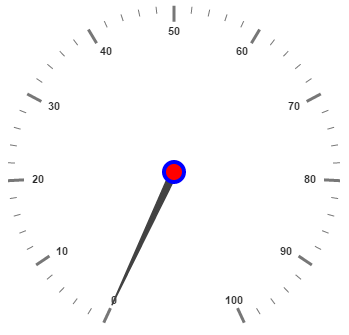

# Scales

**Scales** are the basic functional block of the **Circular Gauge**. By customizing the scales, the appearance of the **Gauge** can be improved. The functional blocks of Circular Gauge are 

* Pointers

* Labels

* CustomLabels

* Indicators

* Ticks

* Ranges

* Sub gauges.

## Adding Scale Collection

**Scale collection** is directly added to the **Gauge** object. Refer the following code example to add scale collection in **Gauge** control.



<ej-circulargauge  id="Gauge1">
       <e-scales>
          <e-scale [radius]=150 >           
          </e-scale>
       </e-scales>
</ej-circulargauge>



Execute the above code to render the following output.

## Scale Customization

**Colors and Border**

The Scale border is modified with the object called **border**. It has two border property namely **color** and **width** which are used to customize the border color of the scale and border width of the scale. Setting the background color improves the look and feel of the **Circular Gauge**. You can customize the background color of the scale using **backgroundColor**. 



<ej-circulargauge  id="CircularGauge1">
       <e-scales>
          <e-scale [radius]=150 [showScaleBar]="true" backgroundColor="red" 
                   [border]="{color: 'Blue',width: 3}" >  
          <e-pointers>
                <e-pointer [length]="100">
                </e-pointer>
            </e-pointers>         
          </e-scale>
       </e-scales>
</ej-circulargauge>



Execute the above code to render the following output.

**Pointer Cap**

**Pointer cap** is a circular shape element that is located at the center of the **Circular Gauge**. The pointer cap is one of the cynosure of the **Circular Gauge**. By customizing the pointer cap, Gauge style is improved. The pointer cap is modified with the object **pointerCap**. It contains radius, borderColor, borderWidth, interiorGradient and backgroundColor properties. The property **radius** is used to set the radius for the pointer cap. **interiorGradient** is used to provide the gradient effects to the pointer cap.



<ej-circulargauge  id="CircularGauge1">
       <e-scales>
          <e-scale [pointerCap.radius]=10 [pointerCap.borderWidth]=4 pointerCap.borderColor="blue"
                    pointerCap.backgroundColor="red" >
          </e-scale>
       </e-scales>
</ej-circulargauge>



Execute the above code to render the following output.

**Appearance**

**Circular Gauge** contains two types of scale direction such as clockwise and counter clockwise. You can set them by enumerable property called **direction**. And you can set the minimum and maximum values for the scale with the properties **minimum** and **maximum**. The two properties **minorIntervalValue** and **majorIntervalValue** are the values used to set interval value for the ticks and labels. The **radius** property is used to set the radius value for the circular scale and the **size** property is used to set the scale bar width. You can also adjust the Opacity of the scale with the property **opacity**. The value for opacity lies between 0 and 1. You can also give some shadow effects for the scale by using the property **shadowOffset.** The property **startAngle** is used to set starting position of the scale at certain angle and **sweepAngle** is used to shrink or expand the scale to certain angle. 



<ej-circulargauge  id="CircularGauge1">
       <e-scales>
          <e-scale [size]=30 [scaleRadius]=130 [minimum]=20 [maximum]=120 [majorIntervalValue]=20
           [minorIntervalValue]=5 direction="counterClockwise" backgroundColor="red" [offset]=20 
           [opacity]=0.5 >
          </e-scale>
       </e-scales>
</ej-circulargauge>



Execute the above code to render the following output.

**Enable/Disable properties**

You can enable / disable properties in Circular Gauge using some properties in scale collection. The **showIndicators** property is used to enable/disable the indicators. **ShowLabels**, **showTicks**, **showRanges**, **showPointers** ans **showScaleBar** are used to enable/ disable labels, ticks, ranges, pointers and scale bar respectively. 

## Multiple Scales

You can set **Multiple scales** for a single **Circular Gauge** control by using an array of scale objects. Each scale object is independent of each other. The following code example refers to two scale objects in a **Gauge**.



<ej-circulargauge  id="CircularGauge1">
       <e-scales>
          <e-scale [size]=30 [scaleRadius]=150 [minimum]=20 [maximum]=120 [majorIntervalValue]=20
           [minorIntervalValue]=5 direction="counterClockwise" backgroundColor="red" [offset]=20 
           [opacity]=0.5 >
            <e-pointers>
                <e-pointer [length]="120" [value]=50 >
                </e-pointer>
            </e-pointers> 
          </e-scale>
          <e-scale [size]=10 [showScaleBar]="false" [scaleRadius]=80 [minimum]=20 [maximum]=120 
                [majorIntervalValue]=10 [labels]="[{ distanceFromScale:40,color:'red'}]"
                direction="counterClockwise" backgroundColor="red" [shadowOffset]=5 [opacity]=0.5 >
            <e-pointers>
                <e-pointer [length]="50" [value]=40 >
                </e-pointer>
            </e-pointers> 
            <e-ticks>
                <e-tick type='major' [distanceFromScale]='40' [height]='16' [width]='1' color='red'>
                </e-tick>
            </e-ticks>
          </e-scale>
       </e-scales>
</ej-circulargauge>



Execute the above code to render the following output.

