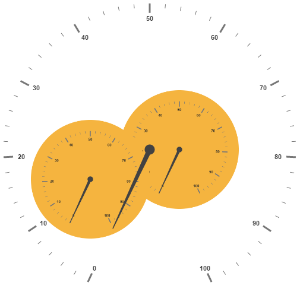

# Sub Gauges

A **Circular Gauge** containing another circular gauge is said to be **Sub Gauges**. In order to make a sample like watch that has second gauge, minute gauge and hour gauge, sub gauges are used.

## Adding SubGauges

Sub gauge collection is directly added to the scale object. Refer the following code example to add custom sub gauge collection in a **Gauge** control.



<ej-circulargauge  id="Gauge1">
</ej-circulargauge>

 <ej-CircularGauge id="circularGauge1">
     <e-scales>
          <e-scale [showSubGauges]="true" [subGauges]="[{gaugeID: 'Gauge1'}]" >           
          </e-scale>
       </e-scales>
  </ej-CircularGauge>



**Basic Customization**

Basic attributes such as **height** and **width** property are used to set height and width of the sub gauge. You can easily position the gauge in another gauge using the **position** object and by giving the **X** and **Y** Coordinates value. **controlID** attribute is used to specify the sub gauge ID.



<ej-circulargauge  id="Gauge1">
</ej-circulargauge>

 <ej-CircularGauge id="circularGauge1">
     <e-scales>
          <e-scale [showSubGauges]="true" [subGauges]="[{gaugeID: 'Gauge1', height:250,
                   width: 250,position: { x: 150, y: 100 }}]" >           
          </e-scale>
       </e-scales>
  </ej-CircularGauge>



Execute the above code to render the following output.

## Multiple SubGauges

You can set multiple sub gauges in a single **Circular Gauge** by adding an array of sub gauge objects. Refer the following code example for multiple sub gauges functionality.



<ej-circulargauge  id="subGauge1"  backgroundColor="#f5b43f">
       <e-scales>
          <e-scale [radius]=150 >           
          </e-scale>
       </e-scales>
</ej-circulargauge>

<ej-circulargauge  id="subGauge2"  backgroundColor="#f5b43f">
       <e-scales>
          <e-scale [radius]=150 >           
          </e-scale>
       </e-scales>
</ej-circulargauge>

 <ej-CircularGauge id="circularGauge1">
     <e-scales>
          <e-scale [showSubGauges]="true" [subGauges]="[{controlID: 'subGauge1',
                            height:200,width: 200,position: { x: 200, y: 150 }},
                           {controlID: 'subGauge2', height:200,width: 200,position: 
                           { x: 50, y: 200 }}]" >           
          </e-scale>
       </e-scales>
  </ej-CircularGauge>



Execute the above code to render the following output.

