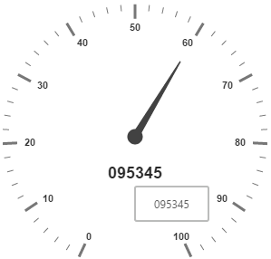

# Tooltip

**Tooltip** feature has been added to the **Circular Gauge**. **Circular Gauge** has several elements such as pointers, label, customLabel, scales, etc. There is a need for **Tooltip** feature in the **Circular Gauge** control because whenever the text hides or overrides with other gauge elements, it may not be fully visible. For resolving those problems **Tooltip** feature has been implemented in the **Circular Gauge** control.

## Default Tooltip

**Tooltip** has three attributes in it. The first two attributes such as **showLabelTooltip** and **showCustomLabelTooltip** are for enabling the **Tooltip** for label as well as custom label in default appearance. 

**ShowLabelTooltip** is to enable the **Tooltip** for labels and **showCustomLabelTooltip** is for enabling the **Tooltip** option for customLabels.



 <ej-CircularGauge id="circularGauge1" [tooltip.showCustomLabelTooltip]="true" 
                                         [tooltip.showCustomLabelTooltip]="true">
     <e-scales>
          <e-scale [showLabels]="true" radius=150 [customLabels]="[{ value: '095345',
                           font: {size: '18px',fontFamily: 'Arial',fontStyle: 'bold'},
                                                        position: { x: 180, y: 220 }}]">         
            <e-pointers>
                <e-pointer [value]=60 [length]="100">
                </e-pointer>
            </e-pointers>
          </e-scale>
       </e-scales>
  </ej-CircularGauge>



Execute the above code to render the following output.

## Tooltip Template

In **Tooltip** option, you can customize the Tooltip window by adding the tooltip template on that page with the help of API **TemplateID**. Refer to the following code example to know more about Tooltip template.



    

        

    

    

        

            <label id="efpercentage">&nbsp;#label#</label>
        

    

 <ej-CircularGauge id="circularGauge1" [tooltip.showCustomLabelTooltip]="true" 
                [tooltip.showCustomLabelTooltip]="true" tooltip.templateID="Tooltip">
     <e-scales>
          <e-scale [showLabels]="true" radius=150 [customLabels]="[{ value: '0 9 5 3 4 5',
                                 font: {size: '18px',fontFamily: 'Arial',fontStyle: 'bold'},
                                                              position: { x: 180, y: 220 }}]">         
            <e-pointers>
                <e-pointer [value]=60 [length]="100">
                </e-pointer>
            </e-pointers>
          </e-scale>
       </e-scales>
  </ej-CircularGauge>



Execute the above code to render the following output.

