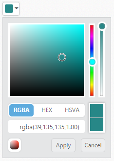

# Getting Started

This section explains briefly about how to create a **ColorPicker** control in your application with **Angular**.

## Create ColorPicker in Angular Application using Webpack

To quick start with Syncfusion JavaScript Angular components run the below commands to clone the repository for [Webpack starter](https://github.com/syncfusion/angular2-seeds) and installing required dependency packages.


 > git clone https://github.com/syncfusion/angular2-seeds

 > cd angular2-seeds

 > npm install


The below steps describes to add ColorPicker component with above cloned seed application.

### Syncfusion JavaScript components source configuration and sample creation

* Copy required Syncfusion Angular source component(s) from the below build location and add it in `src/app/ej` folder.


(Installed Location)\Syncfusion\Essential Studio\14.3.0.49\JavaScript\assets-src\angular2\ 


N> `core.ts` file is mandatory for all Syncfusion JavaScript Angular components. The repository having the source file from Essential Studio for JavaScript v14.3.0.49.

* Create `colorpicker` folder inside `src/app` folder.

* Create `colorpicker.component.html` view file inside `src/app/colorpicker` folder and render ejColorPicker Angular component using the below code example. 


    <input id="colorpicker" ej-colorpicker value="#278787" />


* Create `colorpicker.component.ts` model file inside the folder `src/app/colorpicker` and create colorpicker sample component using the below code example.


import { Component, ViewEncapsulation } from '@angular/core';

@Component({
  selector: 'ej-app',
  templateUrl: './colorpicker.component.html'
})
export class ColorPickerComponent { }


### Configure the routes for the Router

Before adding router configuration for above created ejColorPicker component, we recommend you to go through the [Angular Routing](https://angular.io/docs/ts/latest/guide/router.html) configuration to get the deeper knowledge about Angular routing. 

* Now, we are going to configure the route navigation link for created ColorPicker sample in `src/app/app.component.html` file.



	<ul class="nav navbar-nav">
		. . . .
		<li><a data-toggle="collapse" data-target="#skeleton-navigation-navbar-collapse.in" href="#colorpicker" [routerLink]="['/colorpicker']">ColorPicker </a></li>
	</ul>

<main>
	<router-outlet></router-outlet>
</main>


* Import the ejColorPicker sample component and define the route in `src/app/app.routes.ts` file.


import { Routes } from '@angular/router';
. . . . 
import { ColorPickerComponent } from './colorpicker/colorpicker.component';

export const rootRouterConfig: Routes = [
    { path: '', redirectTo: 'home', pathMatch: 'full' },
    . . . . 
    { path: 'colorpicker', component: ColorPickerComponent }
];


* Import and declare the Syncfusion source component and ejColorPicker sample component into `app.module.ts` like the below code snippet.


import { NgModule, enableProdMode, ErrorHandler } from '@angular/core';
. . . . . 
import { EJ_COLORPICKER_COMPONENTS } from './ej/colorpicker.component';
import { ColorPickerComponent } from './colorpicker/colorpicker.component';

import { rootRouterConfig } from './app.routes';
. . . . 
@NgModule({
  imports: [BrowserModule, FormsModule, HttpModule, RouterModule.forRoot(rootRouterConfig, { useHash: true })],
  declarations: [. . . . , EJ_COLORPICKER_COMPONENTS, ColorPickerComponent],
  bootstrap: [AppComponent]
})
export class AppModule { }


### Running the application

* To run the application, execute below command.


npm start


* Browse to [http://localhost:3000](http://localhost:3000) to see the application. And navigate to ColorPicker tab. The component is rendered as like the below screenshot. You can make changes in the code found under src folder and the browser should auto-refresh itself while you save files. 

N> if you want to use other port, open `package.json` file, then change port in `--port 3000` script and also change the port in `config/webpack.dev.js`.

## Create ColorPicker in Angular Application using SystemJS  

To quick start with Syncfusion JavaScript Angular components run the below commands to clone the repository for [SystemJS starter](https://github.com/syncfusion/angular2-seeds/tree/systemjs) and installing required dependency packages.


 > git clone https://github.com/syncfusion/angular2-seeds/ -b systemjs

 > cd angular2-seeds

 > npm install


The below steps describes to add colorpicker component with above cloned seed application.

### Syncfusion JavaScript components source configuration and sample creation

* Copy required Syncfusion Angular source component(s) from the below build location and add it in `src/ej` folder.


(Installed Location)\Syncfusion\Essential Studio\14.3.0.49\JavaScript\assets-src\angular2\ 


N> `core.ts` file is mandatory for all Syncfusion JavaScript Angular components. The repository having the source file from Essential Studio for JavaScript v14.3.0.49.

* Create `colorpicker` folder inside `src` folder.

* Create `colorpicker.component.html` view file inside `src/colorpicker` folder and render ejColorPicker Angular component using the below code example. 


     <input id="colorpicker" ej-colorpicker value="#278787" />


* Create `colorpicker.component.ts` model file inside the folder `src/colorpicker` and create colorpicker sample component using the below code example.


import { Component, ViewEncapsulation } from '@angular/core';

@Component({
  selector: 'ej-app',
  templateUrl: 'src/colorpicker/colorpicker.component.html'
})
export class ColorPickerComponent { }


### Configure the routes for the Router

Before adding router configuration for above created ejColorPicker component, we recommend you to go through the [Angular Routing](https://angular.io/docs/ts/latest/guide/router.html) configuration to get the deeper knowledge about Angular routing. 

* Now, we are going to configure the route navigation link for created ColorPicker sample in `src/app.component.html` file.



	<ul class="nav navbar-nav">
		. . . .
		<li><a data-toggle="collapse" data-target="#skeleton-navigation-navbar-collapse.in" href="#colorpicker" [routerLink]="['/colorpicker']">ColorPicker </a></li>
	</ul>

<main>
	<router-outlet></router-outlet>
</main>


* Import the ejColorPicker sample component and define the route in `src/app.routes.ts` file.


import { Routes } from '@angular/router';
. . . . 
import { ColorPickerComponent } from './colorpicker/colorpicker.component';

export const rootRouterConfig: Routes = [
    { path: '', redirectTo: 'home', pathMatch: 'full' },
    . . . . 
    { path: 'colorpicker', component: ColorPickerComponent }
];


* Import and declare the Syncfusion source component and ejColorPicker sample component into `app.module.ts` like the below code snippet.


import { NgModule, enableProdMode, ErrorHandler } from '@angular/core';
. . . . . 
import { EJ_COLORPICKER_COMPONENTS } from './ej/colorpicker.component';
import { ColorPickerComponent } from './colorpicker/colorpicker.component';

import { rootRouterConfig } from './app.routes';
. . . . 
@NgModule({
  imports: [BrowserModule, FormsModule, HttpModule, RouterModule.forRoot(rootRouterConfig, { useHash: true })],
  declarations: [. . . . , EJ_COLORPICKER_COMPONENTS, ColorPickerComponent],
  bootstrap: [AppComponent]
})
export class AppModule { }


### Running the application

* To run the application, execute below command.


npm start


* Browse to [http://localhost:3000](http://localhost:3000) to see the application. And navigate to ColorPicker tab. The component is rendered as like the below screenshot. You can make changes in the code found under src folder and the browser should auto-refresh itself while you save files. 

