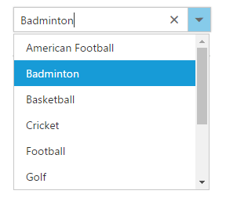

# Getting Started

The external script dependencies of the ComboBox widget are,

* [jQuery 1.7.1](http://jquery.com/) and later versions.

And the internal script dependencies of the ComboBox widget are:

<table>
	<tr>
		<th>File </th>
		<th>Description / Usage </th>
	</tr>
	<tr>
		<td>ej.core.min.js</td>
		<td>Must be referred always before using all the JS controls.</td>
	</tr>
	<tr>
		<td>ej.data.min.js</td>
		<td>Used to handle data operation and should be used while binding data to JS controls.</td>
	</tr>
	<tr>
		<td>ej.combobox.min.js</td>
		<td>The ComboBox's main file</td>
	</tr>
	<tr>
		<td>ej.globalize.min.js</td>
		<td>processing specific source-side actions globally.</td>
	</tr>
</table>

For getting started you can use the ‘ej.web.all.min.js’ file, which encapsulates all the 'ej' controls and frameworks in one single file.  

For themes, you can use the ‘ej.web.all.min.css’ CDN link from the snippet given. To add the themes in your application, please refer [this link](https://help.syncfusion.com/js/theming-in-essential-javascript-components#adding-specific-theme-to-your-application).

## Creating ComboBox in Angular

The ComboBox can be initialized through input or select element.The ComboBox can be created from a HTML ‘input’ element with the HTML 'id' attribute and pre-defined options set to it. To create the ComboBox, you should call the 'ejComboBox' jQuery plug-in function.

Add the HTML input element that needs to be initialized as ComboBox in html.


	
	<input id="gameList" ej-combobox width="100%" [placeholder]="placeholder"/>
			


## Binding Data Source

After initializing, populate the ComboBox with data using the [dataSource](https://help.syncfusion.com/api/js/ejcombobox#members:datasource) property. Here, data object is passed to the ComboBox component.	
	

	
	<input id="List" ej-combobox [dataSource]="data" [fields]="fields" width="100%" />
			

		
	
	
		import {Component} from '@angular/core';

         @Component({
           selector: 'ej-app',
           templateUrl: 'app/components/combobox/combobox.component.html' //give the path file for ComboBox component html file.
          })
          export class DropDownListComponent {
                data: Array<Object> = [];
                fields: Object;
                value: string;
                constructor() {
                this.data = [
                   { id: 'level1', game: 'American Football' }, { id: 'level2', game: 'Badminton' },
	               { id: 'level3', game: 'Basketball' }, { id: 'level4', game: 'Cricket' },
	               { id: 'level5', game: 'Football' }, { id: 'level6', game: 'Golf' },
	               { id: 'level7', game: 'Hockey' }, { id: 'level8', game: 'Rugby' },
	               { id: 'level9', game: 'Snooker' }, { id: 'level10', game: 'Tennis' }
                  ];
              this.fields = { dataSource: this.data, text: "game", value: "id" };
              }
            }		
	


After completing the configuration required to render a basic ComboBox, run the above sample to display the output in your default browser.
	

## Custom Values

The ComboBox allows the user to give input as custom value which is not required to present in predefined set of values. By default, this support is enabled by [allowCustom](https://help.syncfusion.com/api/js/ejcombobox#members:allowcustom) property. In this case, both text field and value field considered as same. The custom value will be sent to post back handler when a form is about to be submitted.


	
	 <input id="List" ej-combobox [dataSource]="data" [fields]="fieldsvalues" width="100%" [allowCustom]="true"/>
			


## Configure the Popup List

By default, the width of the popup list automatically adjusts according to the ComboBox input element's width, and the height of the popup list has '300px'.

The height and width of the popup list can also be customized using the [popupHeight](https://help.syncfusion.com/api/js/ejcombobox#members:popupheight) and [popupWidth](https://help.syncfusion.com/api/js/ejcombobox#members:popupwidth) properties respectively.

In the following sample, popup list's width and height are configured.



	 <input id="List" ej-combobox [dataSource]="data" [fields]="fields"  [popupHeight]="height" [popupWidth]="width"/>


	
	
	
		import {Component} from '@angular/core';

         @Component({
           selector: 'ej-app',
           templateUrl: 'app/components/combobox/combobox.component.html' //give the path file for ComboBox component html file.
          })
          export class DropDownListComponent {
                data: Array<Object> = [];
                fields: Object;
                width: string;
				height: string;
                constructor() {
                this.data = [
                   { id: 'level1', game: 'American Football' }, { id: 'level2', game: 'Badminton' },
	               { id: 'level3', game: 'Basketball' }, { id: 'level4', game: 'Cricket' },
	               { id: 'level5', game: 'Football' }, { id: 'level6', game: 'Golf' },
	               { id: 'level7', game: 'Hockey' }, { id: 'level8', game: 'Rugby' },
	               { id: 'level9', game: 'Snooker' }, { id: 'level10', game: 'Tennis' }
                  ];
              this.fields = { dataSource: this.data, text: "game", value: "id" };
			  this.height = "300px";
			  this.width  = "400px";
              }
            }		
	


