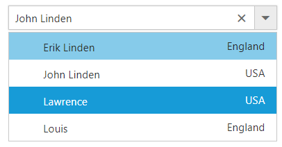
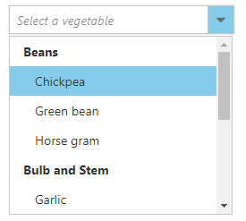
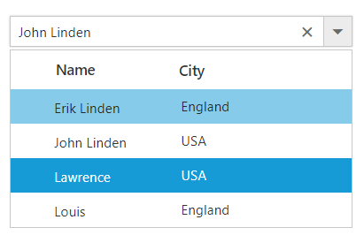
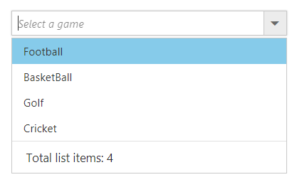
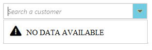
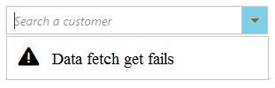

# Templates

The ComboBox has been provided with several options to customize each list item, group title, selected value, header, and footer elements. 

## Item template

The content of each list item within the ComboBox can be customized with the help of [itemTemplate](https://help.syncfusion.com/api/js/ejcombobox#members:itemtemplate) property.

In the following sample, each list item is split into two columns to display relevant data's.


	
	<input ej-combobox width="100%" [dataSource]="data" [fields]="fields"  [itemTemplate]="Template" type="text" id="list" />
			

		
	
	
		import {Component} from '@angular/core';

         @Component({
           selector: 'ej-app',
           templateUrl: 'app/components/combobox/combobox.component.html' //give the path file for ComboBox component html file.
          })
          export class DropDownListComponent {
                data: Array<Object> = [];
                fields: Object;
                Template: any;
              constructor() {
                    this.data = [
                   { text: 'John Linden', status: 'Available', country: 'USA' },
                   { text: 'Erik Linden',  status: 'Available', country: 'England' },
                   { text: 'Louis',  status: 'Available', country: 'England' },
                   { text: "Lawrence", status: "Available", country: 'USA' }];
                  this.fields = { dataSource: this.data, text: 'text', value: 'country'};
                  this.Template = "${text}${country}";
            }
            }		
	


	



## Group template

The group header title under which appropriate sub-items are categorized can also be customized with the help of [groupTemplate](https://help.syncfusion.com/api/js/ejcombobox#members:grouptemplate) property.

This template is common for both inline and floating group header template.

In the following sample, vegetables are grouped according to the category.


	
	<input ej-combobox width="250px" [dataSource]="data" [fields]="fields"  [groupTemplate]="Template" type="text" id="list" />
			

		
	
	
		import {Component} from '@angular/core';

         @Component({
           selector: 'ej-app',
           templateUrl: 'app/components/combobox/combobox.component.html' //give the path file for ComboBox component html file.
          })
          export class DropDownListComponent {
                data: Array<Object> = [];
                fields: Object;
                Template: any;
              constructor() {
                this.data = [
                  { vegetable: 'Cabbage', category: 'Leafy and Salad' }, { vegetable: 'Spinach', category: 'Leafy and Salad' },
                  { vegetable: 'Wheat grass', category: 'Leafy and Salad' }, { vegetable: 'Yarrow', category: 'Leafy and Salad' },
				  { vegetable: 'Chickpea', category: 'Beans' }, { vegetable: 'Green bean', category: 'Beans' },
				  { vegetable: 'Horse gram', category: 'Beans' }, { vegetable: 'Garlic', category: 'Bulb and Stem' },
				  { vegetable: 'Nopal', category: 'Bulb and Stem' }, { vegetable: 'Onion', category: 'Bulb and Stem' }];
              this.fields = { groupBy: 'category', text: 'vegetable',value: 'vegetable' };
              this.Template = "<strong>${category}</strong>";
            }
            }		
	


## Header template

The header element is shown statically at the top of the popup list items within the ComboBox, and any custom element can be placed as a header element using the [headerTemplate](https://help.syncfusion.com/api/js/ejcombobox#members:headertemplate) property.

In the following sample, the list items and its headers are designed and displayed as two columns similar to multiple columns of the grid.


	
	<input ej-combobox [dataSource]="data" [fields]="fields" [itemTemplate]="item"  [headerTemplate]="Template" type="text" id="list" />
			

		
	
	
		import {Component} from '@angular/core';

         @Component({
           selector: 'ej-app',
           templateUrl: 'app/components/combobox/combobox.component.html' //give the path file for ComboBox component html file.
          })
          export class DropDownListComponent {
                data: Array<Object> = [];
                fields: Object;
                item: any;
                Template: any;
              constructor() {
                 this.data = [
                   { text: 'John Linden', status: 'Available', country: 'USA' },
                   { text: 'Erik Linden',  status: 'Available', country: 'England' },
                   { text: 'Louis',  status: 'Available', country: 'England' },
                   { text: "Lawrence", status: "Available", country: 'USA' }];
                  this.fields = { text: 'text', value: 'country'};
                  this.item = "${text}${country}";
                  this.Template = "NameCity";
            }
            }		
	


	

    



## Footer template

The ComboBox has options to show a footer element at the bottom of the list items in the popup list. Here, you can place any custom element as a footer element using the [footerTemplate](https://help.syncfusion.com/api/js/ejcombobox#members:footertemplate) property.

In the following sample, footer element displays the total number of list items present in the ComboBox.


	
	<input ej-combobox [dataSource]="data" [footerTemplate]="Template" type="text" id="list" />
			

	
	
	
		import {Component} from '@angular/core';

         @Component({
           selector: 'ej-app',
           templateUrl: 'app/components/combobox/combobox.component.html' //give the path file for ComboBox component html file.
          })
          export class DropDownListComponent {
               data: Array<Object> = [];
               fields: Object;
               Template: any;
            constructor() {
                 this.data =['Badminton', 'Cricket', 'Football', 'Golf'];
                 this.fields = { text: 'text',value: 'country' };
                 this.Template = " Total list items: "+ this.data.length +""
               }
            }		
	


	

    



## No records template

The ComboBox is provided with support to custom design the popup list content when no data is found and no matches found on search with the help of [noRecordsTemplate](https://help.syncfusion.com/api/js/ejcombobox#members:norecordstemplate) property.

In the following sample, popup list content displays the notification of no data available.


	
	<input ej-combobox [dataSource]="data" [noRecordsTemplate]="Template" type="text" id="list" />
			

	
	
	
		import {Component} from '@angular/core';

         @Component({
           selector: 'ej-app',
           templateUrl: 'app/components/combobox/combobox.component.html' //give the path file for ComboBox component html file.
          })
          export class DropDownListComponent {
               data: Array<Object> = [];
               fields: Object;
               Template: any;
            constructor() {
                 this.data =[];
                 this.fields = { text: 'text',value: 'country' };
                 this.Template = " NO DATA AVAILABLE"
               }
            }		
	


	

    



## Action failure template

There is also an option to custom design the popup list content when the data fetch request fails at the remote server. This can be achieved using the [actionFailureTemplate](https://help.syncfusion.com/api/js/ejcombobox#members:actionfailuretemplate) property.

In the following sample, when the data fetch request fails, the ComboBox displays the notification.


	
	  <input id="List" ej-combobox [dataSource]="data" [fields]="fields" [actionFailureTemplate]="Template" [query]="queries"  [placeholder]="placeholder"  />
			

	
	
	
		import {Component} from '@angular/core';

         @Component({
           selector: 'ej-app',
           templateUrl: 'app/components/combobox/combobox.component.html' //give the path file for ComboBox component html file.
          })
          export class DropDownListComponent {
                data: Array<Object> = [];
                fields: Object;
				queries: any;
                Template: any;
				placeholder: string;
                constructor() {
                  let dataManager = new ej.DataManager({
                      url: 'https://js.syncfusion.com/demos/ejServices/Wcf/Northwind.svc/Customers',
                      crossDomain: true
               });
                  let query = new ej.Query().take(6);
                  this.queries = query;
		          this.data = dataManager;
                  this.fields = {text: "CustomerID", value: "CustomerID" };
				  this.placeholder = 'Select a customer';
                  this.Template = " Data fetch get fails"
              }
            }		
	


	

    



