# Automatic Layout

Diagram provides support to auto-arrange the nodes in the Diagram area that is referred as **Layout**. It includes the following layout modes.

* Hierarchical Layout
* Organization Chart
* Radial Tree

## Hierarchical Layout

The Hierarchical Tree Layout arranges nodes in a tree-like structure, where the nodes in the hierarchical layout may have multiple parents. There is no need to specify the layout root.
To arrange the nodes in hierarchical structure, you need to specify the layout `type` as hierarchical tree. The following example shows how to arrange the nodes in a hierarchical structure.


 

    <ej-diagram id="diagramCore" width="100%" height="450" [dataSourceSettings]="dataSourceSettings" 
    [layout]="layout" [defaultSettings]="defaultSettings" 
    [nodeTemplate]="nodeTemplate">
 </ej-diagram>





import { Component } from '@angular/core';

@Component({
    selector: 'ej-app',
    templateUrl: 'app/components/diagram/hierarchical-layout.component.html',
})
export class HierarchicalLayoutComponent {
    dataSourceSettings: Object;
    defaultSettings: Object;
    layout: Object;
    nodeTemplate: Object;
    constructor() {
        //Initializes data source
        let data = [
            {Name: "Steve-CEO"},
            {Name: "Kevin-Manager",ReportingPerson: "Steve-CEO"},
            {Name: "Peter-Manager",ReportingPerson: "Steve-CEO"},
            {Name: "John- Manager",ReportingPerson: "Peter-Manager"},
            {Name: "Mary-CSE ",ReportingPerson: "Peter-Manager"},
            {Name: "Jim-CSE ",ReportingPerson: "Kevin-Manager"},
            {Name: "Martin-CSE",ReportingPerson: "Kevin-Manager"}
            ];
            this.defaultSettings = {
            node: {
                width: 100, height: 40,fillColor: '#88C65C',
                labels: [{ name: 'label1', fontColor: 'white', fontSize: 12 }]
            },
            connector: { lineColor: '#000000', constraints: ej.datavisualization.Diagram.ConnectorConstraints.None, segments: [{ 'type': 'orthogonal' }], }
        };
        this.layout = { type: ' ej.datavisualization.Diagram.LayoutTypes.HierarchicalTree',orientation: "ej.datavisualization.Diagram.LayoutOrientations.TopToBottom", horizontalSpacing: 25, verticalSpacing: 35, marginX : 3, marginY: 3};
        this.nodeTemplate = function (diagram, node) {
            node.labels[0].text = node.Name;
        };
        this.dataSourceSettings = { id: 'Name', parent: 'ReportingPerson', dataSource: data};
    }
}



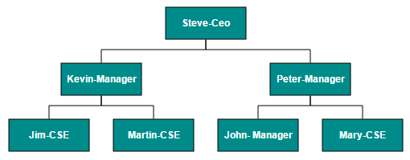

N> You can ignore a particular Node from layout arrangement by setting its **excludeFromLayout** property as true.

## Radial Tree Layout

The Radial Tree layout arranges nodes on a virtual concentric circles around a root node. Sub-trees formed by the branching of child nodes are located radially around the child nodes. This arrangement results in an ever-expanding concentric arrangement with radial proximity to the root node indicating the node level in the hierarchy. When no root node is set, the algorithm automatically considers one of the Diagram nodes as the root node.

To arrange nodes in a radial tree structure, you need to set the `layout.type` as `ej.datavisualization.Diagram.LayoutTypes.RadialTree`. The following code illustrates how to arrange the nodes in a radial tree structure.



//Initializes data source

import { Component, ViewChild } from '@angular/core';
import { EJComponents } from './../../ej/core';

@Component({
    selector: 'ej-app',
    templateUrl: 'app/components/diagram/radial-tree.component.html'
})

export class RadialTreeComponent {
    @ViewChild('diagram') diagram: EJComponents<any, any>;
    dataSourceSettings: Object;
    defaultSettings: Object;
    layout: Object;
    pageSettings: Object;
    snapSettings: Object;
    tool: Object;
    nodeTemplate: Object;
    constructor() {
        let data =[
                {
                    Id: "parent",
                    ImageUrl: "images/Clayton.png
                },
                {
                    Id: 1,
                    ImageUrl: "images/image55.png",
                    ReportingPerson: "parent"
                },
                {
                    Id: 2,
                    ImageUrl: "images/Robin.PNG",
                    ReportingPerson: "parent"
                },
                {
                    Id: 3,
                    ImageUrl: "images/Robin.PNG",
                    ReportingPerson: "parent"
                },
                {
                    Id: 4,
                    ImageUrl: "images/Paul.png",
                    ReportingPerson: "parent"
                },
                {
                    Id: 5,
                    ImageUrl: "images/image53.png",
                    ReportingPerson: "parent"
                },
                {
                    Id: 6,
                    ImageUrl: "images/Maria.png",
                    ReportingPerson: "parent"
                },
                {
                    Id: 7,
                    ImageUrl: "images/Jenny.png",
                    ReportingPerson: 3
                },
                {
                    Id: 8,
                    ImageUrl: "images/Thomas.PNG",
                    ReportingPerson: "parent"
                },
                {
                    Id: 9,
                    ImageUrl: "images/Jenny.png",
                    ReportingPerson: 2
                },
                {
                    Id: 10,
                    ImageUrl: "images/Thomas.png",
                    ReportingPerson: 2
                },
                {
                    Id: 11,
                    ImageUrl: "images/Maria.PNG",
                    ReportingPerson: 4
                },
                {
                    Id: 12,
                    ImageUrl: "images/Thomas.PNG",
                    ReportingPerson: 1
                },
                {
                    Id: 13,
                    ImageUrl: "images/Clayton.png",
                    ReportingPerson: 6
                },
                {
                    Id: 14,
                    ImageUrl: "images/Jenny.png",
                    ReportingPerson: 3
                },
                {
                    Id: 15,
                    ImageUrl: "images/Thomas.png",
                    ReportingPerson: 3
                },
                {
                    Id: 16,
                    ImageUrl: "images/John.png",
                    ReportingPerson: 6
                },
                {
                    Id: 17,
                    ImageUrl: "images/Jenny.png",
                    ReportingPerson: 4
                },
                {
                    Id: 18,
                    ImageUrl: "images/Robin.png",
                    ReportingPerson: 4
                },
                {
                    Id: 19,
                    ImageUrl: "images/Clayton.png",
                    ReportingPerson: 4
                },
                {
                    Id: 20,
                    ImageUrl: "images/image57.png",
                    ReportingPerson: 12
                },
                {
                    Id: 21,
                    ImageUrl: "images/Robin.png",
                    ReportingPerson: 5
                },
                {
                    Id: 22,
                    ImageUrl: "images/image51.png",
                    ReportingPerson: 6
                },
                {
                    Id: 23,
                    ImageUrl: "images/image55.png",
                    ReportingPerson: 19
                },
                {
                    Id: 24,
                    ImageUrl: "images/Thomas.png",
                    ReportingPerson: 8
                },
                {
                    Id: 25,
                    ImageUrl: "images/image56.png",
                    ReportingPerson: 8
                },
                {
                    Id: 26,
                    ImageUrl: "images/image55.png",
                    ReportingPerson: 1
                },
                {
                    Id: 27,
                    ImageUrl: "images/image57.png",
                    ReportingPerson: 13
                },
                {
                    Id: 28,
                    ImageUrl: "images/Robin.PNG",
                    ReportingPerson: 12
                },
                {
                    Id: 29,
                    ImageUrl: "images/Thomas.PNG",
                    ReportingPerson: 13
                },
                {
                    Id: 30,
                    ImageUrl: "images/image57.png",
                    ReportingPerson: 19
                }
            ]
        this.dataSourceSettings = { id: 'Id', parent: 'ReportingPerson', dataSource: data };
        this.defaultSettings = {
            node: {
                width: 50, height: 50,  borderColor: 'transparent', type: 'image'
            },
        };
        this.layout = {
        type: "ej.datavisualization.Diagram.LayoutTypes.RadialTree",
        horizontalSpacing: 30,
        verticalSpacing: 30
    };
        this.nodeTemplate = function (diagram, node) {
        node.name = node.Id;
        node.source = node.ImageUrl;
    };
    }
    ngAfterViewInit() {
        this.diagram.widget.fitToPage();
    }
}


## Organizational Chart

An **organizational chart** is a Diagram that displays the structure of an organization and relationships. To create an organizational chart, `layout.type` should be set as `ej.datavisualization.Diagram.LayoutTypes.OrganizationalChart`.
The following code example illustrates how to create an organizational chart.



//Initializes data source
import { Component } from '@angular/core';

@Component({
    selector: 'ej-app',
    templateUrl: 'app/components/diagram/organizational-chart.component.html',
})
export class OrganizationalChartComponent {
    dataSourceSettings: Object;
    defaultSettings: Object;
    layout: Object;
    nodeTemplate: Object;
    constructor() {
        let data = [{
            Id: "parent",
            Role: "Project Management"
        },
            {
                Id: 1,
                Role: "R&D Team",
                Team: "parent"
            },
            {
                Id: 3,
                Role: "Philosophy",
                Team: "1"
            },
            {
                Id: 4,
                Role: "Organization",
                Team: "1"
            },
            {
                Id: 5,
                Role: "Technology",
                Team: "1"
            },
            {
                Id: 7,
                Role: "Funding",
                Team: "1"
            },
            {
                Id: 8,
                Role: "Resource Allocation",
                Team: "1"
            },
            {
                Id: 9,
                Role: "Targeting",
                Team: "1"
            },
            {
                Id: 11,
                Role: "Evaluation",
                Team: "1"
            },
            {
                Id: 156,
                Role: "HR Team",
                Team: "parent"
            },
            {
                Id: 13,
                Role: "Recruitment",
                Team: "156"
            },
            {
                Id: 113,
                Role: "Training",
                Team: "12"
            },
            {
                Id: 112,
                Role: "Employee Relation",
                Team: "156"
            },
            {
                Id: 14,
                Role: "Record Keeping",
                Team: "12"
            },
            {
                Id: 15,
                Role: "Compensations & Benefits",
                Team: "12"
            },
            {
                Id: 16,
                Role: "Compliances",
                Team: "12"
            },
            {
                Id: 17,
                Role: "Production & Sales Team",
                Team: "parent"
            },
            {
                Id: 119,
                Role: "Design",
                Team: "17"
            },
            {
                Id: 19,
                Role: "Operation",
                Team: "17"
            },
            {
                Id: 20,
                Role: "Support",
                Team: "17"
            },
            {
                Id: 21,
                Role: "Quality Assurance",
                Team: "17"
            },
            {
                Id: 23,
                Role: "Customer Interaction",
                Team: "17"
            },
            {
                Id: 24,
                Role: "Support and Maintenance",
                Team: "17"
            },
            {
                Id: 25,
                Role: "Task Coordination",
                Team: "17"
            }
        ];
        this.dataSourceSettings = {
            id: "Id",
            parent: "Team",
            dataSource: data
        };
        this.defaultSettings = {
            node: {
                width: 100, height: 40, borderColor: 'black', fillColor: "#546e20",
                labels: [{ name: 'label1', fontColor: '#ffffff' }]
            },
            connector: { lineColor: '#000000', segments: [{ 'type': 'orthogonal' }], targetDecorator: { shape: 'none' } }
        };
        this.layout = { type: ' ej.datavisualization.Diagram.LayoutTypes.OrganizationalChart' };
        this.nodeTemplate = function (diagram, node) {
            node.labels[0].text = node.Role;
        };
    }
}



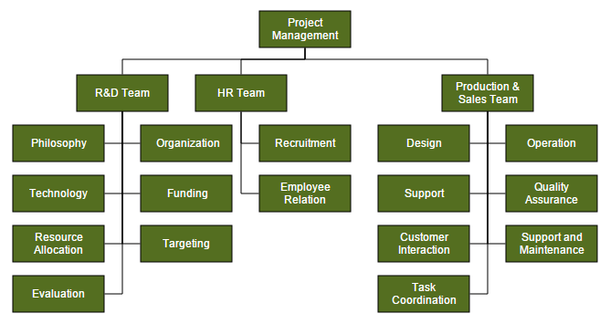

Organizational chart layout starts parsing from root and iterate through all its child elements. ‘getLayoutInfo’ method provides necessary information of a node’s children and the way to arrange (direction, orientation, offsets, etc.) them. You can customize the arrangements by overriding this function as explained.

### GetLayoutInfo

You can set Chart orientations, chart types, and offset to be left between parent and child nodes by overriding the method, diagram.model.layout.getLayoutInfo. The getLayoutInfo method is called to configure every subtree of the organizational chart. It takes the following arguments.

* `diagram`: Reference of diagram
* `node`: Parent node to that options are to be customized
* `options`: object to set the customizable properties

The following code example illustrates how to define the method getLayoutInfo.



let chartOrientations = ej.datavisualization.Diagram.ChartOrientations;
let chartTypes = ej.datavisualization.Diagram.ChartTypes;

//Defines getLayoutInfo
this.getLayoutInfo(diagram, node, options) {
    options.orientation = chartOrientations.Vertical;

    //Configures the sub tree of the node vertically at right-side.
    options.type = chartTypes.Right;
    options.offset = 10;
}
   //Uses layout to auto-arrange nodes on the Diagram page
    this.layout = {
        type: "ej.datavisualization.Diagram.LayoutTypes.OrganizationalChart",
        getLayoutInfo: getLayoutInfo
    };



The following table illustrates the properties that "options" argument takes.

Property|Description|Default Value
---|---|---
options.children|Contains the list of child nodes. Children collection can be modified.|Array of child nodes
options.assistants|By default, the collection is empty. When any of the child nodes have to be set as "Assistant", you can remove from children collection and have to insert into assistants collection. |Empty array
options.orientation|Gets or sets the organizational chart orientation. |ChartOrientation.Vertical
options.type|Gets or sets the chart organizational chart type |For horizontal chart orientation:ChartType.Center For Vertical chart orientation:ChartType.Alternate
options.offset|Offset is the horizontal space to be left between parent and child nodes.|20 pixels.Applicable only for vertical chart orientations.
options.hasSubTree|Gets whether the node contains sub trees.|Boolean
options.level|Gets the depth of the node from layout root|Number
options.enableRouting|By default, Connections are routed based on the chart type and orientations.This property gets or sets whether default routing is to be enabled or disabled.|true
options.rows|Sets the number of rows on which the child nodes will be arranged. Applicable only for balanced type horizontal tree |Number

The following table illustrates the different chart orientations and chart types.

| Orientation | Type | Description | Example |
|---|---|---|---|
| Horizontal | Left | Arranges the child nodes horizontally at the left side of parent. | 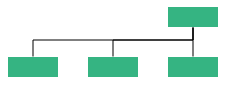 |
| | Right | Arranges the child nodes horizontally at the right side of parent. | 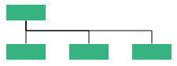 |
| | Center | Arranges the children like standard tree layout orientation. | 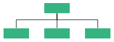 |
| | Balanced | Arranges the leaf-level child nodes in multiple rows. | 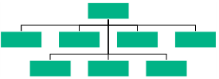 |
| Vertical | Left | Vertically arranges the children at the left side of parent | 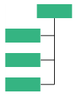 |
| | Right | Vertically arranges the children at the right side of parent | 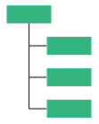 |
| | Alternate | Vertically arranges the children at both left and right sides of parent |  |

## Customize Layout

Orientation, spacings, and position of layout can be customized with a set of properties.

To explore layout properties, refer to [Layout Properties](/api/js/ejDiagram#members:layout "Layout Properties").

### Layout Bounds 

Diagram provides support to align the layout within any custom rectangular area. For more information about bounds, refer to [Layout Bounds] (/api/js/ejDiagram#members:layout-bounds "Layout Bounds")

### Layout Alignment

You can align the layout anywhere over the layout bounds/viewport using the `horizontalAlignment` and `verticalAlignment` properties of layout.

The following code illustrates how to align the layout at the top left of the layout bounds.



import { Component } from '@angular/core';

@Component({
    selector: 'ej-app',
    templateUrl: 'app/components/diagram/organizational-chart.component.html',
})
export class OrganizationalChartComponent {
    layout: Object;
    dataSourceSettings: Object;
    defaultSettings: Object;
    nodeTemplate: Object;

    constructor() {
    //Uses layout to auto-arrange nodes on the Diagram page
    this.layout = {
        //Sets the type of the layout
        type: ej.datavisualization.Diagram.LayoutTypes.HierarchicalTree,
        orientation:  ej.datavisualization.Diagram.LayoutOrientations.TopToBottom,
        horizontalSpacing: 25,
        verticalSpacing: 30,

        //Sets the layout bounds
        bounds: {
            x: 0,
            y: 0,
            width: 500,
            height: 500
        },

        //Sets the alignment of the layout
        horizontalAlignment: ej.datavisualization.Diagram.HorizontalAlignment.Left,
        verticalAlignment: ej.datavisualization.Diagram.VerticalAlignment.Top,
    };
    this.defaultSettings = {
        //Sets the default properties of the node.
        //Sets the default properties of the connector.
    };
    //Initializes the node template.
    this.nodeTemplate = "nodeTemplate";
    //Configures data source for Diagram
    this.dataSourceSettings = {
        //Specifies the dataSource
    };
}};



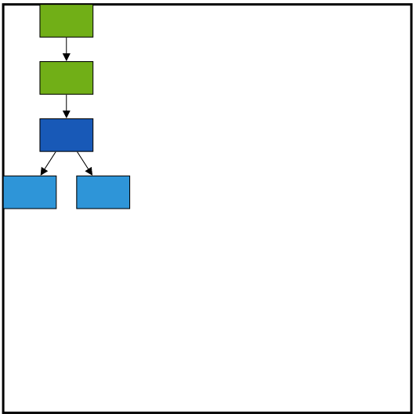

### Layout Margin

Layout provides support to add some blank space between the layout bounds/viewport and the layout. The `margin` property of the layout allows you to set the blank space.

The following code illustrates how to set the layout margin.



export class OrganizationalChartComponent {
    layout: Object;
    dataSourceSettings: Object;
    defaultSettings: Object;
    nodeTemplate: Object;

    constructor() {
    //Uses layout to auto-arrange nodes on the Diagram page
    this.layout = {
        //Sets the type of the layout
        type: ej.datavisualization.Diagram.LayoutTypes.HierarchicalTree,
        orientation:  ej.datavisualization.Diagram.LayoutOrientations.TopToBottom,
        horizontalSpacing: 25,
        verticalSpacing: 30,

        //Sets the layout bounds
        bounds: {
            x: 0,
            y: 0,
            width: 500,
            height: 500
        },

        //Sets the alignment of the layout
        horizontalAlignment: ej.datavisualization.Diagram.HorizontalAlignment.Left,
        verticalAlignment: ej.datavisualization.Diagram.VerticalAlignment.Top,
         //Sets the margin
        margin: {
            left: 10,
            right: 10,
            top: 10,
            bottom: 10
        }
    };
    this.defaultSettings = {
        //Sets the default properties of the node.
        //Sets the default properties of the connector.
    };
    //Initializes the node template.
    this.nodeTemplate = "nodeTemplate";
    //Configures data source for Diagram
    this.dataSourceSettings = {
        //Specifies the dataSource
    };
}};



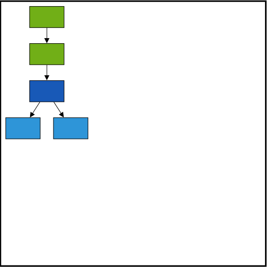

### Layout Orientation

Diagram provides support to customize the orientation of layout. You can set the desired orientation using `layout.orientation`. For more information about orientation, refer to [Layout Orientations](/api/js/global#layoutorientations "Layout Orientations")

The following code illustrates how to arrange the nodes in a "BottomToTop" orientation.



export class OrganizationalChartComponent {
    layout: Object;
    dataSourceSettings: Object;
    defaultSettings: Object;
    nodeTemplate: Object;

    constructor() {
    //Uses layout to auto-arrange nodes on the Diagram page
    this.layout = {
        //Sets the type of the layout
        type: ej.datavisualization.Diagram.LayoutTypes.HierarchicalTree,
        //Sets the orientation
        orientation:  ej.datavisualization.Diagram.LayoutOrientations.TopToBottom,
        horizontalSpacing: 25,
        verticalSpacing: 30,

        //Sets the layout bounds
        bounds: {
            x: 0,
            y: 0,
            width: 500,
            height: 500
        },

        //Sets the alignment of the layout
        horizontalAlignment: ej.datavisualization.Diagram.HorizontalAlignment.Left,
        verticalAlignment: ej.datavisualization.Diagram.VerticalAlignment.Top,
         //Sets the margin
        margin: {
            left: 10,
            right: 10,
            top: 10,
            bottom: 10
        }
    };
    this.defaultSettings = {
        //Sets the default properties of the node.
        //Sets the default properties of the connector.
    };
    //Initializes the node template.
    this.nodeTemplate = "nodeTemplate";
    //Configures data source for Diagram
    this.dataSourceSettings = {
        //Specifies the dataSource
    };
}};


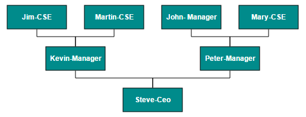

### Fixed Node

Layout provides support to arrange the nodes with reference to the position of a fixed node and the fixed node has to be set to the `layout.fixedNode`.
This is helpful when you try to expand/collapse a node. It might be expected that the position of the double-clicked node should not be changed.



export class OrganizationalChartComponent {
    dataSourceSettings: Object;
    defaultSettings: Object;
    layout: Object;
    nodeTemplate: Object;
    constructor() {
        let data = [{
                name: "parent",
                Role: "General Manager",
                offsetX: 250,
                offsetY: 50
            }, {
                name: "1",
                Role: "Human Resource Manager",
                Manager: "parent"
            }, {
                name: "2",
                Role: "Design Manager",
                Manager: "parent",
            }, {
                name: "3",
                Role: "Marketing Manager",
                Manager: "parent",
            }];
        this.layout = {
                type: "ej.datavisualization.Diagram.LayoutTypes.OrganizationalChart",
                fixedNode: "parent",
                getLayoutInfo: getLayoutInfo
            };
        this.defaultSettings = {
        //Sets the default properties of the node.
        //Sets the default properties of the connector.
        };
        //Initializes the node template.
        this.nodeTemplate = "nodeTemplate";
        //Configures data source for Diagram
        this.dataSourceSettings = {
            //Specifies the dataSource
        };
}};



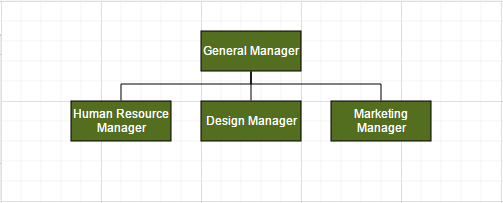

### Expand and collapse

Diagram allows to expand/collapse the sub trees of a layout. `node.isExpanded` allows you to expand/collapse its children. The following code example shows how to expand/collapse the children of a node.



//Initializes Diagram
export class OrganizationalChartComponent {
    dataSourceSettings: Object;
    defaultSettings: Object;
    layout: Object;
    nodeTemplate: Object;
    constructor() {
            //Uses layout to auto-arrange nodes on the Diagram page
            this.layout = {
            type: "ej.datavisualization.Diagram.LayoutTypes.OrganizationalChart",
            fixedNode: "node1"
            };
            //Defines double click event
            this.doubleClick = function (args) {
            var diagram = $("#diagram").ejDiagram("instance");
            var node = args.element;

            // Sets the double clicked node as fixed node
            $("#diagram").ejDiagram({
                layout: {
                    fixedNode: node.name
                }
            });

            //Expands/collapses the children of node
            diagram.updateNode(node.name, {
                isExpanded: !node.isExpanded
            });
        }
    }
}



In above example, while expanding/collapsing a node, it is set as fixed node in order to prevent it from repositioning.

### Refresh layout

Diagram allows to refresh the layout at runtime. To refresh the layout, refer to [Refresh layout](/api/js/ejDiagram#methods:layout "Refresh layout").