### BPMN Shapes

BPMN shapes are used to represent the internal business procedure in a graphical notation and enables you to communicate the procedures in a standard manner. To create a BPMN shape, the `type` of the node should be set as "bpmn" and its `shape` should be set as any one of the built-in shape. [BPMN Shapes](/api/js/global#bpmnshapes "BPMN Shapes"). The following code example illustrates how to create a simple business process. 


<ej-diagram width="100%" height="600" width="700">
<e-nodes>
    <e-node name ="node" type = "bpmn" [width]="100" [height]="100" [offsetX]="100" [offsetY]="100" borderWidth="2" borderColor="black" 
                 shape="event" event="end">
                <e-nodelabels>
                    <e-nodelabel text="End Event"></e-nodelabel>
                </e-nodelabels>
    </e-node>
</e-nodes>
</ej-diagram>





import { Component } from '@angular/core';

@Component({
  selector: 'ej-app',
  templateUrl: 'app/components/diagram/default.component.html'
})
export class DefaultComponent {}
}


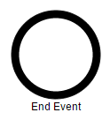

N> The default value for the property `shape` is "event".

The list of BPMN shapes are as follows.

| Shape | Image |
|---|---|
| Event | 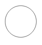 |
| Gateway | 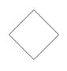 |
| Task | 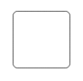 |
| Message |  |
| DataSource |  |
| DataObject |  |
| Group |  |

The BPMN shapes and its types are explained as follows.

### Event 

An event is notated with a circle and it represents an event in a business process. The type of events are as follows.

* Start
* End
* Intermediate

The `event` property of the node allows you to define the type of the event. The default value of the `event` is "start". The following code example illustrates how to create a BPMN Event.



    <ej-diagram width="100%" height="600" width="700" [nodes]="nodes">
    </ej-diagram>




import { Component } from '@angular/core';

@Component({
  selector: 'ej-app',
  templateUrl: 'app/components/diagram/default.component.html'
})
export class NodesComponent {
    nodes: Array<any>;
    constructor() {
        this.nodes = [
            {
                name: "node",
                width: 100,
                height: 100,
                offsetX: 100,
                offsetY: 100,
                borderWidth: 2,
                borderColor: "black",
                //Sets the type as BPMN
                type: ej.datavisualization.Diagram.Shapes.BPMN,
                //Sets the shape as BPMN Event
                shape: ej.datavisualization.Diagram.BPMNShapes.Event,
                //Sets type of the Event
                event: ej.datavisualization.Diagram.BPMNEvents.End,
                //Sets sub-type of the Event
                trigger: ej.datavisualization.Diagram.BPMNTriggers.None
            }
        ];
    }
}



Event triggers are notated as icons inside the circle and they represent the specific details of the process. The `triggers` property of node allows you to set the type of trigger and by default, it is set as "none". The following table illustrates the type of event triggers.

| Triggers | Start | Non-Interrupting Start | Intermediate | Non-Interrupting Intermediate | Throwing Intermediate | End |
| --- | --- | --- | --- | --- | --- | --- |
| None |  |  |  |  |   | 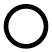 |
| Message |  |  |  |  |  |  |
| Timer | 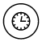 |  |  |  |   |   |
| Conditional |  |  |  |  |   |   |
| Link |   |   |  |   |  |   |
| Signal |  |  | 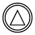 |  |  |  |
| Error |  |   |  |   |   |  |
| Escalation |  |  |  |  |  |  |
| Termination |   |   |   |   |   |  |
| Compensation |  |   |  |   |  |  |
| Cancel |   |   |  |   |   |  |
| Multiple |  |  |  | 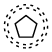 |  |  |
| Parallel |  |  |  |  |   |   |

### Gateway

Gateway is used to control the flow of a process. It is represented as a diamond shape. To create a gateway, the `shape` property of node should be set as "gateway" and the `gateway` property can be set with any of the appropriate [Gateways](/api/js/global#bpmngateways "Gateways"). The following code example illustrates how to create a BPMN Gateway.



export class NodesComponent {
    nodes: Array<any>;
    constructor() {
        this.nodes = [
            {
                name: "node",
                width: 100,
                height: 100,
                offsetX: 100,
                offsetY: 100,
                borderWidth: 2,
                borderColor: "black",
                type: ej.datavisualization.Diagram.Shapes.BPMN,
                //Sets the shape as Gateway
                shape: ej.datavisualization.Diagram.BPMNShapes.Gateway,
                //Sets the type of BPMN Gateway
                gateway: ej.datavisualization.Diagram.BPMNGateways.None,
            }
        ];
    }
}



N> By default, the `gateway` will be set as "none".

There are several types of gateways as tabulated

| Gateways | Image |
|---|---|
| Exclusive |  |
| Parallel | 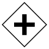 |
| Inclusive |  |
| Complex |  |
| EventBased |  |
| ExclusiveEventBased |  |
| ParallelEventBased |  |

### Activity

The activity is the task that is performed in a business process. It is represented by a rounded rectangle.

There are two types of activities .They are listed as follows.

* Task – Occurs within a process and it is not broken down to finer level of detail.
* Subprocess – Occurs within a process and it is broken down to finer level of detail.

To create a BPMN activity, you need to set the `shape` as "activity". You also need to set the type of the [BPMN Activity](/api/js/global#bpmnactivity "BPMN Activity") by using the `activity` property of node. By default, the type of the `activity` is set as "task". The following code example illustrates how to create an activity.



export class NodesComponent {
    nodes: Array<any>;
    constructor() {
        this.nodes = [
            {
                name: "node",
                width: 100,
                height: 100,
                offsetX: 100,
                offsetY: 100,
                borderWidth: 2,
                borderColor: "black",
                type: ej.datavisualization.Diagram.Shapes.BPMN,
                //Sets the bpmn shape as activity
                shape: ej.datavisualization.Diagram.BPMNShapes.Activity,
                //Sets the type of BPMN Activity
                activity: ej.datavisualization.Diagram.BPMNActivity.Task,
            }
        ];
    }
}


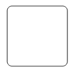

The different activities of BPMN process are listed as follows.

#### Tasks

The `task` property of node allows you to define the `type` of task such as sending, receiving, user based task etc… By default, the `type` property of task is set as "none". The following code illustrates how to create different types of BPMN tasks. 



export class NodesComponent {
    nodes: Array<any>;
    constructor() {
        this.nodes = [
            {
                name: "task",
                width: 100,
                height: 100,
                offsetX: 100,
                offsetY: 100,
                borderWidth: 2,
                borderColor: "black",
                type: ej.datavisualization.Diagram.Shapes.BPMN,
                //Sets the type of bpmn shape
                shape: ej.datavisualization.Diagram.BPMNShapes.Activity,
                //Sets the type of BPMN Activity
                activity: ej.datavisualization.Diagram.BPMNActivity.Task,
                //Sets the type of BPMN Task Activity
                task: {
                    type: ej.datavisualization.Diagram.BPMNTasks.Send
                }
            }
        ];
    }
}



The various types of BPMN tasks are tabulated as follows.

| Task Type | Image |
|---|---|
| Service |  |
| Send |  |
| Receive |  |
| Instantiating Receive |  |
| Manual |  |
| Business Rule |  |
| User |  |
| Script |  |

#### Subprocess

A sub-process is a group of tasks which is used to hide or reveal details of additional levels which can be done using `collapsed` property .



export class NodesComponent {
    nodes: Array<any>;
    constructor() {
        this.nodes = [
            {
                name: "node",
                width: 100,
                height: 100,
                offsetX: 100,
                offsetY: 100,
                borderWidth: 2,
                borderColor: "black",
                type: ej.datavisualization.Diagram.Shapes.BPMN,
                //Sets the type of bpmn shape
                shape: ej.datavisualization.Diagram.BPMNShapes.Activity,
                //Sets the type of BPMN Activity
                activity: ej.datavisualization.Diagram.BPMNActivity.SubProcess,
                //Sets the state of BPMN Subprocess
                subProcess: {
                    collapsed: true,
                }
            }
        ];
    }
}



The different types of subprocess are as follows.

* Event Subprocess
* Transaction 

##### Event Subprocess

A Sub-process is defined as an Event Sub-process when it is triggered by an event. An event-subprocess is placed within another subprocess which is not part of the normal flow of its parent process . You can set event to a sub-process with the `event` and `trigger` property of subprocess. 

 

export class NodesComponent {
    nodes: Array<any>;
    constructor() {
        this.nodes = [
            {
                name: "node",
                width: 100,
                height: 100,
                offsetX: 100,
                offsetY: 100,
                borderWidth: 2,
                borderColor: "black",
                type: ej.datavisualization.Diagram.Shapes.BPMN,
                //Sets the bpmn shape as activity
                shape: ej.datavisualization.Diagram.BPMNShapes.Activity,
                activity: ej.datavisualization.Diagram.BPMNActivity.SubProcess,
                //Creates event subprocess
                subProcess: {
                    type: ej.datavisualization.Diagram.BPMNSubProcessTypes.Event,
                    event: ej.datavisualization.Diagram.BPMNEvents.Start,
                    trigger: ej.datavisualization.Diagram.BPMNTriggers.Message
                }
            }
        ];
    }
}



##### Transaction Subprocess

An transaction is a set of activities that logically belong together, in which all contained activities must complete their parts of the transaction; otherwise the process is undone. The execution result of a transaction is one of Successful Completion, Unsuccessful Completion (Cancel), and Hazard (Exception). The `events` property of subprocess allows to represent these results as an event attached to the subprocess. 



export class NodesComponent {
    nodes: Array<any>;
    constructor() {
        this.nodes = [
            {
                name: "transactionSubProcess",
                width: 130,
                height: 100,
                offsetX: 100,
                offsetY: 100,
                borderWidth: 2,
                borderColor: "black",
                type: ej.datavisualization.Diagram.Shapes.BPMN,
                shape: ej.datavisualization.Diagram.BPMNShapes.Activity,
                activity: ej.datavisualization.Diagram.BPMNActivity.SubProcess,
                //Creates transaction subprocess
                subProcess: {
                    type: ej.datavisualization.Diagram.BPMNSubProcessTypes.Transaction,
                    // Defines a collection of events to be attached 
                    events: [
                        //Defines type of the event and the position relative to the subprocess. 
                        {
                            event: "intermediate",
                            trigger: "cancel",
                            offset: { x: 0.25, y: 1 }
                        },
                        {
                            event: "intermediate",
                            trigger: "error",
                            offset: { x: 0.75, y: 1 }
                        }
                    ]
                }
            }
        ]
    }
}



#### Processes 

Processes is a array collection that defines the children values for BPMN subprocess.



export class NodesComponent {
    nodes: Array<any>;
    connectors: Array<any>;
    constructor() {
        this.nodes = [
            {
                name: "group",
                offsetX: 500,
                offsetY: 300,
                width: 300,
                height: 200,
                type: "bpmn",
                shape: ej.datavisualization.Diagram.BPMNShapes.Group,
                children: [{
                    name: "node",
                    marginLeft: 15,
                    marginTop: 15,
                    width: 250,
                    height: 150,
                    type: "bpmn",
                    shape: ej.datavisualization.Diagram.BPMNShapes.Activity,
                    activity: ej.datavisualization.Diagram.BPMNActivity.SubProcess,
                    subProcess: {
                        collapsed: false,
                        Processes: [{
                                name: "subnode01",
                                marginLeft: 20,
                                marginTop: 50,
                                width: 30,
                                height: 30,
                                type: "bpmn",
                                shape: ej.datavisualization.Diagram.BPMNShapes.Event
                            },
                            {
                                name: "subnode02",
                                marginLeft: 90,
                                marginTop: 25,
                                width: 100,
                                height: 80,
                                type: "bpmn",
                                shape: ej.datavisualization.Diagram.BPMNShapes.Activity,
                                activity: ej.datavisualization.Diagram.BPMNActivity.Task,
                                task: { type: "user" },
                                annotation: {
                                    text: "Review Customer Rating",
                                    length: 125,
                                    angle: 24,
                                    width: 100,
                                    height: 30
                                }
                        }]
                    }
                }]
            }]
        }
    }
        this.connectors = [{
                name: "connector1",
                sourceNode: "subnode01",
                targetNode: "subnode02"
            }];


#### Loop

Loop is a task that is internally being looped. The `loop` property of task allows you to define the type of loop. The default value for `loop` is "none". 



export class NodesComponent {
    nodes: Array<any>;
    constructor() {
        this.nodes = [
            {
                name: "task",
                width: 100,
                height: 100,
                offsetX: 100,
                offsetY: 100,
                borderWidth: 2,
                borderColor: "black",
                type: ej.datavisualization.Diagram.Shapes.BPMN,
                //Sets the type of BPMN shape
                shape: ej.datavisualization.Diagram.BPMNShapes.Activity,
                //Sets the type of BPMN Activity
                activity: ej.datavisualization.Diagram.BPMNActivity.Task,
                //Sets the type of bpmn loops.
                task: {
                    loop: ej.datavisualization.Diagram.BPMNLoops.Standard
                }
            },{
                name: "subprocess",
                width: 100,
                height: 100,
                offsetX: 300,
                offsetY: 100,
                borderWidth: 2,
                borderColor: "black",
                type: ej.datavisualization.Diagram.Shapes.BPMN,
                shape: ej.datavisualization.Diagram.BPMNShapes.Activity,
                //Sets the type of BPMN activity
                activity: ej.datavisualization.Diagram.BPMNActivity.SubProcess,
                //Sets the type of bpmn loops.
                subProcess: {
                    loop: ej.datavisualization.Diagram.BPMNLoops.Standard
                }
            }
        ];
    }
}



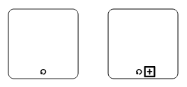

The following table contains various types of BPMN loops.

| Loops | Task | SubProcess |
|---|---|---|
| Standard | 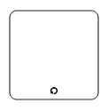 | 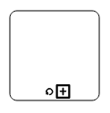 |
| SequenceMultiInstance |  |  |
| ParallelMultiInstance | 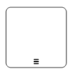 |  |

#### Compensation

Compensation is triggered when operation is partially failed and you can enable it with the `compensation` property of task.



export class NodesComponent {
    nodes: Array<any>;
    constructor() {
        this.nodes = [
            {
                name: "task",
                width: 100,
                height: 100,
                offsetX: 100,
                offsetY: 100,
                borderWidth: 2,
                borderColor: "black",
                type: ej.datavisualization.Diagram.Shapes.BPMN,
                shape: ej.datavisualization.Diagram.BPMNShapes.Activity
                //Sets the type of BPMN Activity
                activity: ej.datavisualization.Diagram.BPMNActivity.Task,
                //Creates compensation task
                task: {
                    compensation: true
                }
            },{
                name: "subprocess",
                width: 100,
                height: 100,
                offsetX: 300,
                offsetY: 100,
                borderWidth: 2,
                borderColor: "black",
                type: ej.datavisualization.Diagram.Shapes.BPMN,
                shape: ej.datavisualization.Diagram.BPMNShapes.Activity,
                //Sets the type of BPMN Activity
                activity: ej.datavisualization.Diagram.BPMNActivity.SubProcess,
                //Creates compensation subprocess 
                subProcess: {
                    compensation: true
                }
            }
        ];
    }
}



#### Call

A call activity is a global sub-process that is reused at various points of the business flow and you can set it with the `call` property of task.



export class NodesComponent {
    nodes: Array<any>;
    constructor() {
        this.nodes = [
            {
                name: "task",
                width: 100,
                height: 100,
                offsetX: 100,
                offsetY: 100,
                borderWidth: 2,
                borderColor: "black",
                type: ej.datavisualization.Diagram.Shapes.BPMN,
                shape: ej.datavisualization.Diagram.BPMNShapes.Activity,
                //Sets the type of BPMN Activity
                activity: ej.datavisualization.Diagram.BPMNActivity.Task,
                //Creates a call task
                task: {
                    call: true
                }
            }
        ];
    }
}



#### Ad-Hoc

An ad hoc subprocess is a group of tasks that are executed in any order or skipped in order to fulfill the end condition and you can set it with the `adhoc` property of subprocess. 



export class NodesComponent {
    nodes: Array<any>;
    constructor() {
        this.nodes = [
            {
                name: "task",
                width: 100,
                height: 100,
                offsetX: 100,
                offsetY: 100,
                borderWidth: 2,
                borderColor: "black",
                type: ej.datavisualization.Diagram.Shapes.BPMN,
                shape: ej.datavisualization.Diagram.BPMNShapes.Activity,
                activity: ej.datavisualization.Diagram.BPMNActivity.SubProcess,
                //Creates ad hoc subprocess
                subProcess: {
                    adhoc: true
                }
            }
        ];
    }
}



#### Boundary

Boundary represents the type of task that is being processed. The `boundary` property of sub process allows you to define the type of boundary. By default, it is set as "default".



export class NodesComponent {
    nodes: Array<any>;
    constructor() {
        this.nodes = [
            {
                name: "task",
                width: 100,
                height: 100,
                offsetX: 100,
                offsetY: 100,
                borderWidth: 2,
                borderColor: "black",
                type: ej.datavisualization.Diagram.Shapes.BPMN,
                shape: ej.datavisualization.Diagram.BPMNShapes.Activity,
                activity: ej.datavisualization.Diagram.BPMNActivity.SubProcess,
                //Adds boundary to a subprocess 
                subProcess: {
                    boundary: ej.datavisualization.Diagram.BPMNBoundary.Call
                }
            }
        ];
    }
}



The following table contains various types of BPMN boundaries.

| Boundary | Image |
|---|---|
| Call | 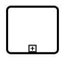 |
| Event | 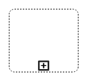 |
| Default |  |

### Data

A data object represents information flowing through the process, such as data placed into the process, data resulting from the process, data that needs to be collected, or data that must be stored. To define a data object, set the `shape` as `ej.datavisualization.Diagram.BPMNShapes.DataObject` and `type` property defines whether data is an input or a output. You can create multiple instances of data object with the `collection` property of data.



export class NodesComponent {
    nodes: Array<any>;
    constructor() {
        this.nodes = [
            {
                name: "dataObject",
                width: 75,
                height: 100,
                offsetX: 100,
                offsetY: 100,
                borderWidth: 2,
                borderColor: "black",
                //Sets the type of the shape
                type: ej.datavisualization.Diagram.Shapes.BPMN,
                //Sets the type of BPMN Shape
                shape: ej.datavisualization.Diagram.BPMNShapes.DataObject,
                //Sets collection as true when Data object is not a Single instance
                data: {
                    type: ej.datavisualization.Diagram.BPMNDataObjects.Input,
                    collection: true
                }
            }
        ];
    }
}



The following table contains various representation of BPMN Data Object.

| Boundary | Image |
|---|---|
| Collection Data Object |  |
| Data Input | 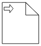 |
| Data Ouptput | 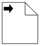 |

### Datasource

DataSource is used to store or access data associated with a business process. To create a data source, set the `shape` as "datasource". The following code example illustrate how to create data source.



export class NodesComponent {
    nodes: Array<any>;
    constructor() {
        this.nodes = [
            {
                name: "dataSource",
                width: 100,
                height: 100,
                offsetX: 100,
                offsetY: 100,
                borderWidth: 2,
                borderColor: "black",
                //Sets type of the shape
                type: ej.datavisualization.Diagram.Shapes.BPMN,
                //Sets the type of bpmn shape
                shape: ej.datavisualization.Diagram.BPMNShapes.DataSource,
            }
        ];
    }
}



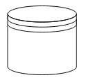

### Artifact

Artifact is used to show additional information about a Process in order to make it easier to understand. There are 2 types of artifacts in BPMN.

* Text Annotation
* Group

#### Text Annoatation

A BPMN object can be associated with a text annotation which does not affect the flow but gives details about objects within a flow. The `annotation` property of the node is used to connect an annotation element to the BPNN node.


export class NodesComponent {
    nodes: Array<any>;
    constructor() {
        this.nodes = [
            {
                name: "data",
                width: 75,
                height: 100,
                offsetX: 100,
                offsetY: 100,
                borderWidth: 2,
                borderColor: "black",
                //Sets type of the shape
                type: ej.datavisualization.Diagram.Shapes.BPMN,
                //Sets the type of bpmn shape
                shape: ej.datavisualization.Diagram.BPMNShapes.DataObject,
                //Sets collection as true when Dataobject is not a Single instance
                data: {
                    collection: true
                },
                annotation: {
                    //Sets the text to annotate the bpmn shape
                    text: "Data Collection",
                    //Sets the angle between the bpmn shape and the annotation
                    angle: 45,
                    //Sets the dimensions of the text
                    width: 100,
                    height: 40,
                    //Sets the distance between the bpmn shape and the annotation 
                    length: 150
                }
            }
        ];
    }
}



#### Group

A group is used to frame a part of the diagram, shows that elements included in it are logically belong together and don't have any other semantics other than organizing elements. To create a Group, the `shape` property of node should be set as "group". The following code example illustrates how to create a BPMN Group.



export class NodesComponent {
    nodes: Array<any>;
    constructor() {
        this.nodes = [
            {
                name: "group",
                width: 100,
                height: 100,
                offsetX: 100,
                offsetY: 100,
                borderWidth: 2,
                borderColor: "black",
                //Sets type of the shape
                type: ej.datavisualization.Diagram.Shapes.BPMN,
                //Sets the type of bpmn shape
                shape: ej.datavisualization.Diagram.BPMNShapes.Group
            }
        ];
    }
}



#### BPMN Flows

BPMN Flows are lines that connects BPMN flow objects.

### Association

BPMN Association flow is used to link flow objects with its corresponding text or artifact. An association is represented as a dotted graphical line with opened arrow. The type of association are as follows.

* Directional
* BiDirectional
* Default

The `association` property allows you to define the type of association.The following code example illustrates how to create an association.



export class NodesComponent {
    connectors: Array<any>;
    constructor() {
        this.connectors = [
            {
                name: "connect1",
                sourcePoint: {
                    x: 100,
                    y: 200
                },
                targetPoint: {
                    x: 300,
                    y: 200
                },
                segments: [{
                    type: "straight"
                }],
                shape: {
                    type: "bpmn",
                    //Sets the type of the flow as association
                    flow: "association",
                    //Sets the type of association
                    association: "bidirectional"
                }
            }
        ];
    }
}



The following table demonstrates the visual representation of assosiation flows.

| Association | Image |
|---|---|
| Default |  |
| Directional |  |
| BiDirectional |  |

N> The default value for the property `association` is "default".

### Sequence

A Sequence flow shows the order in which the activities are performed in a BPMN Process and is represented with a solid graphical line.The type of sequence are as follows.

* Normal
* Conditional
* Default

The `sequence` property allows you to define the type of sequence.The following code example illustrates how to create a sequence flow.



export class NodesComponent {
    connectors: Array<any>;
    constructor() {
        this.connectors = [
            {
                name: "connect1",
                sourcePoint: {
                    x: 100,
                    y: 200
                },
                targetPoint: {
                    x: 300,
                    y: 200
                },
                segments: [{
                    type: "straight"
                }],
                shape: {
                    type: "bpmn",
                    flow: "sequence",
                    //Sets the type of sequence flow
                    sequence: "conditional"
                }
            }
        ];
    }
}



The following table contains various representation of sequence flows.

| Sequence | Image |
|---|---|
| Default |  |
| Conditional |  |
| Normal |  |

N> The default value for the property `sequence` is "normal".

### Message

A Message flow shows the flow of messages between two Participents.A message flow is represented by dashed line.The type of message are as follows.

* InitiatingMessage
* NonInitiatingMessage
* Default

The `message` property allows you to define the type of message.The following code example illustrates how to define a message flow.



export class NodesComponent {
    connectors: Array<any>;
    constructor() {
        this.connectors = [
            {
                name: "connect1",
                sourcePoint: {
                    x: 100,
                    y: 200
                },
                targetPoint: {
                    x: 300,
                    y: 200
                },
                segments: [{
                    type: "straight"
                }],
                shape: {
                    type: "bpmn",
                    flow: "message",
                    //Sets the type of message flow
                    message: "initiatingmessage"
                }
            }
        ];
    }
}



The following table contains various representation of message flows.

| Message | Image |
|---|---|
| Default |  |
| InitiatingMessage |  |
| NonInitiatingMessage |  |

N> The default value for the property `message` is "default".