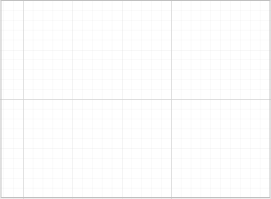

# Getting started

This section explains briefly about how to create a **Diagram** control in your application with **Angular**.

## Adding Script Reference

Create an HTML page and add the scripts references in the order mentioned in the following code example.



<!DOCTYPE html>
<html>
   <head> 
    <link href="//cdn.syncfusion.com/14.3.0.49/js/web/flat-azure/ej.web.all.min.css" rel="stylesheet" />
    
    
    
    
    
    
    
    
    
    
  </head>
  <body>
   <ej-app>Loading...</ej-app>
  </body>
</html>



In the above code, `ej.web.all.min.js`script reference has been added for demonstration purpose. It is not recommended to use this for deployment purpose, as its file size is larger since it contains all the widgets. Instead, you can use[`CSG`](http://csg.syncfusion.com "CSG")utility to generate a custom script file with the required widgets for deployment purpose.

## Initialize Diagram

The Diagram can be created from a HTML ‘input’ element with the HTML 'id' attribute and pre-defined options set to it. To create the Diagram, you should call the 'ejDiagram' jQuery plug-in function.



    <ej-diagram width="1000" height="600">
     </ej-diagram>

			

	
	
	
import {Component} from '@angular/core';
import {EJ_DIAGRAM_COMPONENTS} from 'ej/diagram.component';
@Component({
    selector: 'sd-home',
    //give the path file for diagram component html file.
    templateUrl: 'app/components/diagram/diagram.component.html'
    })
    export class DiagramComponent {
        }		
	


This creates an empty diagram

### Initialize Nodes and Connectors

Let us create and add a `node` (JSON data) with specific position, size, label and shape. Connect two or more nodes by adding a `connector` into `diagram.connectors` collection with reference to source and target end.



<ej-diagram width="1000" height="600">
	    <e-nodes>
            <e-node name ="Start" type = "flow" shape="terminator" [width]="140" [height]="50" [offsetX]="300" [offsetY]="50">
                <e-nodelabels>
                    <e-nodelabel text="Start"></e-nodelabel>
                </e-nodelabels>
            </e-node>
            <e-node name ="Init" type = "flow" shape="process" [width]="140" [height]="50" [offsetX]="300" [offsetY]="140">
                <e-nodelabels>
                    <e-nodelabel text="var i = 0;"></e-nodelabel>
                </e-nodelabels>
            </e-node>
        </e-nodes>
        <e-connectors>
            <e-connector name="connector1" sourceNode="Start" targetNode="Init">
            <e-segments>
                <e-segment type="orthogonal"></e-segment>
            </e-segments>
            </e-connector>
        </e-connectors>
</ej-diagram>


	
	
	
import {Component} from '@angular/core';
import {EJ_DIAGRAM_COMPONENTS} from 'ej/diagram.component';

@Component({
  selector: 'sd-home',
  templateUrl: 'app/components/diagram/diagram.component.html'
})
export class DiagramComponent {
    margin:Object ;
    constructor() {
        this.margin ={ "left": 25, "right": 25}
}}
	

	

### Business object (Employee information)

* Define Employee Information as JSON data. The following code example shows an employee array whose,
	* `Name` is used as a unique identifier and
	* `ReportingPerson` is used to identify the person to whom an employee report to, in the organization.



<ej-diagram id="diagramCore" width="900px" height="450px" [dataSourceSettings]="dataSourceSettings" [layout]="layout" [defaultSettings]="defaultSettings" [nodeTemplate]="nodeTemplate">
</ej-diagram>



### Map data source

* You can configure this "Employee Information" with Diagram, so that the node and connector are automatically generated using mapping properties.

Following code examples show how dataSourceSetting is used to map id and parent with property name identifiers for employee information. The NodeTemplate is used to update each node based on employee data.



export class DefaultComponent {
    dataSourceSettings: Object;
    defaultSettings:Object;
    layout: Object;
    nodeTemplate: Function;
    constructor() {
        let data = [
	{ Name: "Elizabeth", Role: "Director" },
	{ Name: "Christina", ReportingPerson: "Elizabeth", Role: "Manager" },
	{ Name: "Yoshi", ReportingPerson: "Christina", Role: "Lead" },
	{ Name: "Philip", ReportingPerson: "Christina", Role: "Lead" },
	{ Name: "Yang", ReportingPerson: "Elizabeth", Role: "Manager" },
	{ Name: "Roland", ReportingPerson: "Yang", Role: "Lead" },
	{ Name: "Yvonne", ReportingPerson: "Yang", Role: "Lead" }
];
        //To represent the roles
        let codes = {
            Director: "rgb(0, 139,139)",
            Manager: "rgb(30, 30,113)",
            Lead: "rgb(0, 100,0)"
        }
        this.dataSourceSettings ={ id: "Name",parent: "ReportingPerson",dataSource: data};
        this.layout = { type: "organizationalchart", orientation: "toptobottom", horizontalSpacing: 25, verticalSpacing: 35, marginX: 3, marginY: 3};
        // Bind custom data with node
        this.nodeTemplate = function (diagram, node) {
                node.labels[0].text = node.Name;
	            node.fillColor = codes[node.Role];
                };
        this.defaultSettings = {
            node: {
                fillColor: "#88C65C", width: 100,
                height: 40, borderColor: "black", borderWidth: 1, labels: [{ name: "label1", fontColor: "white", fontSize: 12, margin: { left: 10, right: 10 } }]
            },
            connector: {
                lineColor: "#000000", segments: [{ type: "orthogonal" }], targetDecorator: { shape: "none" }
                }
        };
    }
}



* The Employee details are displayed in the Diagram as follows.

