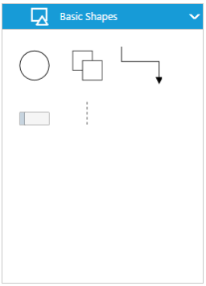

# Symbol Palette

The **SymbolPalette** displays a collection of palettes. The Palette shows a set of nodes and connectors. It allows you to drag and drop the nodes and connectors into the Diagram.

## Create symbol palette

The `diagramId` property of symbol palette should be set with the corresponding Diagram ID to drag and drop the nodes and connectors into the Diagram. The following code illustrates how to create symbol palette.  



<!--Initializes the Diagram element-->

    <ej-diagram id="diagramCore" width="100%" height="100%">
    </ej-diagram>

<!-- Initializes the SymbolPalette element -->

    <ej-symbolpalette   id="symbolpalette" diagramId="diagramCore">
    </ej-symbolpalette>





import {Component} from '@angular/core';

@Component({
  selector: 'ej-app',
  templateUrl: 'app/components/diagram/Symbol-palette.component.html',
})

export class SymbolpaletteComponent {
    constructor() {}
    }



## Add palettes to SymbolPalette

A palette allows to display a group of related symbols and it textually annotates the group with its header.
To initialize a palette, define a JSON object with the property `name` that is displayed as the header text of palette. The `expanded` property of palette allows to expand/collapse its palette items.
The following code example illustrates how to define a palette and how its added to symbol palette.



    <ej-symbolpalette   id="symbolpalette" diagramId="diagramCore" [palettes]="palettes">
    </ej-symbolpalette>

    <ej-diagram id="diagramCore" width="100%" height="100%">
    </ej-diagram>



You can add any number of palettes to the `palettes` collection of the symbol palette. The following example illustrates how to define symbol palette with a palette object that is defined in the previous step.



export class SymbolpaletteComponent {
    palettes: Array<any>;
    constructor() {
        this.palettes = [
            {
                //Sets the name of the palette
                name: "Basic Shapes",
                //Sets whether the palette expands/collapse its children
                expanded: true
                }];
            }
}



The following image shows the symbol palette with multiple palette Items.

### Customize the Palette Header

Palettes can be annotated with its header texts and you can change the height of palette header by using `HeaderHeight` property of symbol palette.

Also, you can embed any HTML element into a palette header by defining the ScriptTemplate id to palette's templateId property. Following code example illustrates how to customize palette headers.



    <ej-symbolpalette   id="symbolpalette" diagramId="diagramCore" [headerHeight]=headerHeight [palettes]="palettes">
    </ej-symbolpalette>

    <ej-diagram id="diagramCore" width="100%" height="100%">
    </ej-diagram>

<!--dependency scripts-->
										





export class SymbolpaletteComponent {
    palettes: Array<any>;
    headerHeight: Number;
    constructor() {
        this.headerHeight: 30;
        this.palettes = [
            {
                //Sets the name of the palette
                name: "Basic Shapes",
                //Sets the id of the script template 
                templateId: "svgTemplate",
                }];
            }
}



The following image shows the customized palette header

## Add symbols to palette

The symbol need to be defined and added to the `items` collection of the palette. You can create a symbol as a node, group, connector, lane, or phase except swimlane.
 
The following code example illustrates how to define a palette with symbols that are defined in the previous section. 



export class SymbolPaletteComponent {
    palettes: Array<any>;
    constructor() {
        this.palettes = [
            {
                'name': 'Flow Shapes', 'expanded': true,
                //Adds the palette items to palette
                'items': [
                    {
                        name: "Ellipse",
                        //Specifies node size
                        width: 40,
                        height: 40,
                        //Specifies node offset and shape 
                        offsetX: 20,
                        offsetY: 20,
                        shape: "ellipse"}]
            }
    }
}



### Customize the size of symbols

You can customize the size of the individual symbol. The `paletteItem` property of node enables you to define the size of the symbols. The following code example illustrates how to change the size of a symbol.



    <ej-symbolpalette   id="symbolpalette" diagramId="diagramCore" [palettes]="palettes" [paletteItemWidth]="50" [paletteItemHeight]="50" >
    </ej-symbolpalette>



Symbol size will be set based on the following precedence.

**Precedence**

| Palette Item | Rendering Size |  
|---|---|---|
| Width | paletteItem.width > model.paletteItemWidth > node.width |  
| Height | paletteItem.height > model.paletteItem.Height > node.height | 

* Symbol size will be rendered in the palette based on node.paletteItem's `width` and `height` property. 
* If paletteItem's width and height property is not specified, symbol size will be rendered in the palette based on model's `paletteItemWidth` and `paletteItemHeight` property. 
* If you don't specify above two, then symbol size will be rendered in the palette based on node's `width` and `height` property. 
 

### Stretch the symbols into the palette

The `enableScale` property of the paletteItem enables you to customize the size of the symbol regardless of the precedence. The following code example illustrates how to customize the symbol size.



export class SymbolPaletteComponent {
    palettes: Array<any>;
    constructor() {
        this.palettes = [
            {
                name: "Basic Shapes",
                expanded: true,
                items: [{
                    name: "Rectangle",
                    height: 40,
                    width: 80,
                    //Specifies the size of palette Item 
                    paletteItem: {
                        // Enables to fit the content into the specified palette item size
                        enableScale: true
                        // When it is set as false, the element is rendered with actual node size
                    }
                }]
            }];
    }
}



## Symbol Previews

Image, simple snippet to customize the preview size

You can customize the preview size of the individual palette items. The `paletteItem` property of node enables you to define the preview size of the symbol items. The following code example illustrates how to change the preview size of a palette item.



    <ej-symbolpalette   id="symbolpalette" diagramId="diagramCore" [palettes]="palettes" height="600px" width="250px" [headerHeight]=headerHeight [paletteItemWidth]="50" [paletteItemHeight]="50" [previewWidth]="100" [previewHeight]="100">
    </ej-symbolpalette>



Symbol palette allows to sets the offset of the dragging helper relative to the mouse cursor.


 

    <ej-symbolpalette   id="symbolpalette" diagramId="diagramCore" [palettes]="palettes" height="600px" width="250px" [headerHeight]=headerHeight [paletteItemWidth]="50" [previewOffset]="previewOffset" [paletteItemHeight]="50" 
    [previewWidth]="100" [previewHeight]="100">
    </ej-symbolpalette>





export class SymbolpaletteComponent {
    palettes: Array<any>;
    headerHeight: Object;
    constructor() {
        this.previewOffset = {
             x: 50,
             y: 50
         };
        this.palettes = [
            {
                name: "Basic Shapes",
                expanded: true,
                items: [{
                    name: "Rectangle",
                    height: 50,
                    width: 50,
                }];
            }
        }
}



Symbol preview size will be set based on the following precedence.

**Precedence**

| Palette Item |   Preview Size |
|---|---|---|
| Width |  paletteItem.previewWidth > model.previewWidth > node.width |
| Height | paletteItem.previewHeight > model.previewHeight > node.height |

* Symbol preview size will be set based on node.paletteItem's `previewWidth` and `previewHeight` property. 
* If paletteItem's width and height property is not specified, symbol size will be set based on model's `previewWidth` and `previewHeight` property. 
* If you don't specify above two, then symbol size will be rendered in the palette based on node's `width` and `height` property. 

## Show/hide the symbol Text 

You can show/hide the symbol text by using the `showPaletteItemText` property of symbol palette.



    <ej-symbolpalette   id="symbolpalette" diagramId="diagramCore" [palettes]="palettes" height="600px" width="250px" [showPaletteItemText]="showPaletteItemText">
    </ej-symbolpalette>





export class SymbolPaletteComponent {
    showPaletteItemText: boolean;
    constructor(){
            //Specifies whether palette item text should be visible or not
            this.showPaletteItemText = true;
            }



To explore the properties of symbol palette, refer to [Symbol Palette Properties](/api/js/ejsymbolpalette#members "Symbol Palette Properties").