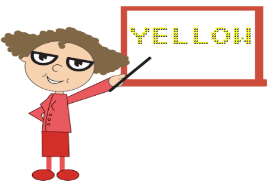

# Character Settings

## Appearance

The opacity of the character is adjustable with the help of **opacity** property. The space between two characters are adjusted with **spacing** property as like in the segment settings.



<ej-digitalgauge id="DigitalGauge1" width="800" [items]="[{value: 'Syncfusion',characterSettings: {
                                                                        opacity: 0.3,spacing: 3}}]">
</ej-digitalgauge>



Execute the above code examples to render the **Digital****Gauge** as follows.

## Count and Type

The number of text to be displayed can be limited by the attribute called **count**. In **Digital Gauge** five different types of characters are supported. They are as follows, 

  * EightCrossEightDotMatrix

  * SevenSegment

  * FourteenSegment

  * SixteenSegment 

  * EightCrossEightSquareMatrix.



<ej-digitalgauge id="DigitalGauge1" width="800" [items]="[{value: '1234567890',characterSettings:{
            type: 'sevensegment', count: 10,spacing: 10}, segmentSettings:{length: 8,width: 1}}]">
</ej-digitalgauge>



Execute the above code examples to render the **Digital****Gauge** as follows.

## Text Positioning

The text in the **Digital****Gauge** is positioned with position object. This object contains two attributes such as **x** and **y.** The **x** variable positions the text in the horizontal axis and the **y** variable positions the text in the vertical axis.



<ej-digitalgauge id="DigitalGauge1" height="300" frame.backgroundImageUrl="Board1.jpg" width="800"
             [items]="[{value: 'YELLOW',position:{x:80, y:10}, segemntSettings:{color:'yellow'}}]">
</ej-digitalgauge>



Execute the above code examples to render the **Digital****Gauge** as follows.

## Shadow Effects

The text in the **Digital Gauge** is positioned with position object. This object contains two attributes such as **x** and **y.** The **x** variable positions the text in the horizontal axis and **y** variable positions the text in the vertical axis.



<ej-digitalgauge id="DigitalGauge1" width="800" [items]="[{value: 'WELCOME',shadowColor: 'yellow',
      shadowBlur: 20,shadowOffsetX: 15, shadowOffsetY: 15, segmentSettings:{length: 3,width: 3}}]">
</ej-digitalgauge>



Execute the above code examples to render the **Digital****Gauge** as follows.

## Font Customization

You can customize the **font** of the text as per your requirement. To customize the font, you have to set `enableCustomFont`. Following font customization options are available.

**Font-family**- used to set the font-family of the text.

**Font-style**- used to set the font-style of the text.

**Font-size**- used to set the font-size of the text.



<ej-digitalgauge id="DigitalGauge1" width="800" [items]="[{font: {fontFamily:'Arial',fontStyle:'Italic',size:'18px',opacity:0.5} }]">
</ej-digitalgauge>



