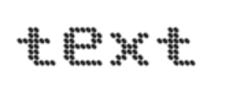
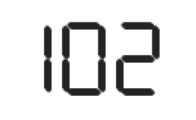
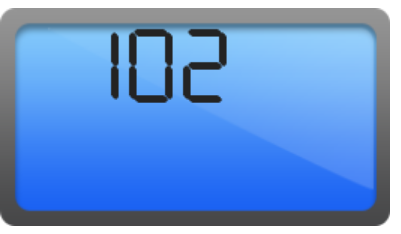
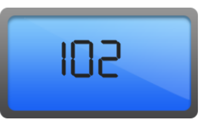
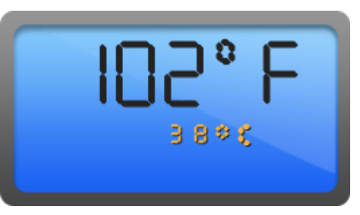

#Getting Started

Before we start with the DigitalGauge, please refer [this page](https://help.syncfusion.com/angular/overview) for general information regarding integrating Syncfusion widget’s.

## Adding JavaScript and CSS Reference

To render the DigitalGauge control, the following list of external dependencies are needed, 

* [jQuery](http://jquery.com) - 1.7.1 and later versions
* [jsRender](https://github.com/borismoore/jsrender) - to render the templates
* [Angular](https://angular.io/) - Angular latest versions

The other required internal dependencies are tabulated below,

<table>
   <tr>
      <th>
         <b>Files</b>
      </th>
      <th>
         <b>Description/Usage </b>
      </th>
   </tr>
   <tr>
      <td>
         ej.core.min.js
      </td>
      <td>
        It is referred always before using all the JS controls.
      </td>
   </tr>
   <tr>
      <td>
         ej.data.min.js
      </td>
      <td>
         Used to handle data operation and is used while binding data to the JS controls.
      </td>
   </tr>
   <tr>
      <td>
        ej.digitalgauge.min.js
      </td>
      <td>
        DigitalGauge core script file which includes DigitalGauge related scripts files.
      </td>
   </tr>
   <tr>
      <td>
        excanvas.min.js
      </td>
      <td>
        
      </td>
   </tr>
</table>

## Preparing HTML document

Create an HTML page and add the scripts references in the order mentioned in the following code example.



    <html>
    <head>
    <title>Angular DigitalGauge</title>

    <!-- Essential Studio for JavaScript  theme reference -->
    <link rel="stylesheet" href="http://cdn.syncfusion.com/{{ site.releaseversion }}/js/web/flat-azure/ej.web.all.min.css" />

    <!-- Angular related script references -->
    <!-- 1. Load libraries -->
         <!-- Polyfill(s) for older browsers -->
       
    
    
    

    <!-- Essential Studio for JavaScript  script references -->
    
    
     
    
    
    <!-- 2. Configure SystemJS -->
    
    

    </head>
    <!-- 3. Display the application -->
    <body>
    <ej-app>  
		    

			      
Angular Syncfusion Components App

			      

		    

	  </ej-app>
    </body>
    </html>



N> Uncompressed version of library files are also available which is used for development or debugging purpose and can be generated from the custom script [here](http://csg.syncfusion.com).

## Control Initialization

* Copy DigitalGauge Syncfusion Angular source component(s) from the below build location and add it in `src/ej` folder (For ex., consider the `digitalgauge` component).


(Installed Location)\Syncfusion\Essential Studio\14.3.0.49\JavaScript\assets-src\angular2\ 


N> `core.ts` file is mandatory for all Syncfusion JavaScript Angular components. The repository having the source file from Essential Studio for JavaScript v14.3.0.49.

* Create `digitalgauge` folder inside `src` folder.

* Create `digitalgauge.component.html` view file inside `src/digitalgauge` folder and render ejDigitalGauge Angular component using the below code example. 


<ej-digitalgauge id="defaultdigitalgauge">
</ej-digitalgauge>


* Create `digitalgauge.component.ts` model file inside the folder `src/digitalgauge` and create sample component using the below code example.



import { Component, ViewEncapsulation } from '@angular/core';

@Component({
  selector: 'ej-app',
  templateUrl: 'src/digitalgauge/digitalgauge.component.html'
})
export class DigitalGaugeComponent {

}


## Configure the routes for the Router

Before adding router configuration for above created ejDigitalGauge component, we recommend you to go through the [Angular Routing](https://angular.io/docs/ts/latest/guide/router.html) configuration to get the deeper knowledge about Angular routing. 

* Now, we are going to configure the route navigation link for created digitalgauge sample in `src/app.component.html` file.



	<ul class="nav navbar-nav">
		<li>
            <a data-toggle="collapse" data-target="#skeleton-navigation-navbar-collapse.in" 
                    href="#digitalgauge" [routerLink]="['/digitalgauge']">digitalgauge </a>
        </li>
	</ul>

<main>
	<router-outlet></router-outlet>
</main>


* Import the ejDigitalGauge sample component and define the route in `src/app.routes.ts` file.


import { Routes } from '@angular/router';
. . . . 
import { DigitalGaugeComponent } from './digitalgauge/digitalgauge.component';

export const rootRouterConfig: Routes = [
    { path: '', redirectTo: 'home', pathMatch: 'full' },
    . . . . 
    { path: 'digitalgauge', component: DigitalGaugeComponent }
];


* Import and declare the Syncfusion source component and ejDigitalGauge sample component into `app.module.ts` like the below code snippet.


import { NgModule, enableProdMode, ErrorHandler } from '@angular/core';
. . . . . 
import { EJ_DIGITALGAUGE_COMPONENTS } from './ej/digitalgauge.component';
import { DigitalGaugeComponent } from './digitalgauge/digitalgauge.component';

import { rootRouterConfig } from './app.routes';
. . . . 
@NgModule({
  imports: [BrowserModule, FormsModule, HttpModule, RouterModule.forRoot(rootRouterConfig, { useHash: true })],
  declarations: [. . . . , EJ_DIGITALGAUGE_COMPONENTS, DigitalGaugeComponent],
  bootstrap: [AppComponent]
})
export class AppModule { }


## Running the application

* To run the application, execute below command.


npm start


* Browse to [http://localhost:3000](http://localhost:3000) to see the application. And navigate to digitalgauge tab. The component is rendered as like the below screenshot. You can make changes in the code found under src folder and the browser should auto-refresh itself while you save files. 

 

## Set Height and Width values

Basic attributes of each canvas elements are height and width. You can set the height and width of the gauge.



<ej-digitalgauge [height]="145" [width]="260">
</ej-digitalgauge>



On executing the above code, sample renders a default **Digital Gauge** with the specified height and width values.

## Set Items Property

You can customize the **Digital Gauge** using different properties.

**Add Segment and Character Properties**

* In this example, the **Digital Gauge** uses a welcome board in which the text color must be distinctly visible in nature. To meet this requirement, you can give some segment properties such as segment spacing, segment width, segment color, segment length and segment opacity.

* **Character** type is used to define the Digital representation of the character. Thee five types of character representation are as follows:

  * EightCrossEightDotMatrix

  * SevenSegment

  * FourteenSegment

  * SixteenSegment 

  * EightCrossEightSquareMatrix.



<ej-digitalgauge id="digitalGauge" [height]="145" [width]="260">
    <e-digitalgauge-items>
        <e-digitalgauge-item value='"102"' [segmentSettings.width]="2" [segmentSettings.length]="20"
             characterSettings.type="SevenSegment" [characterSettings.spacing]="12">
        </e-digitalgauge-item>
    </e-digitalgauge-items>
</ej-digitalgauge>



On executing the above code, sample renders a **Digital Gauge** with default values as follows.

## Add Background Image

You can add a `frame.backgroundImageUrl` to set the background for the **Digital Gauge**.



<ej-digitalgauge id="digitalGauge"
        frame.backgroundImageUrl="node_modules/syncfusion-javascript/Content/ej/web/common-images/frame.png">
</ej-digitalgauge>



On executing the above code, sample renders a default **Digital Gauge** as follows.           

## Add Location

You can position the digital letters inside the canvas element using **position** property.



<ej-digitalgauge id="digitalGauge">
    <e-digitalgauge-items>
        <e-digitalgauge-item [position.x]="15" [position.y]="40">
        </e-digitalgauge-item>
    </e-digitalgauge-items>
</ej-digitalgauge>



On executing the above code, sample renders a default **Digital Gauge** as follows.

## Add Items collection

You can add **Items collection** to display the temperature value as used in the Digital thermometer.



<ej-digitalgauge id="digitalGauge" [height]="145" [width]="260" 
                       frame.backgroundImageUrl="Content/ej/web/common-images/frame.png">
    <e-digitalgauge-items>
        <e-digitalgauge-item value='"102"' [segmentSettings.width]="2" [segmentSettings.length]="20"
           characterSettings.type="SevenSegment" [characterSettings.spacing]="12" [position.x]="0"
           [position.y]="12">
        </e-digitalgauge-item>
        <e-digitalgauge-item value='"0"' [segmentSettings.width]="2" [segmentSettings.length]="5" 
            [segmentSettings.spacing]="0" characterSettings.type="SevenSegment"
            [characterSettings.spacing]="5" [position.x]="77" [position.y]="7">
        </e-digitalgauge-item>
        <e-digitalgauge-item value="F" [segmentSettings.width]="2" [segmentSettings.length]="20" 
            [segmentSettings.spacing]="0" characterSettings.type="SevenSegment" 
            [characterSettings.spacing]="12" [position.x]="216" [position.y]="12">
        </e-digitalgauge-item>
        <e-digitalgauge-item value='"38"' [segmentSettings.width]="1" [segmentSettings.length]="5" 
            [segmentSettings.spacing]="0" segmentSettings.color="#F5b43f"
            characterSettings.type="SevenSegment" [characterSettings.spacing]="12" [position.x]="60"
            [position.y]="68">
        </e-digitalgauge-item>
        <e-digitalgauge-item value='"0"' [segmentSettings.width]="2" [segmentSettings.length]="2"
            [segmentSettings.spacing]="0" segmentSettings.color="#F5b43f"
            characterSettings.type="SevenSegment" [characterSettings.spacing]="12" [position.x]="82"
             [position.y]="65">
        </e-digitalgauge-item>
        <e-digitalgauge-item value="c" [segmentSettings.width]="2" [segmentSettings.length]="4"
             [segmentSettings.spacing]="0" segmentSettings.color="#F5b43f"
                  characterSettings.type="SevenSegment" [characterSettings.spacing]="12" [position.x]="110"
                   [position.y]="68">
        </e-digitalgauge-item>
    </e-digitalgauge-items>
</ej-digitalgauge>



The following screenshot displays a **Digital Gauge** with all the customizations discussed earlier.

