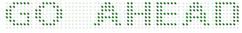

# Segment Settings

## Appearance

* **Digital Gauge** consists of several digital segments. Segment is customized with some properties. Color of the segment is set by using **color** property. Color is either given as string or hexadecimal value. 

* You can add gradient effects to the segments with the help of **gradient** attribute. The **opacity** of the segment is also adjustable. The space between two segments are adjusted with **spacing** property.



<ej-digitalgauge id="DigitalGauge1" with="800" [items]="[{value: 'GO AHEAD',
                segmentSettings: {color: 'Green', opacity: 0.1, spacing:4 }}]">
</ej-digitalgauge>



Execute the above code examples to render the **Digital****Gauge** as follows.

## Dimension Modification

* **Digital Gauge** consists of several digital segments. Segment is customized with some properties. Color of the segment is set by using **color** property. Color is either given as string or hexadecimal value. 

* You can add gradient effects to the segments with the help of **gradient** attribute. The **opacity** of the segment is also adjustable. The space between two segments are adjusted with **spacing** property.



<ej-digitalgauge id="DigitalGauge1" with="800" [items]="[{value: 'WELCOME',
                                   segmentSettings: {length: 3, width: 3 }}]">
</ej-digitalgauge>



Execute the above code examples to render the **Digital****Gauge** as follows.

