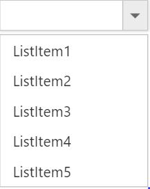
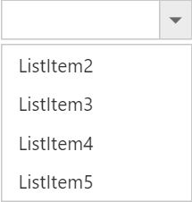

# How To

## Set focus to control initially?

[Access key](https://en.wikipedia.org/wiki/Access_key) property can be added in input element to set focus. Here focus is set by using access key + "j".



<input id="countriesSelect" ej-dropdownlist [dataSource]="countries" [fields]="fieldsvalues" width="100%" [(value)]="value" [enabled]="enable"/>





import {Component} from '@angular/core';

@Component({
    selector: 'ej-app',
    templateUrl: './Dropdownlist.component.html'
})
export class DropdownlistComponent {
    countries: Array<Object> = [];	
    fieldsvalues: Object;
	enabled: boolean;
    constructor() {
        this.countries = [
           { value: 11, parentId: 'a', text: "Algeria"},
           { value: 12, parentId: 'a', text: "Armenia"},
           { value: 13, parentId: 'a', text: "Bangladesh"},
           { value: 14, parentId: 'a', text: "Cuba"},
           { value: 15, parentId: 'b', text: "Denmark"}
        ];
        this.fieldsvalues = {  dataSource: this.countries };       
		this.enabled = true;
    }
}



## Add an item dynamically to the DropDownList?

You can use [addItem](https://help.syncfusion.com/api/js/ejdropdownlist#methods:additem) method to add single or multiple items dynamically to the popup list. You can define all the possible values that is supported by field property such as text, value, id, HTML attributes, selected, image and its associated attributes such as alt, width, and height etc..,

Adding text and value is demonstrated in the below given sample,



<input id="countriesSelect" ej-dropdownlist [dataSource]="countries" [fields]="fieldsvalues"  width=340 [(value)]="value" multiSelectMode="VisualMode" />
<button (click)="additem()">additem</button>





import {Component} from '@angular/core';

@Component({
    selector: 'ej-app',
    templateUrl: './DropDownList.component.html'
})
export class DropDownListComponent {
    countries: Array<Object> = [];	
    fieldsvalues: Object;
    newCountries: Array<Object> = [];
	
    constructor() {
		
        this.countries = [
           { value: 11, parentId: 'a', text: "Algeria"},
           { value: 12, parentId: 'a', text: "Armenia"},
           { value: 13, parentId: 'a', text: "Bangladesh"},
           { value: 14, parentId: 'a', text: "Cuba"},
           { value: 15, parentId: 'b', text: "Denmark"}
        ];
		this.newCountries=[
		{value: 16, parentId: 'a', text: "Iceland"},
			{value: 17, parentId: 'a', text: "Malysia"},
			];
        this.fieldsvalues = {  text: "text", value: "value" };		
    }
	additem(){		
		var obj=$("#countriesSelect").data("ejDropDownList");
		obj.addItem(this.newCountries);		
	}
}



## Disable/ Enable the DropDownList widget?

You can enable or disable the DropDownList widget using "enabled" property or methods. Detailed information is given [here](customization#enabledisable-the-widget).

## Control the popup visibility via methods in script showPopup ()/hidePopup ()?

By default popup list is shown on DropDownList button click but you can display the list initially by enabling the [showPopupOnLoad](https://help.syncfusion.com/api/js/ejdropdownlist#members:showpopuponload) property. You can also use [showPopup ()](https://help.syncfusion.com/api/js/ejdropdownlist#methods:showpopup) or [hidePopup ()](https://help.syncfusion.com/api/js/ejdropdownlist#methods:hidepopup) methods at run time to display or hide the popup list.

## Retrieve the selected item data from select event via arguments?

Bind the select event and you can retrieve the value from args.value. 



<input id="countriesSelect" ej-dropdownlist [dataSource]="countries" [fields]="fieldsvalues"  width=340 [(value)]="value" multiSelectMode="VisualMode" [showCheckbox]="showCheckBox" (select)="Select($event)"/>





import {Component} from '@angular/core';

@Component({
    selector: 'ej-app',
    templateUrl: './DropDownList.component.html'
})
export class DropDownListComponent {
    countries: Array<Object> = [];	
    fieldsvalues: Object;
    showCheckBox: boolean;
	
    constructor() {
		
        this.countries = [
           { value: 11, parentId: 'a', text: "Algeria"},
           { value: 12, parentId: 'a', text: "Armenia"},
           { value: 13, parentId: 'a', text: "Bangladesh"},
           { value: 14, parentId: 'a', text: "Cuba"},
           { value: 15, parentId: 'b', text: "Denmark"},
           { value: 16, parentId: 'b', text: "Egypt"},
           { value: 17, parentId: 'c', text: "Finland"},
           { value: 10, parentId: 'c', text: "India"},
           { value: 19, parentId: 'c', text: "Malaysia"},
           { value: 20, parentId: 'd', text: "New Zealand"},
           { value: 21, parentId: 'd', text: "Norway"},
           { value: 22, parentId: 'd', text: "Poland"},
           { value: 23, parentId: 'e', text: "Romania"},
           { value: 24, parentId: 'e', text: "Singapore"},
           { value: 25, parentId: 'e', text: "Thailand"},
           { value: 26, parentId: 'e', text: "Ukraine"}
        ];
		
        this.fieldsvalues = {  text: "text", value: "value" };
        this.showCheckBox = true;		
    }
	Select(args){		
		console.log("Value is " + args.value);
    }
}



The following screenshot will exhibit the select event arguments details,

## Append custom HTML in DropDownList popup outside the scroller part?

Create a custom HTML element and insert it after popup wrapper.



<input id="countriesSelect" ej-dropdownlist [dataSource]="countries" [fields]="fieldsvalues"  width=340 [(value)]="value" [showCheckbox]="showCheckBox" multiSelectMode="VisualMode" />
<button (click)="CheckAll()">CheckAll</button>





import {Component} from '@angular/core';

@Component({
    selector: 'ej-app',
    templateUrl: './DropDownList.component.html'
})
export class DropDownListComponent {
    countries: Array<Object> = [];	
    fieldsvalues: Object;
    showCheckBox: boolean;
	
    constructor() {
		
        this.countries = [
           { value: 11, parentId: 'a', text: "Algeria"},
           { value: 12, parentId: 'a', text: "Armenia"},
           { value: 13, parentId: 'a', text: "Bangladesh"},
           { value: 14, parentId: 'a', text: "Cuba"},
           { value: 15, parentId: 'b', text: "Denmark"},
           { value: 16, parentId: 'b', text: "Egypt"},
           { value: 17, parentId: 'c', text: "Finland"},
           { value: 10, parentId: 'c', text: "India"},
           { value: 19, parentId: 'c', text: "Malaysia"},
           { value: 20, parentId: 'd', text: "New Zealand"},
           { value: 21, parentId: 'd', text: "Norway"},
           { value: 22, parentId: 'd', text: "Poland"},
           { value: 23, parentId: 'e', text: "Romania"},
           { value: 24, parentId: 'e', text: "Singapore"},
           { value: 25, parentId: 'e', text: "Thailand"},
           { value: 26, parentId: 'e', text: "Ukraine"}
        ];
        this.fieldsvalues = {  text: "text", value: "value" };
        this.showCheckBox = true;		
    }
	CheckAll(){		
		var obj=$("#countriesSelect").data("ejDropDownList");
		obj.checkAll());		
	}
}



## Add check all option in popup list?

You can use [headerTemplate](https://help.syncfusion.com/api/js/ejdropdownlist#members:headertemplate) property to add any HTML element. Code snippet to add check all option is given below,



<input id="countriesSelect" ej-dropdownlist [dataSource]="countries"  [fields]="fieldsvalues" [headerTemplate]="headerTemplate" (create)="create()" multiSelectMode= "VisualMode" [showCheckbox]="showCheckBox"  width=340  /> 
 




import {Component} from '@angular/core';

@Component({
    selector: 'ej-app',
    templateUrl: './DropDownList.component.html'
})
export class DropDownListComponent {
    showCheckBox: boolean;
    headerTemplate: any;
    fieldsvalues: Object;
    countries: Array<Object> = [];
    constructor() {
        this.countries = [
           { value: 11, parentId: 'a', text: "Algeria"},
           { value: 12, parentId: 'a', text: "Armenia"},
           { value: 13, parentId: 'a', text: "Bangladesh"},
           { value: 14, parentId: 'a', text: "Cuba"},
           { value: 15, parentId: 'b', text: "Denmark"},
           { value: 16, parentId: 'b', text: "Egypt"},
           { value: 17, parentId: 'c', text: "Finland"},
           { value: 10, parentId: 'c', text: "India"},
           { value: 19, parentId: 'c', text: "Malaysia"},
           { value: 20, parentId: 'd', text: "New Zealand"},
           { value: 21, parentId: 'd', text: "Norway"},
           { value: 22, parentId: 'd', text: "Poland"},
           { value: 23, parentId: 'e', text: "Romania"},
           { value: 24, parentId: 'e', text: "Singapore"},
           { value: 25, parentId: 'e', text: "Thailand"},
           { value: 26, parentId: 'e', text: "Ukraine"}
        ]; 
       this.fieldsvalues = {  text: 'text', value: 'value' };
       this.showCheckBox= true;       
       this.headerTemplate= "
<input id ='check' type='checkbox'/>
"; 
    }
	create() {
		$("#check").ejCheckBox({ text: "Check All", 
		change: function(args){ 
			window.flag = true;
            var obj = $("#countriesSelect").data("ejDropDownList");
            if (args.isChecked) obj.checkAll();
            else obj.uncheckAll();
            window.flag = false;
		} });
		
            }
}





        .temp {
            height: 30px;
            display: block;
            padding-left: 13px;
            padding-top: 5px;
            border-bottom: 1px solid #c8c8c8;
        }
        .e-chkbox-wrap .e-text {
            font-size: 14px;
            padding-left: 10px;
        }

     


The following screenshot exhibits the output of the above code,

# To Cascade DropDownLists with different field names
By default cascading is performed based on the Value field, so that it needs to be same with cascaded DropDownList. If you need to cascade 2 DropDownLists with different field names and same values in it, you can achieve it using cascadeQuery and [cascade](https://help.syncfusion.com/api/js/ejdropdownlist#events:cascade "") event. Define the cascade event for the DropDownList from which you need to filter the datasource for the other DropDownList. 

In the cascade event arguments, modify the cascadeQuery which has the filtering query for the cascading DropDownList with your customized query.  So to filter the datasource based on the different field names, pass an ej.Query() which want to execute for cascade DropDownList.

Refer the following code blocks below



<input id="countrySelect" ej-dropdownlist [dataSource]="countries" [fields]="fieldsvalues" width="50%" [enabled]="enabled"/>
<input id="groupSelect" ej-dropdownlist [dataSource]="groups" [fields]="fieldsvaluesforgroup" width="50%" cascadeTo="countrySelect" (cascade)="cascade($event)"/>





import {Component} from '@angular/core';

@Component({
    selector: 'ej-app',
    templateUrl: './cascadeTo.component.html'
})
export class cascadeToComponent {
    countries: Array<Object> = [];
	groups: Array<Object> = [];
	fieldsvaluesforgroup: Object;
    fieldsvalues: Object;   
	enabled: boolean;
    constructor() {
        this.countries = [
           { value: 11, parentId: 'a', text: "Algeria"},
           { value: 12, parentId: 'a', text: "Armenia"},
           { value: 13, parentId: 'a', text: "Bangladesh"},
           { value: 14, parentId: 'a', text: "Cuba"},
           { value: 15, parentId: 'b', text: "Denmark"},
           { value: 16, parentId: 'b', text: "Egypt"},
           { value: 17, parentId: 'c', text: "Finland"},
           { value: 18, parentId: 'c', text: "India"},
           { value: 19, parentId: 'c', text: "Malaysia"},
           { value: 20, parentId: 'd', text: "New Zealand"},
           { value: 21, parentId: 'd', text: "Norway"},
           { value: 22, parentId: 'd', text: "Poland"},
           { value: 23, parentId: 'e', text: "Romania"},
           { value: 24, parentId: 'e', text: "Singapore"},
           { value: 25, parentId: 'e', text: "Thailand"},
           { value: 26, parentId: 'e', text: "Ukraine"}
        ];
		this.groups = [
		    { Id: 'a', text: "Group A" },
            { Id: 'b', text: "Group B" },
            { Id: 'c', text: "Group C" },
            { Id: 'd', text: "Group D" },
            { Id: 'e', text: "Group E" }
		];
        this.fieldsvalues = { dataSource: this.countries, text: 'text', value: 'value' };
		this.fieldsvaluesforgroup={ dataSource: this.groups, text: 'text', value: 'Id'};
		this.enabled= false;
    }
    cascade(args){
        args.requiresDefaultFilter = false; // restrict the built-in mapping for cascading dropdown

        args.cascadeQuery = ej.Query().where("parentId", "equal", args.cascadeValue); // query to filter value based parentId
    }
}



## To reorder the selected items and assign it to the top of popup list
Consider a DropDownList enabled with Virtual Scrolling, Filter search and Checkbox. This allows you to search through the list items and select multiple items. Selected items will be maintained in the DropDownList textbox but randomly shown in the pop up. 
To arrange the selected items and move it to the top of popup list, we need to get the sorted list of selected items and add it to the existing popup list items from popup close event. 
Initialize a DropDownList control with allowVirtualScrolling, enableFilterSearch and showCheckbox. 



<input id="countriesSelect" ej-dropdownlist [dataSource]="countries"  [fields]="fieldsvalues" [showCheckbox]="showCheckBox" (popupHide)="onPopupHide($event)"   [allowVirtualScrolling]="allowVirtualScrolling"  width=340 multiSelectMode="VisualMode"/>





import {Component} from '@angular/core';

@Component({
    selector: 'ej-app',
    templateUrl: './Dropdownlist.component.html'
})
export class DropdownlistComponent {
    countries: Array<Object> = [];	
    fieldsvalues: Object;
	allowVirtualScrolling: boolean;
    showCheckBox: boolean;

    constructor() {
        this.countries = [
           { value: 11, parentId: 'a', text: "Algeria"},
           { value: 12, parentId: 'a', text: "Armenia"},
           { value: 13, parentId: 'a', text: "Bangladesh"},
           { value: 14, parentId: 'a', text: "Cuba"},
           { value: 15, parentId: 'b', text: "Denmark"},
           { value: 16, parentId: 'b', text: "Egypt"},
           { value: 17, parentId: 'c', text: "Finland"},
           { value: 18, parentId: 'c', text: "India"},
           { value: 19, parentId: 'c', text: "Malaysia"},
           { value: 20, parentId: 'd', text: "New Zealand"},
           { value: 21, parentId: 'd', text: "Norway"},
           { value: 22, parentId: 'd', text: "Poland"},
           { value: 23, parentId: 'e', text: "Romania"},
           { value: 24, parentId: 'e', text: "Singapore"},
           { value: 25, parentId: 'e', text: "Thailand"},
           { value: 26, parentId: 'e', text: "Ukraine"}
        ];
        this.fieldsvalues = {  dataSource: this.countries, text: 'text', value: 'value' };       
		this.allowVirtualScrolling = true;
        this.showCheckBox = true;
    }
    onPopupHide(args){
        var obj=$("#countriesSelect").data("ejDropDownList");
        var items = obj.model.selectedItems.slice(0); // get the selected items
        items.sort(function (a, b) { return a - b; }); // numeric sorting for selected indices
        reorder(obj, items);
    }
    function reorder(obj, items) {
        var selectedLi = [], selectedData = [], newSelectedIndex = [], count = 0;
        var totalLi = obj.ultag.children("li"); // get the existing list items
        var totalData = obj.getListData(); // get the existing list items
        for (var m = 0; m <items.length; m++) {                   
            newSelectedIndex.push(m); // store the selected items to an array
            if(items[m] !=m)
                $(obj.ultag.children("li")[items[m]]).insertBefore(obj.ultag.children("li").eq(m)); // insert it to the ul li available in DropDownList
        }
        for (var n = items.length - 1; n >= 0; n--) {
            selectedData.push(totalData[items[n]]);
            totalData.splice(items[n], 1);  // generate new data excluding the previously selected items              
        }
        selectedData.reverse();                        
        obj._listItem(selectedData.concat(totalData)); // combine the new data and existing dataSource with excluded items
        obj.uncheckAll();
        obj.option("selectedIndices", newSelectedIndex);   // reset the select indices value since they are reorder to top            
    }
}



## To enable filter search for virtual items that are not visible on the page when virtualScrollMode is continuous
By default when virtualScrolling is enabled, filterSearch will work only for the elements available at that moment. To enable searching for the complete datasource bound to DropDownList, we need to manually configure the search query and corresponding changes for it. 
Initialize a DropDownList control with allowVirtualScrolling, enableFilterSearch and showCheckbox. 



<input id="countriesSelect" ej-dropdownlist [dataSource]="datamanager" [query]="query" [fields]="fieldsvalues" [showCheckbox]="showCheckBox" [itemsCount]="itemsCount"  [allowVirtualScrolling]="a"  virtualScrollMode="continuous" width=340 multiSelectMode="VisualMode" (search)="onSearch" (actionBegin)= "onBegin" (change) ="onChange" (create)= "onCreate"/>





import {Component} from '@angular/core';

@Component({
    selector: 'ej-app',
    templateUrl: './DropDownList.component.html'
})
export class DropDownListComponent {
    fieldsvalues: Object;
	datamanager: Object;
	enableFilterSearch: boolean;
	itemsCount: int;
    query: any;
    allowVirtualScrolling: boolean;
    showCheckBox: boolean;
    selectedItemsOnSearch: any;

    constructor() {       
        this.fieldsvalues = {  text: "ShipName", groupBy: "ShipCountry"};
        this.datamanager = ej.DataManager({ url: "http://mvc.syncfusion.com/services/Northwnd.svc/Orders" });
		this.itemsCount= 20;
		this.enableFilterSearch= true;
        this.query = ej.Query().select("ShipName", "ShipCountry");
        this.allowVirtualScrolling = true;
        this.showCheckBox = true;
        this.selectedItemsOnSearch = [];
    }
	
}



Now override the addItem method which will be redefined based on this scenario to avoid adding duplicate data on virtualScrolling and empty the _updateSelectedIndexByValue prototype method.


    
    function onCreate(args) {
        window.dropObj = this;
        window.dropObj._updateSelectedIndexByValue = function () { }
        window.dropObj.addItemMethod = window.dropObj.addItem;
        window.dropObj.addItem = function (list) {
            appendList(this, list);
        }
    }
    /*
    In this method, we just override the functionalities of built-in addItem method to avoid the duplicate from remote to get append into <ul> tag. 
    */
    function appendList(proxy, selectedList) {
        var alreadyPushed = false;
        if (selectedList.length) {
            for (var i = 0; i < selectedList.length; i++) {
                for (var j = 0; j < proxy._rawList.length; j++) {
                    if (proxy._rawList[j][proxy.model.fields.value] === selectedList[i][proxy.model.fields.value]) {
                        alreadyPushed = true;
                        break;
                    }
                }
                if (!alreadyPushed) {
                    window.dropObj.addItemMethod(selectedList[i]);
                }
                alreadyPushed = false;
            }
        }
    }
    


In the begin event for loading data items from remote source, modify the query for fetching data based on the search string. Also when items fetched from remote service append it to a temporary list instead of main popup list



    function onBegin(args) {
        var proxy = this;
        if (proxy.inputSearch && proxy.inputSearch.val() != "") {
            args.cancel = true;
            var skipQuery = proxy._addSearchQuery(ej.Query(), !proxy._isPlainType(proxy._rawList)).skip(proxy._getLi().length).clone();
            queryPromise = proxy.model.dataSource.executeQuery(skipQuery);
            queryPromise.done(function (e) {
                dynamicItems(proxy, e.result);
            }).fail(function () {
                console.log("failure triggered")
            }).always(function (e) {
                proxy._removeLoadingClass();
            });
        }
    }
    /*
    In this method, appending the items directly to <ul> tag of popup list items dynamically when searching and do virtual scrolling. 
    */
    function dynamicItems(proxy, itemTag) {

        if (!itemTag) return false;
        proxy._mapFields();
        var list = $.isArray(itemTag) ? itemTag : [itemTag];
        if (list.length < 1) return false;
        proxy._generateLi(list, proxy.mapFld);
        proxy.ultag.append(proxy.dummyUl);               
        if (proxy.model.showCheckbox) {
            proxy._appendCheckbox(proxy.dummyUl);
        }
        if (proxy._isPopupShown()) {
            var scrollerPosition = proxy.scrollerObj ? proxy.scrollerObj.scrollTop() : 0;
            proxy._refreshScroller();
            if (proxy.scrollerObj) proxy.scrollerObj.option("scrollTop", scrollerPosition);
        }
    }



When performing search, define the event to change the query string for filtering data from remote service based on the search string. Also maintain selected items so that when you empty the search text box selected items will be appended to the popup list.


    
    /*
    In search event, we just filter out the query string according the search string from remote and append it to popup list items. 
    Maintaining the selected items on searching in selectedItemOnSelect variable and append those items once search input have empty string. 
    */

    function onSearch(args) {
        window.search = args;
        if (!window.searchFlag) {
            window.searchFlag = true;
            window.processSearchString = args.searchString;
            var proxy = window.dropObj;
            if (args.searchQuery && proxy.inputSearch.val() !== "") {
                var searchQuery = args.searchQuery.clone();
                var queryPromise = proxy.model.dataSource.executeQuery(searchQuery);
                queryPromise.done(function (e) {
                    if (window.processSearchString == window.search.searchString) {
                        proxy._filterSearch(args.searchQuery, e);
                        console.log("added");
                    }
                    else {
                        window.searchFlag = false;
                        console.log("recursive called");
                        onSearch(window.search);
                    }
                }).fail(function () {
                    console.log("fail triggered");
                }).always(function () {
                    window.searchFlag = false;
                });
                args.cancel = true;
            }
            else if (selectedItemsOnSearch.length > 0) {
                appendList(proxy, selectedItemsOnSearch);
                selectedItemsOnSearch = [];
                window.searchFlag = false;
            }
            else {
                window.searchFlag = false;
                args.cancel = true;
            }
        }
        else {
            console.log("continuous search have restricted");
        }
    }



Finally define change event to maintain the selected items on search



    function onChange(args) {
        var proxy = this;
        if (proxy.inputSearch && proxy.inputSearch.val() != "") {
            var item = {}, alreadyAdded = false;
            item[proxy.model.fields.value] = args.selectedValue;
            item[proxy.model.fields.text] = args.selectedText;
            if (args.isChecked) {
                for (var i = 0; i < selectedItemsOnSearch.length; i++) {
                    if (selectedItemsOnSearch[i].value == args.value) {
                        alreadyAdded = true;
                    }
                }
                if (!alreadyAdded) selectedItemsOnSearch.push(item);
            }
            else {
                for (var i = 0; i < selectedItemsOnSearch.length; i++) {
                    if (selectedItemsOnSearch[i].value == args.value) {
                        selectedItemsOnSearch.splice(i, 1);
                    }
                }
            }
        }
        else if (selectedItemsOnSearch.length > 0) {
            appendList(proxy, selectedItemsOnSearch);
            selectedItemsOnSearch = [];
        }
    }
    


## To remove the items from DropDownList?

You can remove the items from the DropDownList  by using [splice](http://www.tutorialspoint.com/javascript/array_splice.htm#) method and then rebind the data source through set model. 
Removing an entry from DropdownList is demonstrated in the below given sample.



<input id="countriesSelect" ej-dropdownlist [dataSource]="countries" [fields]="fieldsvalues"  width=340 [(value)]="value" [showCheckbox]="showCheckBox" multiSelectMode="VisualMode" />
<button (click)="Remove()">Remove</button>





import {Component} from '@angular/core';

@Component({
    selector: 'ej-app',
    templateUrl: './DropDownList.component.html'
})
export class DropDownListComponent {
    countries: Array<Object> = [];	
    fieldsvalues: Object;
    showCheckBox: boolean;
	
    constructor() {
		
        this.countries = [
           { value: 11, parentId: 'a', text: "Algeria"},
           { value: 12, parentId: 'a', text: "Armenia"},
           { value: 13, parentId: 'a', text: "Bangladesh"},
           { value: 14, parentId: 'a', text: "Cuba"},
           { value: 15, parentId: 'b', text: "Denmark"},
           { value: 16, parentId: 'b', text: "Egypt"},
           { value: 17, parentId: 'c', text: "Finland"},
           { value: 10, parentId: 'c', text: "India"},
           { value: 19, parentId: 'c', text: "Malaysia"},
           { value: 20, parentId: 'd', text: "New Zealand"},
           { value: 21, parentId: 'd', text: "Norway"},
           { value: 22, parentId: 'd', text: "Poland"},
           { value: 23, parentId: 'e', text: "Romania"},
           { value: 24, parentId: 'e', text: "Singapore"},
           { value: 25, parentId: 'e', text: "Thailand"},
           { value: 26, parentId: 'e', text: "Ukraine"}
        ];
        this.fieldsvalues = {  text: "text", value: "value" };
        this.showCheckBox = true;		
    }
	Remove(){		
		var object=$("#countriesSelect").data("ejDropDownList");
		data1 = object.model.dataSource.splice(0);
        data1.splice(0, 1);
        object.setModel({ dataSource: data1 });		
	}
}



The following screenshot exhibits the output of above code:

Before removing an item:

After removing an item:

## Select the image rather than the text from the DropDownList when the template concept is used?

By default, the DropDownList displays only the text of the data item. We can able to customize the selected data to show case the custom visual element in the DropDownList’s input element.

Initialize the DropDownList as follows



   <input id="countriesSelect" ej-dropdownlist [dataSource]="listddl"  [fields]="fieldsvalues" [template]="template" watermarkText="Select an employee"  (select)="onSelect($event)" popupWidth="200px" width="200px"  />

    
    

Upon selecting the items from the DropDownList, the client side event “select” will be triggered, in that find the input element which holds the text value and make it as “hidden” and then create the span element for the custom value and append to the DropDownList outer wrapper element.



import {Component} from '@angular/core';

@Component({
    selector: 'ej-app',
    templateUrl: './DropDownList.component.html',
    styleUrls: ['./dropdownlist.component.css']
})
export class DropDownListComponent {
    list: object;	
    fieldsvalues: Object;
    template: any;
	
    constructor() {
		
        this.list = [
    { text: "Erik Linden", image: "3", designation: "Representative", country: "England" }, 
    { text: "John Linden", image: "6", designation: "Representative", country: "Norway" },
    { text: "Louis", image: "7", designation: "Representative", country: "Australia" }, 
    { text: "Lawrence", image: "8", designation: "Representative", country: "India" }];
this.template ='
' +
                        '
 ${text} 

';
        this.fieldsvalues = {  text: "text", value: "value" };
       		
    }
	onSelect(args){
        
    if(!args.model.showCheckbox && args.model.multiSelectMode == "none"){
         var imgLocation = "http://js.syncfusion.com/demos/web/images/Employee/" + args.value + ".png";
         if($("#myImg").length != 1){
             var target = $("#selectCar");
             $(target).css({display : "none"});
             var dateSpan = document.createElement('span');
             dateSpan.innerHTML = '';
              $(dateSpan).insertBefore(target);
          }
          else{

              edit_save = document.getElementById("myImg");
              edit_save.src = imgLocation;     
          }
    }
	}
}


Apply the following styles 



    



N> This scenarios, will be suits for the single select mode in the DropDownList.

## Apply HTML Attributes such as color and class directly to the input element rather than the outer wrapper element of DropDownList?

By default, htmlAttributes property of DropDownList, will add the HTML attributes to the input element of DropDownList. But, the following attributes such as class, style, readOnly and disabled cannot add directly to the input element.

This can be achieved, by adding the attributes directly to the input element if you needed.



<input id="countriesSelect" ej-dropdownlist [dataSource]="countries" [fields]="fieldsvalues"  width=340 [(value)]="value" [showCheckbox]="showCheckBox" multiSelectMode="VisualMode" (create)="create()" />





import {Component} from '@angular/core';

@Component({
    selector: 'ej-app',
    templateUrl: './DropDownList.component.html'
})
export class DropDownListComponent {
    countries: Array<Object> = [];	
    fieldsvalues: Object;
    showCheckBox: boolean;
	
    constructor() {
		
        this.countries = [
           { value: 11, parentId: 'a', text: "Algeria"},
           { value: 12, parentId: 'a', text: "Armenia"},
           { value: 13, parentId: 'a', text: "Bangladesh"},
           { value: 14, parentId: 'a', text: "Cuba"},
           { value: 15, parentId: 'b', text: "Denmark"},
           { value: 16, parentId: 'b', text: "Egypt"},
           { value: 17, parentId: 'c', text: "Finland"},
           { value: 10, parentId: 'c', text: "India"},
           { value: 19, parentId: 'c', text: "Malaysia"},
           { value: 20, parentId: 'd', text: "New Zealand"},
           { value: 21, parentId: 'd', text: "Norway"},
           { value: 22, parentId: 'd', text: "Poland"},
           { value: 23, parentId: 'e', text: "Romania"},
           { value: 24, parentId: 'e', text: "Singapore"},
           { value: 25, parentId: 'e', text: "Thailand"},
           { value: 26, parentId: 'e', text: "Ukraine"}
        ];
        this.fieldsvalues = {  text: "text", value: "value" };
        this.showCheckBox = true;		
    }
	create(){		
		var object=$("#countriesSelect").data("ejDropDownList");
        object.popup.attr("style", "color:yellow");	
	}
}



 

## Add tooltip on hovering the DropDownList’s items?
 
 In order to get tooltip on hovering the DropDownList popup items, use htmlAttributes field in it. Generate a DataSource with a field for mapping the HtmlAttributes having the “title” attribute value, which will allow you to show the tooltip on hovering. The htmlAttributes field will set the HTML properties for the list items.



 <input id="countriesSelect" ej-dropdownlist [dataSource]="countries" [fields]="fieldsvalues"  width=340 [(value)]="value" [showCheckbox]="showCheckBox" multiSelectMode="VisualMode" />





import {Component} from '@angular/core';

@Component({
    selector: 'ej-app',
    templateUrl: './DropDownList.component.html'
})
export class DropDownListComponent {
    countries: Array<Object> = [];	
    fieldsvalues: Object;
    showCheckBox: boolean;
	
    constructor() {
		
        this.countries = [
           { value: 11, parentId: 'a', text: "Algeria", tooltip: { title: "Algeria" } },
           { value: 12, parentId: 'a', text: "Armenia", tooltip: { title: "Armenia" } },
           { value: 13, parentId: 'a', text: "Bangladesh", tooltip: { title: "Banglasesh" } },
           { value: 14, parentId: 'a', text: "Cuba", tooltip: { title: "Cuba" } },
           { value: 15, parentId: 'b', text: "Denmark", tooltip: { title: "Denmark" } },
        ];
        this.fieldsvalues = {  text: "text", value: "value",htmlAttributes:'tooltip' };
        this.showCheckBox = true;		
    }
}



## Stop/Prevent the events (change/select) in the DropDownList?

The client side events such as “select” or “change” can be prevented in the DropDownList by using argument name called cancel.



 <input id="countriesSelect" ej-dropdownlist [dataSource]="countries" [fields]="fieldsvalues"  width=340 [(value)]="value" [showCheckbox]="showCheckBox" multiSelectMode="VisualMode" (ejchange)="OnSelect($event)" (select)="OnSelect($event)"/>





import {Component} from '@angular/core';

@Component({
    selector: 'ej-app',
    templateUrl: './DropDownList.component.html'
})
export class DropDownListComponent {
    countries: Array<Object> = [];	
    fieldsvalues: Object;
    showCheckBox: boolean;
	
    constructor() {
		
        this.countries = [
           { value: 11, parentId: 'a', text: "Algeria", tooltip: { title: "Algeria" } },
           { value: 12, parentId: 'a', text: "Armenia", tooltip: { title: "Armenia" } },
           { value: 13, parentId: 'a', text: "Bangladesh", tooltip: { title: "Banglasesh" } },
           { value: 14, parentId: 'a', text: "Cuba", tooltip: { title: "Cuba" } },
           { value: 15, parentId: 'b', text: "Denmark", tooltip: { title: "Denmark" } },
        ];
        this.fieldsvalues = {  text: "text", value: "value",htmlAttributes:'tooltip' };
        this.showCheckBox = true;		
    }
}


While selecting the items in the DropDownList, the select or change event will be triggered. In that, sets “true” to the cancel argument, which will prevent the further selecting of items in the DropDownList.



    onSelect(args) {
        args.cancel = true;
    }
    


## How can I add items in ejDropDownList at the first place in list?

To add the item in the certain position, then we should clear the old dataSource and add the items in array using jQuery Splice() method and then should re-initialize the dataSource in DropDownList.

Initialize the DropDownList as follows



<input id="countriesSelect" ej-dropdownlist [dataSource]="countries" [fields]="fieldsvalues" width=340 />
<button type="button" (click)="dataPrepend()">PREPEND</button>
<button type="button" (click)="dataAppend()">POSTPOND</button>





import {Component} from '@angular/core';

@Component({
    selector: 'ej-app',
    templateUrl: './Dropdownlist.component.html'
})
export class DropdownlistComponent {
    countries: Array<Object> = [];	
    fieldsvalues: Object;
	
    constructor() {
        this.countries = [
           { value: 11, parentId: 'a', text: "Algeria"},
           { value: 12, parentId: 'a', text: "Armenia"},
           { value: 13, parentId: 'a', text: "Bangladesh"},
           { value: 14, parentId: 'a', text: "Cuba"},
           { value: 15, parentId: 'b', text: "Denmark"},
           { value: 16, parentId: 'b', text: "Egypt"},
           { value: 17, parentId: 'c', text: "Finland"},
           { value: 18, parentId: 'c', text: "India"},
           { value: 19, parentId: 'c', text: "Malaysia"},
           { value: 20, parentId: 'd', text: "New Zealand"},
           { value: 21, parentId: 'd', text: "Norway"},
           { value: 22, parentId: 'd', text: "Poland"},
           { value: 23, parentId: 'e', text: "Romania"},
           { value: 24, parentId: 'e', text: "Singapore"},
           { value: 25, parentId: 'e', text: "Thailand"},
           { value: 26, parentId: 'e', text: "Ukraine"}
        ];
        this.fieldsvalues = {  dataSource: this.countries, text: 'text', value: 'value' };       
		
    }
}



Upon clicking to the Prepend button, which will insert the items at index of “0” in the DropDownList.



    dataPrepend() {
        var prepend = $('#countriesSelect').data("ejDropDownList");
        if (prepend.model.dataSource != null) {
            prepend.model.dataSource.splice(0, 0, { text: "India", value: "-1" });
            var b = prepend.model.dataSource;
            prepend.model.dataSource = null;
            prepend.option("dataSource", b);
        }
    }
    


If you click the postpone button, which insert items at the last index in the DropDownList.



  dataAppend() {
        $('#countriesSelect').ejDropDownList("addItem", { text: "India" });
   }



## Can a DropDownList have delimiters in their JSON data source?

If the items have delimiter character, the same delimiter should not be set in the “delimiterChar” property of DropDownList. The default delimiter is “comma”. We suggest to use different delimiter character in the “delimiterChar” property of DropDownList if the multiSelectMode or showCheckbox is enabled.

Setting delimiter character other than comma will differentiate the selected items in DropDownList. Else you can use multiSelectMode as visualMode, so that each selected item in DropDownList will be boxed separately in the textbox.

Method 1: Setting custom delimiter Character



<input id="countriesSelect" ej-dropdownlist [dataSource]="countries" [fields]="fieldsvalues" width="100%" [(value)]="value" [showCheckbox]="showCheckbox" delimiterChar= ";" multiSelectMode= "delimiter"/>





import {Component} from '@angular/core';

@Component({
    selector: 'ej-app',
    templateUrl: './Dropdownlist.component.html'
})
export class DropdownlistComponent {
    countries: Array<Object> = [];	
    fieldsvalues: Object;
    showCheckbox: boolean;
    constructor() {
        this.countries = [
           { value: 11, parentId: 'a', text: "Algeria"},
           { value: 12, parentId: 'a', text: "Armenia"},
           { value: 13, parentId: 'a', text: "Bangladesh"},
           { value: 14, parentId: 'a', text: "Cuba"},
           { value: 15, parentId: 'b', text: "Denmark"},
           { value: 16, parentId: 'b', text: "Egypt"},
           { value: 17, parentId: 'c', text: "Finland"},
           { value: 18, parentId: 'c', text: "India"},
           { value: 19, parentId: 'c', text: "Malaysia"},
           { value: 20, parentId: 'd', text: "New Zealand"},
           { value: 21, parentId: 'd', text: "Norway"},
           { value: 22, parentId: 'd', text: "Poland"},
           { value: 23, parentId: 'e', text: "Romania"},
           { value: 24, parentId: 'e', text: "Singapore"},
           { value: 25, parentId: 'e', text: "Thailand"},
           { value: 26, parentId: 'e', text: "Ukraine"}
        ];
        this.fieldsvalues = {  dataSource: this.countries };       
        this.showCheckbox = true;
    }
}



Method 2: Using Visual Mode



<input id="countriesSelect" ej-dropdownlist [dataSource]="countries" [fields]="fieldsvalues" width="100%" [(value)]="value" multiSelectMode="VisualMode"/>





import {Component} from '@angular/core';

@Component({
    selector: 'ej-app',
    templateUrl: './Dropdownlist.component.html'
})
export class DropdownlistComponent {
    countries: Array<Object> = [];	
    fieldsvalues: Object;
	
    constructor() {
        this.countries = [
           { value: 11, parentId: 'a', text: "Algeria"},
           { value: 12, parentId: 'a', text: "Armenia"},
           { value: 13, parentId: 'a', text: "Bangladesh"},
           { value: 14, parentId: 'a', text: "Cuba"},
           { value: 15, parentId: 'b', text: "Denmark"},
           { value: 16, parentId: 'b', text: "Egypt"},
           { value: 17, parentId: 'c', text: "Finland"},
           { value: 18, parentId: 'c', text: "India"},
           { value: 19, parentId: 'c', text: "Malaysia"},
           { value: 20, parentId: 'd', text: "New Zealand"},
           { value: 21, parentId: 'd', text: "Norway"},
           { value: 22, parentId: 'd', text: "Poland"},
           { value: 23, parentId: 'e', text: "Romania"},
           { value: 24, parentId: 'e', text: "Singapore"},
           { value: 25, parentId: 'e', text: "Thailand"},
           { value: 26, parentId: 'e', text: "Ukraine"}
        ];
        this.fieldsvalues = {  dataSource: this.countries, text: 'text', value: 'value' };       
		
    }
}



