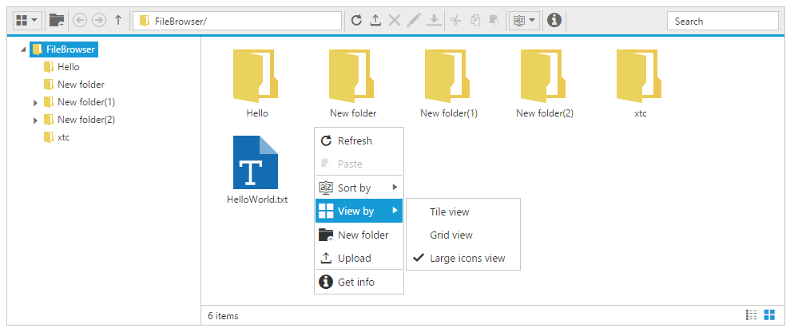

# Context Menu

The context-menu has [list of items](#context-menu-items) which helps to perform FileExplorer operations, and it appears based on the target such as file or folder.

## Context menu items

The below table shows the context menu items corresponding to the location where it is opened:

<table>
<tr>
<th>
Context menu location</th><th>
Context menu items</th><th>
Screenshot</th></tr>
<tr>
<td>
While right click on treeview nodes (from navigation pane)  </td><td>
* New folder * Upload * Delete * Rename * Cut * Copy * Paste    </td><td>
    </td></tr>
<tr>
<td>
While right click on File / Folder  </td><td>
* Open * Download * Upload * Delete * Rename * Cut * Copy * Paste * Get info    </td><td>
    </td></tr>
<tr>
<td>
While right click on layout (content pane)  </td><td>
* Refresh * Paste * Sort By * New folder * Upload  * Get info     </td><td>
    </td></tr>
</table>
The below table explains the behavior of each context menu item:

<table>
<tr>
<td>
Open  </td><td>
It opens the selected folder. When an image file selected it opens the preview of the image. For the remaining files this option becomes disabled.  </td></tr>
<tr>
<td>
Download  </td><td>
It downloads the selected file. When a file or number of files selected at that time only download option enabled.  If multiple files selected then it downloads all the files in a zip format.  </td></tr>
<tr>
<td>
Cut  </td><td>
It makes the copy of the selected files or folders into the clipboard. When the user paste the files in any location, the files are removed from the source location.  </td></tr>
<tr>
<td>
Copy  </td><td>
It makes the copy of the selected files or folders into the clipboard. When the user paste the files, the copy of the files only pasted in the target location.  </td></tr>
<tr>
<td>
Paste  </td><td>
It paste the files from the clipboard into the current selected folder. Note that when the files are copied into the clipboard at that time only it enabled.  </td></tr>
<tr>
<td>
Delete  </td><td>
It deletes the current selected file or folder. When you select any file or folder at that time only this option gets enabled.  If multiple files selected then it deletes all the selected items.  </td></tr>
<tr>
<td>
Rename  </td><td>
This is used to rename the current selected file or folder. When you select any file or folder at that time only this option gets enabled.  Even multiple files selected it renames the single file only.  </td></tr>
<tr>
<td>
New folder  </td><td>
It creates a new folder on the current directory.  While click on the NewFolder item a dialog appears to get the folder name. Based on the user input, a new folder create on the current directory.  </td></tr>
<tr>
<td>
Upload  </td><td>
It uploads a file or list of files into the current directory.  </td></tr>
<tr>
<td>
Get info  </td><td>
It displays the details of the current selected file or folder.  </td></tr>
<tr>
<td>Sort By  </td>
<td>
It's used to sorting the files and folders from the current directory.The sorting can be done based on the columns available from grid,in both ascending and descending order.  
</td></tr>
</table>

## Context menu Visibility

The presence of the context menu can be controlled by the `showContextMenu` property. This was enabled by default, and by disabling this property you can prevent our built-in context menu.



<ej-fileexplorer id="fileExplorer" 
   path= "http://js.syncfusion.com/demos/ejServices/Content/FileBrowser/"
   ajaxAction="http://js.syncfusion.com/demos/ejServices/api/FileExplorer/FileOperations" 
   [showContextMenu]="false" style="display:block">
</ej-fileexplorer>



## Enable / Disable the Context menu Item

The context menu items can be enabled or disabled through the client side public methods. It enables or disables the item from all the context menu where it is present. 

For example, if you disable the “Upload” item, it disables in all places wherever it appears such as open the context menu on treeview, open on file/folder, and open on layout.

* enableMenuItem
* disableMenuItem

These methods only accepts the context menu item name as the parameter. 



            let fileExpObj = $("#fileExplorer").data("ejFileExplorer");

            // this disables the New Folder item

            fileExpObj.disableMenuItem("New folder");

            // this disables the Download item

            fileExpObj.disableMenuItem("Download");



N> To use this method we need to take instance of FileExplorer and should invoke that methods as like mentioned above.

## Context Menu Customization

You can customize the ContextMenu of FileExplorer control by using contextMenuSettings property. 

You can add your own context menu items and its action along with default context menu items of FileExplorer control. You can also remove the default context menu items in FileExplorer control. 

To add/remove/re-arrange context menu items, you need to use contextMenuSettings.items property and to bind required actions for newly added menu items and add sub menu items, use contextMenuSettings.customMenuFields property. 


	
<ej-fileexplorer id="fileExplorer" 
  path= "http://js.syncfusion.com/demos/ejServices/Content/FileBrowser/"
  ajaxAction="http://js.syncfusion.com/demos/ejServices/api/FileExplorer/FileOperations"
  (menuOpen)="onMenuOpen($event)" (layoutChange)="onLayoutChange()" 
  [isResponsive]="true" minWidth="150px" [contextMenuSettings]="contextMenuSettings"
  width="100%" layout="tile" style="display:block">
</ej-fileexplorer>





import { Component } from '@angular/core';
import { ViewEncapsulation } from '@angular/core';

@Component({
  selector: 'ej-app',
  templateUrl: 'src/fileexplorer/fileexplorer.component.html',
  styleUrls: ['src/fileexplorer/fileexplorer.component.css'],
  encapsulation: ViewEncapsulation.None,
})
export class FileExplorerComponent {
    contextMenuSettings: Object;
    constructor() {
        this.contextMenuSettings = {
                    // define the ContextMenu items
                    items: {
                        // removed the 'NewFolder' item from NavigationPane ContextMenu
                        navbar: ['Upload', '|', 'Delete', 'Rename', '|', 'Cut', 'Copy',
                        'Paste', '|', 'Getinfo'],
                        // added the custom ContextMenu item (View) to Current working 
                        directory ContextMenu
                        cwd: ['Refresh', 'Paste', '|', 'SortBy', 'View', '|', 'NewFolder',
                        'Upload', '|', 'Getinfo'],
                        // removed 'Upload' item from Selected files/ folder's ContextMenu
                        files: ['Open', 'Download', '|', 'Delete', 'Rename', '|', 'Cut',
                        'Copy', 'Paste', '|','OpenFolderLocation', 'Getinfo']
                    },
                    // added the custom ContextMenu item's (View) functionality
                    customMenuFields: [
                    {
                        id: 'View',
                        text: 'View by',
                        spriteCssClass: 'custom-grid',
                        child: [
                        {
                            id: 'tile',
                            text: 'Tile view',
                            action: function (event) {
                            let fileExplorerObj = $('#fileExplorer4').data('ejFileExplorer');
                            fileExplorerObj.option('layout', event.ID);
                            }
                        },
                        {
                            id: 'grid',
                            text: 'Grid view',
                           action: function (event) {
                           let fileExplorerObj = $('#fileExplorer4').data('ejFileExplorer');
                           fileExplorerObj.option('layout', event.ID);
                            }
                        },
                        {
                            id: 'large',
                            text: 'large',
                           action: function (event) {
                           let fileExplorerObj = $('#fileExplorer4').data('ejFileExplorer');
                           fileExplorerObj.option('layout', event.ID);
                            }
                        }, ]
                    }, ]
                };
    }
    onLayoutChange() {
         let fileExplorerObj = $('#fileExplorer4').data('ejFileExplorer');
         $('.fe-context-menu .View').removeClass('custom-grid custom-tile custom-large');
         $('.fe-context-menu .View').addClass('custom-' + fileExplorerObj.model.layout);
    }
    onMenuOpen(event) {
        if (event.contextMenu == 'cwd') {
                let fileExplorerObj = $('#fileExplorer4').data('ejFileExplorer');
                $('.fe-context-menu').find('.e-fe-activeicon').removeClass('e-fe-activeicon');
                $('.fe-context-menu').find('.' + fileExplorerObj.model.layout)
                .addClass('e-fe-activeicon');
            }
    }
}



Icons of context menu items can be customized by overriding the default context menu item style. Add the following code in fileexplorer.component.css file which illustrates how to customize the icon of context menu items.



    .fe-context-menu .custom-grid:before {
        content: "\e7b9";
    }

    .fe-context-menu .custom-large:before {
        content: "\e7bb";
    }

    .fe-context-menu .custom-tile:before {
        content: "\e7be";
    }



The following screenshot displays the customization of context menu in FileExplorer control.

For more details about context menu customization, refer the sample [here](http://jsplayground.syncfusion.com/Sync_nz201mh4).

## Context Menu Events

You would be notified with events when you try to open the context menu items (**menuBeforeOpen**), after context menu items is opened (**menuOpen**) and when you click the menu items (**menuClick**). The following code example illustrates how to define those events.



<ej-fileexplorer id="fileExplorer" 
   path= "http://js.syncfusion.com/demos/ejServices/Content/FileBrowser/"
   ajaxAction="http://js.syncfusion.com/demos/ejServices/api/FileExplorer/FileOperations"
   (menuOpen)="onMenuOpen($event)" (menuBeforeOpen)="onMenuBeforeOpen($event)" 
   (menuClick)="onMenuClick($event) "style="display:block">
</ej-fileexplorer>





import { Component } from '@angular/core';

@Component({
  selector: 'ej-app',
  templateUrl: 'src/fileexplorer/fileexplorer.component.html'
})
export class FileExplorerComponent {
    contextMenuSettings: Object;
    constructor() {
    onMenuBeforeOpen(event) {
        //you add/remove the context menu items in run time
        //do your custom action here.
        event.dataSource.pop();
    }
    onMenuOpen(event) {
       //you can also identify which context menu is opened by 
        if (event.contextMenu == "cwd") {
            //do your custom action here.
        }
    }
    onMenuClick(event) {
        switch (args.text) {
            case "large":
                //do your custom action here.
                break;
        }
    }
    }
}

