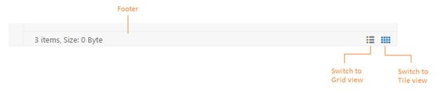

# Customization

## Dimension Customization

The dimension of the FileExplorer can be customized through `height` and `width` property. The dimension can be set in percentage (ex; width: “100 %”), so that the control inherits the width from the parent element. 



<ej-fileexplorer id="fileExplorer" 
   path= "http://js.syncfusion.com/demos/ejServices/Content/FileBrowser/"
   ajaxAction="http://js.syncfusion.com/demos/ejServices/api/FileExplorer/FileOperations" 
   width="900px" height="300px" style="display:block">
</ej-fileexplorer>



## Customizing the Navigation pane

The navigation pane contains the tree view element which displays all the folders from the filesystem in a hierarchical manner. This is useful to a quick navigation of any folder in the filesystem.

The visibility of the navigation pane can be controlled by the `showNavigationPane` property. By disabling this property, you can hide the navigation pane from FileExplorer. 



<ej-fileexplorer id="fileExplorer" 
   path= "http://js.syncfusion.com/demos/ejServices/Content/FileBrowser/"
   ajaxAction="http://js.syncfusion.com/demos/ejServices/api/FileExplorer/FileOperations" 
   [showNavigationPane]="false" style="display:block">
</ej-fileexplorer>



## Customizing the Content pane

The content pane is the main part of the FileExplorer UI which displays all the files and folders from the filesystem. The content pane supports the following two types of layout views:

* Grid
* Tile

The **grid  view** displays the files and folders in a grid layout with the details in separate columns. By default the grid view having the four columns which displays the file name, type, date modified and size of the file.

The **tile view** display the files and folders like a small size icons. It allows the thumbnails for the image files so that you can view the tiny preview of all image files.

### Changing the Layout views	

You can change the layout of current view by the switcher which displays at right-bottom of footer in the FileExplorer. By clicking the grid and tile view buttons you can change the layout of current view.

Also the layout views can be changed through the `layout` property. Also the layout views can be changed through the [layout](https://help.syncfusion.com/api/angular/ejfileexplorer#members:layout) property. The [layoutChange](https://help.syncfusion.com/api/angular/ejfileexplorer#events:layoutchange) event will be triggered whenever the layout view type is changed.



<ej-fileexplorer id="fileExplorer" 
  path= "http://js.syncfusion.com/demos/ejServices/Content/FileBrowser/"
  ajaxAction="http://js.syncfusion.com/demos/ejServices/api/FileExplorer/FileOperations" 
  layout="tile" style="display:block">
</ej-fileexplorer>



### Customizing the Grid view

By default sorting is enabled in grid view of FileExplorer, it helps you to sort each columns in ascending or descending order by pressing the corresponding column header. The sorting functionality can be disabled by setting `allowSorting` property to false.

The behavior of the columns can be customized through the `columns` property. 



<ej-fileexplorer id="fileExplorer" 
   path= "http://js.syncfusion.com/demos/ejServices/Content/FileBrowser/"
   ajaxAction="http://js.syncfusion.com/demos/ejServices/api/FileExplorer/FileOperations" 
   [gridSettings]="gridSettings" style="display:block">
</ej-fileexplorer>





import { Component } from '@angular/core';

@Component({
  selector: 'ej-app',
  templateUrl: 'src/fileexplorer/fileexplorer.component.html'
})
export class FileExplorerComponent {
    gridSettings: Object;
    constructor() {
        this.gridSettings = {
        allowSorting: false,
        // it displays 3 columns only, like this you can display your // desired columns here
        columns: [
            { field: "name", headerText: "Name", width: 150 },
            { field: "dateModified", headerText: "Date Modified", width: 150 },
            { field: "size", headerText: "Size", width: 90, textAlign: "right",
             headerTextAlign: "left" }
        ]
        }   
    }
}



## Footer Customization 

The footer displays the details of the current selected files and folders, and the footer contains the switcher to change the layout view. The visibility of the footer can be customized by the `showFooter` property. 



<ej-fileexplorer id="fileExplorer" 
   path= "http://js.syncfusion.com/demos/ejServices/Content/FileBrowser/"
   ajaxAction="http://js.syncfusion.com/demos/ejServices/api/FileExplorer/FileOperations" 
   [showFooter]="false" style="display:block">
</ej-fileexplorer>



## Customize the Root Folder name in FileExplorer

You can set the alias name to the root folder of FileExplorer by using `rootFolderName` API. It is used to replace the actual root folder name in the FileExplorer UI. Refer to the below code to set the alias name for the root folder of FileExplorer.  



<ej-fileexplorer id="root" 
   path= "http://js.syncfusion.com/demos/ejServices/Content/FileBrowser/"
   ajaxAction="http://js.syncfusion.com/demos/ejServices/api/FileExplorer/FileOperations" 
   rootFolderName="This PC" style="display:block">
</ej-fileexplorer>


