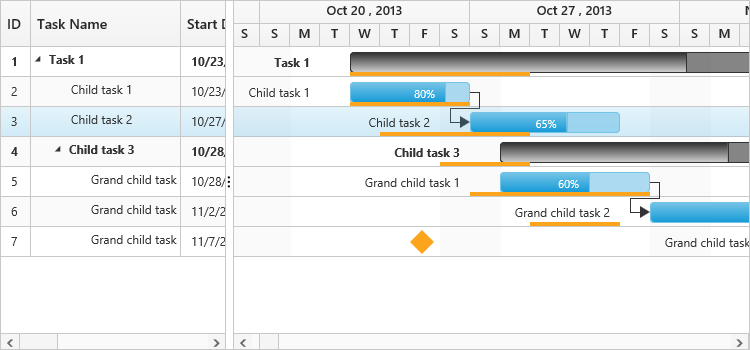

# Baseline

Baseline is used to describe the original plan of the task and it can be the same as current duration of the task or different. The following code example shows you how to enable baseline in Gantt control.



<ej-gantt id="GanttControl"  baselineStartDateMapping="baselineStartDate" 
    baselineEndDateMapping="baselineEndDate" [renderBaseline]="true">
</ej-gantt>



[Click](http://ng2jq.syncfusion.com/#/gantt/baseline;theme=bootstrap) here to view the online demo sample for baselines in Gantt.

The following screenshot shows the baseline in Gantt control.

