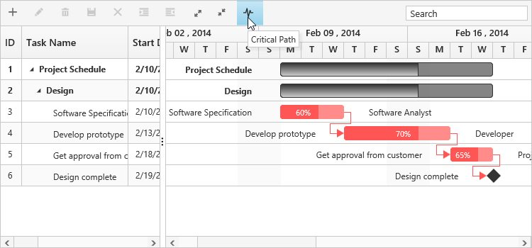
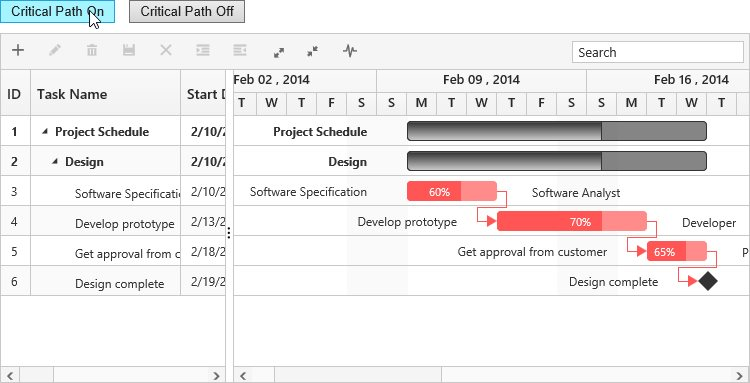
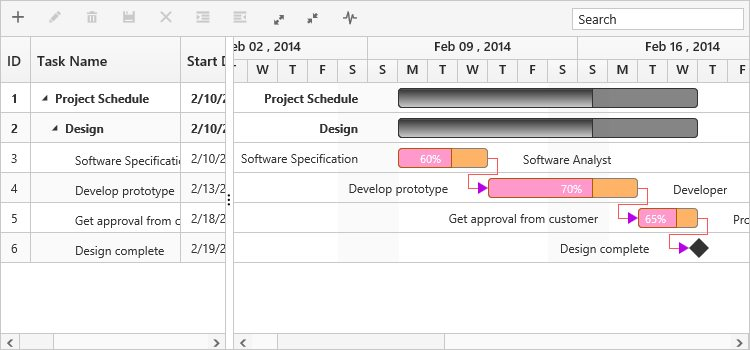

# Critical Path

The critical path in a project is indicated by a single task or a series of tasks in a project, critical path describes the calculated start date or end date of a project. If a task in a critical path is delayed, then the entire project will be delayed.

The critical path can be enabled in Gantt by using built-in toolbar button or **showCriticalPath** method.

## Using Toolbar Icon

You can enable/disable the critical path in Gantt by using toolbar button, and this button can be enabled in the Gantt toolbar by using the following code example.



<ej-gantt id="GanttControl" [toolbarSettings]="toolbarSettings">
</ej-gantt>





import {Component} from '@angular/core';

@Component({
    selector: 'ej-app',
    templateUrl: 'app/app.component.html',
})
export class AppComponent {
    public toolbarSettings: any;
    constructor() {
        this.toolbarSettings = {
            showToolbar: true,
            toolbarItems: [
                //..
                "criticalPath",
            ],
        },
    }
}



[Click](http://js.syncfusion.com/demos/web/#!/bootstrap/gantt/schedulingconcepts/criticalpath) here to view the online demo sample for critical path in Gantt.

## Using Method

You can enable the critical path by using **showCriticalPath****()** method with parameter as **true**. And critical path can be disabled using the same method with parameter as **false**.


 
<button id="buttonon" (click)="show($event, item)">Critical Path On</button>
<button id="buttonoff" (click)="hide($event, item)">Critical Path Off</button>
<ej-gantt>
//...
</ej-gantt>





import {Component} from '@angular/core';

@Component({
    selector: 'ej-app',
    templateUrl: 'app/app.component.html',
})
export class AppComponent {
    public toolbarSettings: any;
    constructor() {
        //...
    }
    public show(event, item) {
        var obj = $("#GanttControl").ejGantt("instance");
        obj.showCriticalPath(true);
    }
    public hide(event, item) {
        var obj = $("#GanttControl").ejGantt("instance");
        obj.showCriticalPath(false);
    }
}



## Customizing critical path background

You can customize the critical task background by setting custom color codes to the critical task elements’ class names,

Taskbar–.e-ganttchart .e-criticaltaskbar 

Progressbar–.e-ganttchart .e-criticalprogressbar     

Connector line–.e-ganttchart .e-criticalconnectorline       

Connector line left arrow– .e-ganttchart .e-criticalconnectorlineleftarrow  

Connector line right arrow–  .e-ganttchart .e-criticalconnectorlinerightarrow 

write the following code in app.component.css file

 

    .e-ganttchart .e-criticaltaskbar {
                background-color : #ffb366!important;
                border-color : gray!important
    }
    .e-ganttchart .e-criticalprogressbar {
                background-color : #ff99cc!important;
                border-color : #b35900!important
    }
    .e-ganttchart .e-criticalconnectorline {
                background-color : #b800e6!important;
    }
    .e-ganttchart .e-criticalconnectorlineleftarrow {
                border-right-color : #b800e6!important;
    }
    .e-ganttchart .e-criticalconnectorlinerightarrow{
                border-left-color : #b800e6!important;
    }





import {Component} from '@angular/core';

@Component({
    selector: 'ej-app',
    templateUrl: 'app/app.component.html',
    styleUrls: ['app/app.component.css']
})
export class AppComponent {
    public toolbarSettings: any;
    constructor() {
        //...
    }
}



