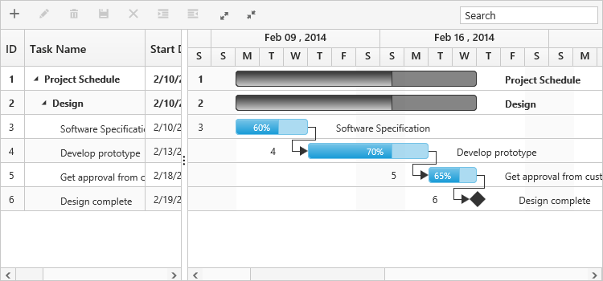
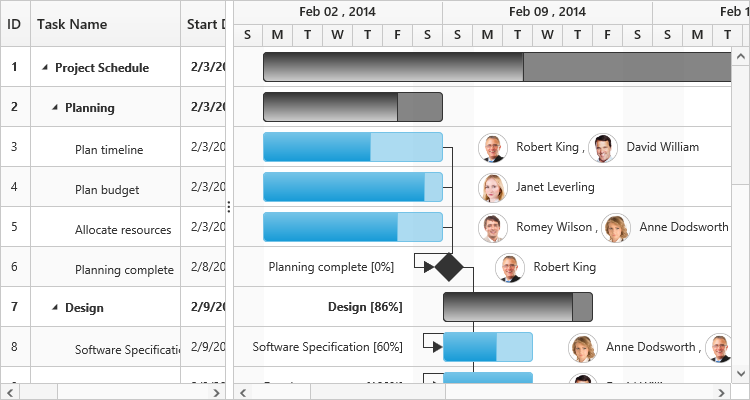
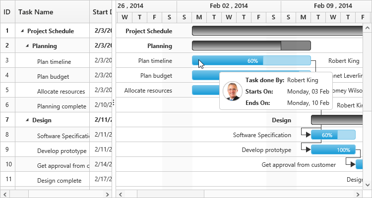
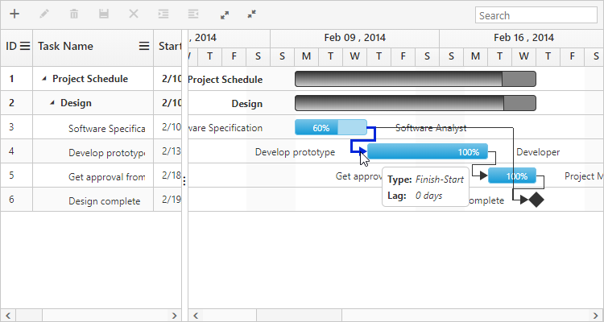
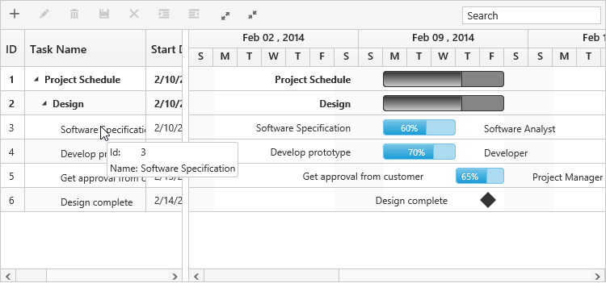
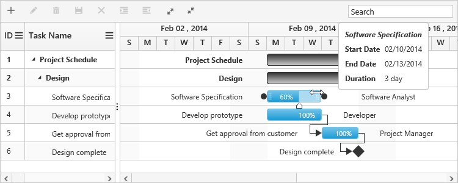
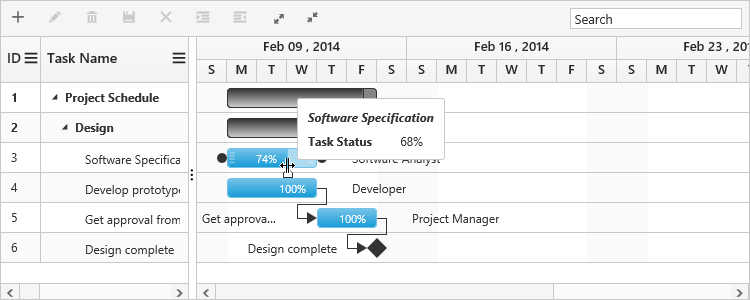

# Customizations 

Gantt provides support for the following UI customizations,

* Taskbar template
* Task label template
* Tooltip template

## Taskbar template

You can design your own taskbars to view the tasks in Gantt by using [`taskbarTemplate`](/api/angular/ejgantt#members:taskbartemplate "taskbarTemplate") property. And it is possible to map the JsRender script or script element’s ID to this property. It is also possible to customize the parent taskbars and milestones with custom templates by using [`parentTaskbarTemplate`](/api/angular/ejgantt#members:parenttaskbartemplate "parentTaskbarTemplate") and [`milestoneTemplate`](/api/angular/ejgantt#members:milestonetemplate "milestoneTemplate") properties. 

The following code example shows how to define template for taskbars in Gantt.
Write the following JsRender code in index.html file.







<ej-gantt
    taskbarTemplate= "#taskbarTemplate"
    parentTaskbarTemplate= "#parentTaskbarTemplate"
    milestoneTemplate= "#milestoneTemplate">
</ej-gantt>



The DOM structure and class names mentioned in the above code snippet is mandatory for providing the editing support in custom templates.

[Click](http://js.syncfusion.com/demos/web/#!/bootstrap/gantt/customizations/taskbartemplate) here to view the online demo sample for Taskbar templates in Gantt.

The following screenshot shows the template for taskbars in Gantt.

## Task label template

By default, task name will be displayed to the left and resource names will be displayed to the right of the taskbars as task labels. We can enable/disable this default task labels by using [`showTaskNames`](/api/angular/ejgantt#members:showtasknames) and [`showResourceNames`](/api/angular/ejgantt#members:showresourcenames) properties. But these task labels are customizable.

### Mapping data source fields as task labels

It is also possible to set any data source fields as task labels using [`rightTaskLabelMapping`](/api/angular/ejgantt#members:righttasklabelmapping "rightTaskLabelMapping") and [`leftTaskLabelMapping`](/api/angular/ejgantt#members:lefttasklabelmapping "leftTaskLabelMapping") properties.

The following code example explains how to set task name field as right label and task ID field as left label,



<ej-gantt
    rightTaskLabelMapping= "taskName"
    leftTaskLabelMapping= "taskID">
</ej-gantt>



The following screenshot shows Gantt with task labels mapped with different data source fields

### Task label templates

It is possible to customize the task labels with templates, by using [`rightTaskLabelTemplate`](/api/angular/ejgantt#members:righttasklabeltemplate "rightTaskLabelTemplate") and [`leftTaskLabelTemplate`](/api/angular/ejgantt#members:lefttasklabeltemplate "leftTaskLabelTemplate") properties.

The following code example explains how to map custom templates to task labels and place this in index.html file.







<ej-gantt
    rightTaskLabelTemplate= "#rightLabelTemplate"
    leftTaskLabelTemplate= "#leftLabelTemplate">
</ej-gantt>



You can find the online demo sample for task label templates in Gantt [here](http://js.syncfusion.com/demos/web/#!/bootstrap/gantt/customizations/tasklabeltemplate)

The following screenshot shows Gantt with task label templates.

## Tooltip template

### Taskbar tooltip

The default tooltip in Gantt can be customized by using the [`taskbarTooltipTemplateId`](/api/angular/ejgantt#members:taskbartooltiptemplateid "taskbarTooltipTemplateId") property. We need to map the JsRender script element’s ID value to this property.

The following code example shows how to customize the tooltip.







<ej-gantt
    //...
    taskbarTooltipTemplateId= "tooltipTemplate">
</ej-gantt>



The following screenshot shows Gantt with task tooltip customization.

N> JsRender template script should be defined in index.html file.

### Dependency tooltip

The default dependency tooltip in Gantt can be customized by using [`predecessorTooltipTemplate`](/api/angular/ejgantt#members:predecessortooltiptemplate "predecessorTooltipTemplate") property. We can map value to this property as  JsRender template script id with prefix of '#' or HTML elements in string format. The following code example shows how to use the [`predecessorTooltipTemplate`](/api/angular/ejgantt#members:predecessortooltiptemplate "predecessorTooltipTemplate") property.







<ej-gantt
    //...
    predecessorTooltipTemplate= "#ToolTipTemplate",>
</ej-gantt>



The following screenshot show the output of above code example.

You can find the JS playground sample for dependency tooltip template [here](http://jsplayground.syncfusion.com/Sync_f5fvhwfi).

N> JsRender template script should be defined in index.html file.

### Cell tooltip 

TreeGrid part tooltip can also be customized using [`cellTooltipTemplate`](/api/angular/ejgantt#members:celltooltiptemplate) property. We need to map the script element or element id to this property. The following code explains how to customize the cell tooltip in Gantt.







<ej-gantt
    //...
    [showGridCellTooltip]= "true"
    cellTooltipTemplate="#CustomToolTip"
    >
</ej-gantt>



You can find the online demo sample for tooltip templates for taskbars [here](http://js.syncfusion.com/demos/web/#!/bootstrap/gantt/customizations/tooltiptemplate)

N> JsRender template script should be defined in index.html file.

### Taskbar Editing Tooltip

Editing tooltip is used to show the updated start date, end date, duration and progress values of a task while resizing, dragging and progress bar resizing actions. Currently two editing tooltips are available in Gantt.

* Taskbar editing tooltip
* Progress bar editing tooltip

We can customize the default taskbar editing tooltip and progress bar editing tooltip in Gantt.

#### Customize taskbar editing tooltip

Taskbar editing tooltip can be customized by using [`taskbarEditingTooltipTemplate`](/api/angular/ejgantt#members:taskbareditingtooltiptemplate) and [`taskbarEditingTooltipTemplateId`](/api/angular/ejgantt#members:taskbareditingtooltiptemplateid) properties. The below code example shows how to customize the taskbar editing tooltip in Gantt.







<ej-gantt
    //...
    taskbarEditingTooltipTemplateId="taskbar_editing_tooltip_template"
    >
</ej-gantt>



The below screenshot shows the output of above code example.

You can find the JS playground sample for this property [here](http://jsplayground.syncfusion.com/Sync_khndhguw).

N> JsRender template script should be defined in index.html file.

#### Customize progress bar editing tooltip

Progress bar editing tooltip can be customized by using [`progressbarTooltipTemplate`](/api/angular/ejgantt#members:progressbartooltiptemplate) and [`progressbarTooltipTemplateId`](/api/angular/ejgantt#members:progressbartooltiptemplateid) properties. The below code example shows how to customize the progress bar editing tooltip in Gantt.







<ej-gantt
    //...
    progressbarTooltipTemplateId="progressbar_editing_tooltip_template"
    >
</ej-gantt>



The below screenshot shows the output of above code example.

You can find the JS playground sample for this property [here](http://jsplayground.syncfusion.com/Sync_aakdzajo).

N> JsRender template script should be defined in index.html file.
