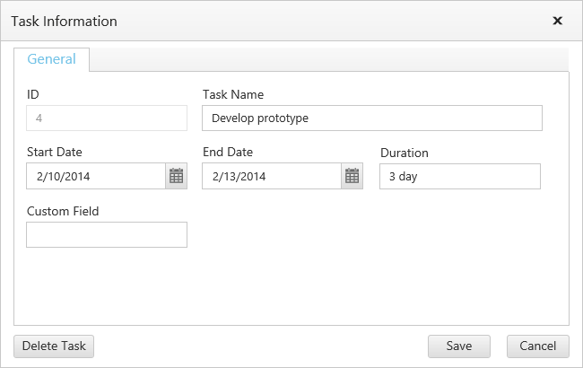
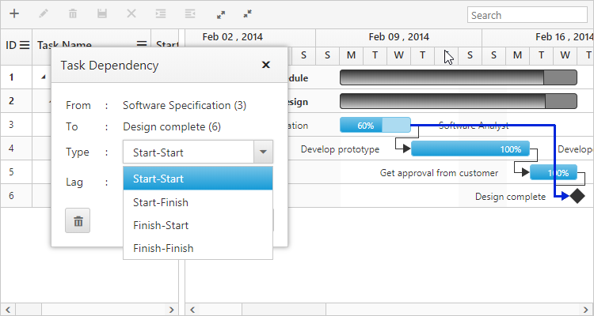
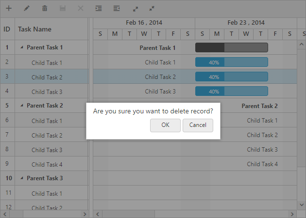
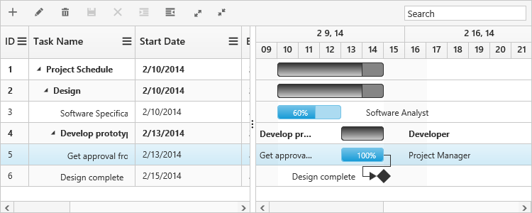

# Editing

The Gantt control provides in-built support to add, insert and update the tasks. The following are the types of editing available in Gantt.

* Cell Editing
* Normal Editing
* Taskbar Editing
* Dependency Editing

## Cell Editing

### Initialize cell edit mode

Update the task details through grid cell editing by setting [`editMode`](/api/angular/ejgantt#members:editsettings-editmode "editSettings.editMode") as `cellEditing`.

The following code example shows you how to enable the `cellEditing` in Gantt control.



<ej-gantt
    //...
    [editSettings]= "editSettings">
</ej-gantt>





import {Component} from '@angular/core';

@Component({
    selector: 'ej-app',
    templateUrl: 'app/app.component.html',
})
export class AppComponent {
    public editSettings: any;
    constructor() {
        this.editSettings = {
            allowEditing: true,
            editMode: "cellEditing"
        }
    }
}



The output of Gantt with cellEditing is as follows.

### Save editing cell

Currently editing cell value can be saved by clicking the save toolbar icon or clicking on any other cell element in the grid and also editing cell can be saved by using [`saveEdit`](/api/angular/ejgantt#methods:saveedit) method, using this method we can save the current editing cell dynamically on any action like external button click, please refer the following code example.



<ej-gantt id="GanttContainer"
    //...
    >
</ej-gantt>

saveEdit





import {Component} from '@angular/core';

@Component({
    selector: 'ej-app',
    templateUrl: 'app/app.component.html',
})
export class AppComponent {
    constructor() {

    }
    saveEdit(event) {
        $("#GanttContainer").ejGantt("instance").saveEdit();
    }
}



### Cancel editing cell

Currently editing cell value can be restored with old value by using cancel toolbar icon or by pressing <kbd>Esc</kbd> key. And also this can be done by using [`cancelEdit`](/api/angular/ejgantt#methods:canceledit) method on any other external actions like button click, please refer the following code example.



<ej-gantt id="GanttContainer"
    //...
    >
</ej-gantt>

cancelEdit





import {Component} from '@angular/core';

@Component({
    selector: 'ej-app',
    templateUrl: 'app/app.component.html',
})
export class AppComponent {
    constructor() {

    }
    cancelEdit(event) {
        $("#GanttContainer").ejGantt("instance").cancelEdit();
    }
}



### Prevent Cell Editing

In cell editing action [`beginEdit`](/api/angular/ejgantt#events:beginedit) and [`endEdit`](/api/angular/ejgantt#events:endedit) events are triggered before and after the editing action.
Cell editing for particular column or specific cell can be prevented by using [`beginEdit`](/api/angular/ejgantt#events:beginedit) event, please refer following code example for this.



<ej-gantt
    //...
    [editSettings]= "editSettings" (beginEdit)="beginEdit($event)">
</ej-gantt>





import {Component} from '@angular/core';

@Component({
    selector: 'ej-app',
    templateUrl: 'app/app.component.html',
})
export class AppComponent {
    public editSettings: any;
    constructor() {
        this.editSettings = {
            allowEditing: true,
            editMode: "normal"
        }
    }
    beginEdit(event){
        if (event.columnIndex == 1)
            event.cancel = true;
    }
}



## Normal Editing

### Initialize Normal edit mode

Update the task details through edit dialog by setting [`editMode`](/api/angular/ejgantt#members:editsettings-editmode "editSettings.editMode") as `normal`.

The following code example shows you how to enable normal editing in Gantt control.



<ej-gantt
    //...
    [editSettings]= "editSettings">
</ej-gantt>





import {Component} from '@angular/core';

@Component({
    selector: 'ej-app',
    templateUrl: 'app/app.component.html',
})
export class AppComponent {
    public editSettings: any;
    constructor() {
        this.editSettings = {
            allowEditing: true,
            editMode: "normal"
        }
    }
}



The following screenshot shows the output of `normal` editing.

### Define required fields in add/edit dialog

In Gantt we can define the editing fields available in add and edit dialogs by using [`addDialogFields`](/api/angular/ejgantt#members:adddialogfields) and [`editDialogFields`](/api/angular/ejgantt#members:editdialogfields) properties. Each editing fields are defined with [`field`](/api/angular/ejgantt#members:editdialogfields-field "editDialogFields.field") and [`editType`](/api/angular/ejgantt#members:editdialogfields-edittype "editDialogFields.editType") properties. The following code example shows how to define [`editDialogFields`](/api/angular/ejgantt#members:editdialogfields) property.



<ej-gantt
    //...
    [editSettings]= "editSettings"
    [editDialogFields]= "editDialogFields">
</ej-gantt>





import {Component} from '@angular/core';

@Component({
    selector: 'ej-app',
    templateUrl: 'app/app.component.html',
})
export class AppComponent {
    public editSettings: any;
    public editDialogFields: any;
    constructor() {
        this.editSettings = {
            allowEditing: true,
            editMode: "normal"
        };
        this.editDialogFields = [
            { field: "taskID", editType: "stringedit" },
            { field: "taskName", editType: "stringedit" },
            { field: "startDate", editType: "datepicker" },
            { field: "endDate", editType: "datepicker" },
            { field: "duration", editType: "stringedit" }
        ];
    }
}



The following screenshot show the output of above code example.

N> Similarly we can define the required fields in add dialog with [`field`](/api/angular/ejgantt#members:adddialogfields-field "addDialogFields.field") and [`editType`](/api/angular/ejgantt#members:adddialogfields-edittype "addDialogFields.editType") properties.

### Add custom column fields in General tab

By default custom column fields are included in add/edit dialog's custom field tab but we can display this column field in General tab by setting [`displayInGeneralTab`](/api/angular/ejgantt#members:editdialogfields-displayingeneraltab "editDialogFields.displayInGeneralTab") property as `true` in [`addDialogFields`](/api/angular/ejgantt#members:adddialogfields) and [`editDialogFields`](/api/angular/ejgantt#members:editdialogfields) properties. The following code example shows how to add custom column field in General tab of edit dialog.



<ej-gantt
    //...
    [editSettings]= "editSettings"
    [editDialogFields]= "editDialogFields"
    (load)="load($event)">
</ej-gantt>





import {Component} from '@angular/core';

@Component({
    selector: 'ej-app',
    templateUrl: 'app/app.component.html',
})
export class AppComponent {
    public editSettings: any;
    public editDialogFields: any;
    constructor() {
        this.editSettings = {
            allowEditing: true,
            editMode: "normal"
        };
        this.editDialogFields = [
            { field: "taskID", editType: "stringedit" },
            { field: "taskName", editType: "stringedit" },
            { field: "startDate", editType: "datepicker" },
            { field: "endDate", editType: "datepicker" },
            { field: "duration", editType: "stringedit" },
            { field: "customField", editType: "stringedit", displayInGeneralTab: true }
        ];
    }
    load(event) {
        var column = { field: "customField", mappingName: "customField", headerText: "Custom Field" };
        event.model.columns.push(column);
    }
}



The following screenshot show the output of above code example.

N> Similarly we can include custom fields in add dialog's General tab by setting [`displayInGeneralTab`](/api/angular/ejgantt#members:adddialogfields-displayingeneraltab "addDialogFields.displayInGeneralTab") as `true` in [`addDialogFields`](/api/angular/ejgantt#members:adddialogfields) collection.

N> Default columns predecessors, resources and notes are displayed in separate tabs, we can't include this in General tab of add/edit dialog.

### Open add/edit dialog dynamically

Gantt add and edit dialogs can be opened dynamically by using [`openAddDialog`](/api/angular/ejgantt#methods:openadddialog) and [`openEditDialog`](/api/angular/ejgantt#methods:openeditdialog) methods. The following code example shows how to open add and dialog on separate button click actions.



<ej-gantt id="GanttContainer"
    //...
    [editSettings]= "editSettings">
</ej-gantt>
<button id="openAddDialog" (click)="openAddDialog($event)">openAddDialog</button>
<button id="openEditDialog" (click)="openEditDialog($event)">openEditDialog</button>





import {Component} from '@angular/core';

@Component({
    selector: 'ej-app',
    templateUrl: 'app/app.component.html',
})
export class AppComponent {
    public editSettings: any;
    constructor() {
        this.editSettings = {
            allowEditing: true,
            editMode: "normal"
        }
    }
    openAddDialog(event)
        $("#GanttContainer").ejGantt("instance").openAddDialog();
    }

    openEditDialog(event){
        $("#GanttContainer").ejGantt("instance").openEditDialog();
    }
}



N> We should select any one of the row in Gantt to open the edit dialog.

## Taskbar Editing

Update the task details by interactions such as resizing and dragging the taskbar. Taskbar editing can be enabled by setting [`allowGanttChartEditing`](/api/angular/ejgantt#members:allowganttchartediting) as `true`. The following code example shows you how to enable taskbar resizing in Gantt control.



<ej-gantt id="GanttContainer"
    //...
    [allowGanttChartEditing]= "true">
</ej-gantt>



You can also enable or disable the progress bar resizing by using the [`enableProgressbarResizing`](/api/angular/ejgantt#members:enableprogressbarresizing). The following code example shows how to disable this property.



<ej-gantt id="GanttContainer"
    //...
    [enableProgressBarResizing]= "true">
</ej-gantt>



### Prevent taskbar editing for particular task

On taskbar edit action [`taskbarEditing`](/api/angular/ejgantt#events:taskbarediting) and [`taskbarEdited`](/api/angular/ejgantt#events:taskbaredited) event will be triggered. We can prevent the taskbar from editing by using [`taskbarEditing`](/api/angular/ejgantt#events:taskbarediting) event and we can revert taskbar edit action by using [`taskbarEdited`](/api/angular/ejgantt#events:taskbaredited) event. The following code example shows how to achieve this.



<ej-gantt
    //...
    (taskbarEdited)="taskbarEdited($event)"
    (taskbarEditing)="taskbarEditing($event)"
    >
</ej-gantt>





import {Component} from '@angular/core';

@Component({
    selector: 'ej-app',
    templateUrl: 'app/app.component.html',
})
export class AppComponent {
    constructor() {
    }
    taskbarEdited(event) { // We can edit task id 5 task but changes reverted on mouse up action
        if (event.data.taskId == 5)
            event.cancel = true;
    }
    taskbarEditing(event) {
        if (event.rowData.taskId == 4) // We can't edit Task Id 4
            event.cancel = true;
    }
}



## Dependency Editing

In Gantt, we can add, edit, update the task dependencies by mouse interactions, edit dialog and public methods. The code example shows how to enable dependency editing in Gantt.



<ej-gantt
    //...
    [allowGanttChartEditing]="true"
    predecessorMapping="predecessor"
    >
</ej-gantt>



### Add Dependency

Task dependency can be added by mouse interactions by connecting connector points in predecessor and successor tasks. The following screen shot shows the add dependency action.

### Edit Dependency

Task dependency value can be edited by using edit dialog and [`updateDependency`](/api/angular/ejgantt#methods:updatedependency) method. Dependency edit dialog can be opened by double clicking on corresponding dependency line. Client side [`actionBegin`](/api/angular/ejgantt#events:actionbegin) event will be triggered twice with different `requestType` argument values while opening of dependency dialog. First time, event will be triggered with `requestType` argument values as `beforeDependencyEditDialogOpen`, in this event we can get the current editing dependency line information, next [`actionBegin`](/api/angular/ejgantt#events:actionbegin) will be triggered with `requestType` argument value as `afterDependencyEditDialogOpen`, in this event we can get the information about current editing dependency line and editing elements in edit dialog. Using this event we can customize the dependency edit dialog elements.



<ej-gantt
    //...
    (actionBegin)="actionBegin($event)"
    >
</ej-gantt>





import {Component} from '@angular/core';

@Component({
    selector: 'ej-app',
    templateUrl: 'app/app.component.html',
})
export class AppComponent {
    constructor() {
    }
    actionBegin(args) {
        if(args.requestType == "beforeDependencyEditDialogOpen") {

        }
        else if(args.requestType == "afterDependencyEditDialogOpen") {

        }
    }
}



The following screen shot shows the dependency edit dialog.

### Delete Dependency

Task dependency can be deleted by using edit dialog and [`deleteDependency`](/api/angular/ejgantt#methods:deletedependency) method. The following screen shot shows the dependency edit dialog with delete option.

[Click](http://ng2jq.syncfusion.com/#/gantt/editing;theme=bootstrap) here to view the online demo sample for editing in Gantt.

## Update Gantt record value dynamically

Gantt record's value can be dynamically updated by using [`updateRecordByTaskId`](/api/angular/ejgantt#methods:updaterecordbytaskid "updateRecordByTaskId(data)") or [`updateRecordByIndex`](/api/jangulars/ejgantt#methods:updaterecordbyindex "updateRecordByIndex(index, data)") method. [`updateRecordByTaskId`](/api/angular/ejgantt#methods:updaterecordbytaskid "updateRecordByTaskId(data)") method used to update the Gantt record by using it's task id value and [`updateRecordByIndex`](/api/angular/ejgantt#methods:updaterecordbyindex "updateRecordByIndex(index, data)") method was used to update Gantt record value by row index value. We can invoke this method on any external button click action, the following code example shows how to use this methods.



<ej-gantt id="GanttContainer"
    //...
    >
</ej-gantt>
<button id="updateRecordByTaskId" (click)="updateRecordByTaskId($event)">updateRecordByTaskId</button>
<button id="updateRecordByRowIndex" (click)="updateRecordByRowIndex($event)">updateRecordByRowIndex</button>





import {Component} from '@angular/core';

@Component({
    selector: 'ej-app',
    templateUrl: 'app/app.component.html',
})
export class AppComponent {
    constructor() {

    }
    updateRecordByTaskId(event) {
        var ganttObj = $("#GanttContainer").ejGantt("instance"),
            data = {
                taskID: 4,
                taskName: "Updated by task id",
                startDate: new Date("02/10/2014"),
                endDate: new Date("02/14/2014"),
                duration: 5,
                progress: "80",
                resourceId: [2]
            };
        ganttObj.updateRecordByTaskId(data);
    }

    updateRecordByRowIndex(event) {
        var ganttObj = $("#GanttContainer").ejGantt("instance"),
            data = {
                taskID: 5,
                taskName: "Updated by index value",
                startDate: new Date("02/10/2014"),
                endDate: new Date("02/14/2014"),
                duration: 3, progress: "100",
                predecessor: "4SS",
                resourceId: [2]
            };
        ganttObj.updateRecordByIndex(4, data);
    }
}



You can find the JS playground sample for this [here](http://jsplayground.syncfusion.com/Sync_w5suulh5).

## Delete confirmation message

Delete confirmation message is used to get the confirmation from the user before delete the record. This confirmation message can be enabled by setting [`showDeleteConfirmDialog`](/api/angular/ejgantt#members:editsettings-showdeleteconfirmdialog "editSettings.showDeleteConfirmDialog") property as `true`.

The following code snippet explains how to enable delete confirmation message in Gantt.



<ej-gantt
    //...
    [editSettings]= "editSettings">
</ej-gantt>





import {Component} from '@angular/core';

@Component({
    selector: 'ej-app',
    templateUrl: 'app/app.component.html',
})
export class AppComponent {
    public editSettings: any;
    constructor() {
        this.editSettings = {
            allowDeleting: true,
            showDeleteConfirmDialog: true
        }
    }
}



The above screen shot shows the appearance of delete confirmation message in Gantt.

## Task Indent

Task indent option in Gantt was enabled by setting [`allowIndent`](/api/angular/ejgantt#members:editsettings-allowindent "editSettings.allowIndent") as `true`. Tasks can be indented by clicking on indent toolbar item or by using [`indentItem`](/api/angular/ejgantt#methods:indentitem) method. We can invoke this method dynamically on any action like external button click. The below code example shows how to enable indent option in Gantt.



<ej-gantt
    //...
    [editSettings]= "editSettings"
    [toolbarSettings]= "toolbarSettings">
</ej-gantt>

<button id="indentTask" (click)="indentTask($event)">indentTask</button>





import {Component} from '@angular/core';

@Component({
    selector: 'ej-app',
    templateUrl: 'app/app.component.html',
})
export class AppComponent {
    public editSettings: any;
    public toolbarSettings: any;
    
    constructor() {
        this.editSettings = {
            allowIndent: true,
        };
        this.toolbarSettings = {
            showToolbar: true,
            toolbarItems : ["indent"]
        };
    }
    indentTask(event){
        var ganttObj = $("#GanttContainer").ejGantt("instance");
        if (ganttObj.selectedRowIndex() != -1)
            ganttObj.indentItem();
    }
}



The following screenshots shows the output of above code example.

Before Indent
{:.caption}

After Indent
{:.caption}

N> We should select any one of the row in Gantt to perform task indent action.

## Task Outdent

Task outdent option in Gantt was enabled by setting [`allowIndent`](/api/angular/ejgantt#members:editsettings-allowindent "editSettings.allowIndent") as `true`. Tasks can be outdent by clicking on outdent toolbar item or by using [`outdentItem`](/api/angular/ejgantt#methods:outdentitem) method. We can invoke this method dynamically on any action like external button click. The below code example shows how to enable outdent option in Gantt.



<ej-gantt
    //...
    [editSettings]= "editSettings"
    [toolbarSettings]= "toolbarSettings">
</ej-gantt>

<button id="outdentTask" (click)="outdentTask($event)">outdentTask</button>





import {Component} from '@angular/core';

@Component({
    selector: 'ej-app',
    templateUrl: 'app/app.component.html',
})
export class AppComponent {
    public editSettings: any;
    public toolbarSettings: any;
    
    constructor() {
        this.editSettings = {
            allowIndent: true,
        };
        this.toolbarSettings = {
            showToolbar: true,
            toolbarItems : ["outdent"]
        };
    }
    outdentTask(event){
        var ganttObj = $("#GanttContainer").ejGantt("instance");
        if (ganttObj.selectedRowIndex() != -1)
            ganttObj.outdentItem();
    }
}



The following screenshots shows the output of above code example.

Before Outdent
{:.caption}

After Outdent
{:.caption}

N> We should select any one of the row in Gantt to perform task outdent action.

## Task Delete

Task delete option in Gantt was enabled by setting [`allowDeleting`](/api/angular/ejgantt#members:editsettings-allowdeleting "editSettings.allowDeleting") as `true`. Tasks can be delete by clicking on delete toolbar item or by using [`deleteItem`](/api/angular/ejgantt#methods:deleteitem) method. We can invoke this method dynamically on any action like external button click. The below code example shows how to enable delete option in Gantt.



<ej-gantt
    //...
    [editSettings]= "editSettings"
    [toolbarSettings]= "toolbarSettings">
</ej-gantt>

<button id="deleteTask" (click)="deleteTask($event)">deleteTask</button>





import {Component} from '@angular/core';

@Component({
    selector: 'ej-app',
    templateUrl: 'app/app.component.html',
})
export class AppComponent {
    public editSettings: any;
    public toolbarSettings: any;
    
    constructor() {
        this.editSettings = {
            allowDeleting: true,
        };
        this.toolbarSettings = {
            showToolbar: true,
            toolbarItems : ["delete"]
        };
    }
    deleteTask(event){
        var ganttObj = $("#GanttContainer").ejGantt("instance");
        if (ganttObj.selectedRowIndex() != -1)
            ganttObj.deleteItem();
    }
}



The following screenshots shows the output of above code example.

Before Delete
{:.caption}

After Delete
{:.caption}

N> We should select any one of the row in Gantt to perform task delete action.

## Read-only Gantt

In Gantt, all editing options can be disabled by setting [`readOnly`](/api/angular/ejgantt#members:readonly) property as `true`. The following code example shows how to make Gantt control as read-only.



<ej-gantt
    //...
    [readOnly]= "true"
    >
</ej-gantt>


