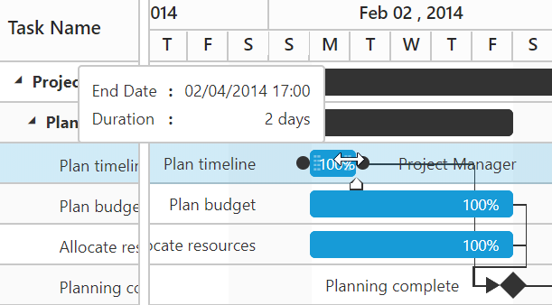

## Round-off start date, end date and duration value on taskbar editing
In Gantt start date, end date and duration values can be round-off as per current `scheduleHeaderSettings.scheduleHeaderType` value on taskbar resizing and dragging actions. This can be achieved by setting `roundOffDuration` argument value as `true` in `taskbarEditing` event.

The below code example explains how to achieve this requirement. 



<ej-gantt id="GanttControl" (taskbarEditing)="taskbarEditing($event)">
</ej-gantt>





import {Component} from '@angular/core';

@Component({
    selector: 'ej-app',
    templateUrl: 'app/app.component.html',
})
export class AppComponent {
    public taskbarEditing: any;
	constructor() {
		public taskbarEditing = function (args) {
		args.roundOffDuration= true;
		}
	}
}



Before resizing

{:.caption}

After resizing

{:.caption} 
