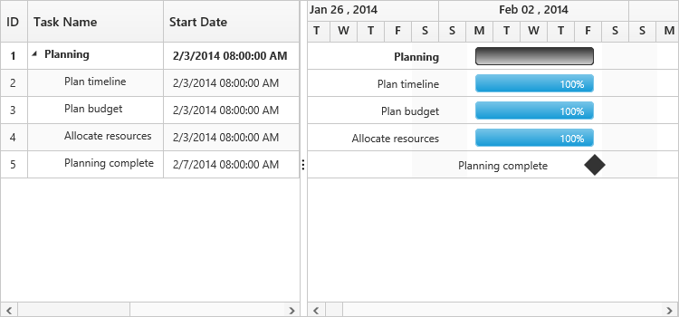

# Time Options

Start date and End date in the datasource defines the starting point and ending point of a task in the project. It can be of two data types,

* Date 
* Datetime

The datetime data type for start date and end date defines the exact starting point and ending point of a task along with time details of a day. There are two types of time scales available based on working hours,

* `TimeScale8Hours`  for 8 hour working scale
* `TimeScale24Hours` for 24 hour working scale

Use the following code example for setting different time scales of working hours.



<ej-gantt id="GanttControl" [workingTimeScale]="workingTimeScale"
    //...>
</ej-gantt>





import {Component} from '@angular/core';

@Component({
    selector: 'ej-app',
    templateUrl: 'app/app.component.html'
})
export class AppComponent {
    public workingTimeScale: any;
    constructor() {
        //...
        this.workingTimeScale = ej.Gantt.workingTimeScale.TimeScale24Hours
    }
}



Use the following code example for including time options in start date and end date of a task.



<ej-gantt id="GanttControl" [dataSource]="taskDetails"
      taskIdMapping= "taskID"
      taskNameMapping= "taskName"
      startDateMapping= "startDate"
      progressMapping= "progress"
      durationMapping= "duration"
      endDateMapping= "endDate"
      childMapping= "subtasks"
      [treeColumnIndex]= "treeColumnIndex"
      dateFormat= "M/d/yyyy hh:mm:ss tt"
      scheduleStartDate="new Date('02/01/2014 00:00:00 AM')"
      scheduleEndDate="new Date('03/14/2016 00:00:00 PM')" 
      [workingTimeScale]="workingTimeScale"
    //...>
</ej-gantt>





import {Component} from '@angular/core';

@Component({
    selector: 'ej-app',
    templateUrl: 'app/app.component.html'
})
export class AppComponent {
    public taskDetails: any;
    public treeColumnIndex;
    public workingTimeScale;
    constructor() {
        //...
        this.treeColumnIndex = 1;
        this.workingTimeScale = ej.Gantt.workingTimeScale.TimeScale24Hours;
        this.taskDetails = [{
            taskID: 1,
            taskName: "Planning",
            startDate: "02/03/2014 08:00:00 AM",
            endDate: "02/07/2014 05:00:00 PM",
            subtasks: [{
                    taskID: 2,
                    taskName: "Plan timeline",
                    startDate: "02/03/2014 08:00:00 AM",
                    endDate: "02/07/2014 05:00:00 PM",
                    duration: 5,
                    progress: "100"
                },
                {
                    taskID: 3,
                    taskName: "Plan budget",
                    startDate: "02/03/2014 08:00:00 AM",
                    endDate: "02/07/2014 05:00:00 PM",
                    duration: 5,
                    progress: "100"
                },
                {
                    taskID: 4,
                    taskName: "Allocate resources",
                    startDate: "02/03/2014 08:00:00 AM",
                    endDate: "02/07/2014 05:00:00 PM",
                    duration: 5,
                    progress: "100"
                },
                {
                    taskID: 5,
                    taskName: "Planning complete",
                    startDate: "02/07/2014 08:00:00 AM",
                    endDate: "02/07/2014 05:00:00 PM",
                    duration: 0,
                }

            ]
        }];
    }
}



Execute the above code to render the following output.

