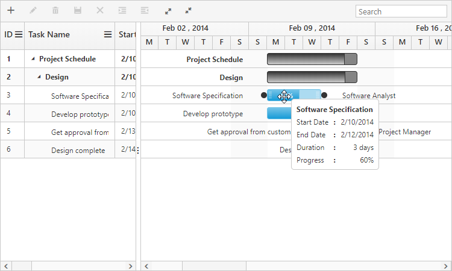

# Tooltip

The Gantt has support to display tooltip for both taskbars and for column cells.

## Taskbar and dependency line tooltip

In Gantt, you can enable or disable taskbar and dependency line mouse hover tooltip by using the [`enableTaskbarTooltip`](/api/angular/ejgantt#members:enabletaskbartooltip) property. The default value of this property was `true`. The following code example shows, how to enable the taskbar and dependency line tooltip in Gantt.



<ej-gantt id="GanttControl" [enableTaskbarTooltip]="true"
    predecessorMapping="predecessor"
    //...>
</ej-gantt>



Taskbar tooltip can be customized by using the [`taskbarTooltipTemplate`](/api/angular/ejgantt#members:taskbartooltiptemplate) property and  dependency line tooltip can be customized by using the [`predecessorTooltipTemplate`](/api/angular/ejgantt#members:predecessortooltiptemplate) property, these properties are described briefly in the [customization](/angular/gantt/customizations) section.

Taskbar Tooltip
{:.caption}

Dependency Tooltip
{:.caption}

## Taskbar drag tooltip

It is possible to enable or disable the tooltip while performing editing actions on taskbar (left resizing, right resizing, dragging and progress resizing) by using the [`enableTaskbarDragTooltip`](/api/angular/ejgantt#members:enabletaskbardragtooltip) property. By default, this property is set to `true`. The following code example explains this behavior.



<ej-gantt id="GanttControl" [enableTaskbarDragTooltip]="true"
    //...>
</ej-gantt>



## Cell tooltip

It is possible to enable or disable the TreeGrid cell tooltip in mouse hover by using the [`showGridCellTooltip`](/api/angular/ejgantt#members:showgridcelltooltip) property. By default, this property is set to `true`. The following code example explains how to enable disable this property.



<ej-gantt id="GanttControl" [showGridCellTooltip]="true"
    //...>
</ej-gantt>



This tooltip can be customized using the [`cellTooltipTemplate`](/api/angular/ejgantt#members:celltooltiptemplate) property, which is described briefly in the [customization](/angular/gantt/customizations) section.

## Tree column (Expander column) tooltip 

It is also possible to display tooltip only for expander column by setting the [`showGridExpandCellTooltip`](/api/angular/ejgantt#members:showgridexpandcelltooltip) property. The following code example shows you to enable expander column tooltip in Gantt.



<ej-gantt id="GanttControl" [showExpandGridCellTooltip]="true"
    //...>
</ej-gantt>



