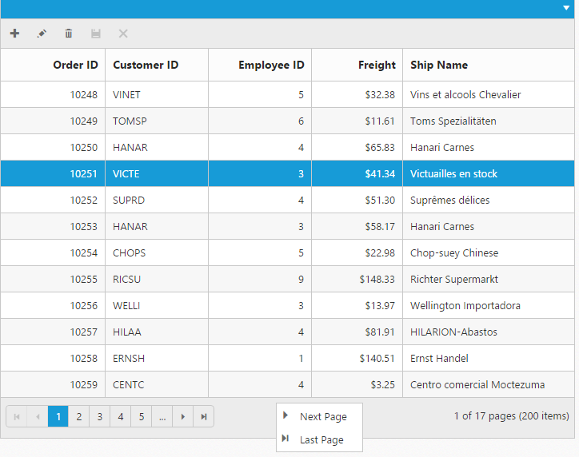

# Context Menu

Context menu is used to improve user action with Grid using popup menu. It can be shown by defining [`contextMenuSettings.enableContextMenu`](https://help.syncfusion.com/api/angular/ejgrid#members:contextmenusettings-enablecontextmenu "contextMenuSettings.enableContextMenu") as true. Context menu has option to add default items in [`contextMenuSettings.contextMenuItems`](https://help.syncfusion.com/api/angular/ejgrid#members:contextmenusettings-contextmenuitems "contextMenuSettings.contextMenuItems") and customized items in [`contextMenuSettings.customContextMenuItems`](https://help.syncfusion.com/api/angular/ejgrid#members:contextmenusettings-customcontextmenuitems "contextMenuSettings.customContextMenuItems").

## Default Context Menu items

Please find the below table for default context menu items and its actions.

 <table>
        <tr>
            <th>
                Section
            </th>
            <th>
                Context menu items
            </th>
            <th>
                Action
            </th>
        </tr>
        <tr>
            <td rowspan="4">
                Header
            </td>
            <td>
                Sort in Ascending Order
            </td>
            <td>
                Sort column in Ascending order
            </td>
        </tr>
        <tr>
            <td>
                Sort in Descending Order
            </td>
            <td>
                Sort column in Descending order
            </td>
        </tr>
        <tr>
            <td>
                Group
            </td>
            <td>
                Group the current column
            </td>
        </tr>
        <tr>
            <td>
                Ungroup
            </td>
            <td>
                Ungroup the current column if already grouped
            </td>
        </tr>
        <tr>
            <td rowspan="5">
                Body
            </td>
            <td>
                Add Record
            </td>
            <td>
                Start Add new record
            </td>
        </tr>
        <tr>
            <td>
                Edit Record
            </td>
            <td>
                Start Edit in current record
            </td>
        </tr>
        <tr>
            <td>
                Delete Record
            </td>
            <td>
                Delete the current record
            </td>
        </tr>
        <tr>
            <td>
                Save
            </td>
            <td>
                Save the record if Add/Edit record is started
            </td>
        </tr>
        <tr>
            <td>
                Cancel
            </td>
            <td>
                Cancel Added/Edited state
            </td>
        </tr>
        <tr>
            <td rowspan="4">
                Pager
            </td>
            <td>
                Next Page
            </td>
            <td>
                Go to Next Page
            </td>
        </tr>
        <tr>            
            <td>
                Last Page
            </td>
            <td>
                Go to Last page
            </td>
        </tr>
        <tr>
            <td>
                Previous page
            </td>
            <td>
                Go to previous page
            </td>
        </tr>
        <tr>
            <td>
                First page
            </td>
            <td>
                Go to first page
            </td>
        </tr>
    </table>



<ej-grid  id="Grid"  [allowPaging]="true"  [dataSource]="gridData" [allowSorting]="true" [allowGrouping]="true" [editSettings.allowAdding]='true'  [editSettings.allowEditing]='true' [editSettings.allowDeleting]='true' [toolbarSettings.showToolbar]="true" [toolbarSettings.toolbarItems]="tools"  [contextMenuSettings.enableContextMenu]="true" pageSettings.pageSize="5" >
    <e-columns>
        <e-column field="OrderID" [isPrimaryKey]="true"  width="85" textAlign="right" headerText="Order ID"></e-column>
        <e-column field="CustomerID" headerText="Customer ID" width="85" ></e-column>        
        <e-column field="EmployeeID" headerText="Employee ID"  width="85" textAlign="right"></e-column>
        <e-column field="Freight" headerText="Freight" format="{0:C}"  width="85" textAlign="right"></e-column>
        <e-column field="ShipName" width="85"  headerText="Ship Name"></e-column>     
        
    </e-columns>
</ej-grid>





import { Component } from '@angular/core';

@Component({
    selector: 'ej-app',
    templateUrl: 'src/grid/grid.component.html',
})
export class GridComponent {
    public gridData: any;
    public tools;

    constructor() {

        this.tools = ["add", "edit", "delete", "cancel", "update"];
        //The datasource "window.gridData" is referred from 'http://js.syncfusion.com/demos/web/scripts/jsondata.min.js'
        this.gridData = (window as any).gridData;

    }
}



{:catption}

Contextmenu at header

{:catption}

Contextmenu at body

{:caption}

Contextmenu at pager

N> `allowGrouping`, `allowSorting` should be enabled to perform default context menu actions in Grid header. `allowEditing`, `allowDeleting` and `allowAdding` should be enabled to perform default actions in body.

## Custom Context Menu

Custom context menu is used to create your own menu item and its action. To add customized context menu items, you need to use [`contextMenuSettings.customContextMenuItems`](https://help.syncfusion.com/api/angular/ejgrid#members:contextmenusettings-customcontextmenuitems "contextMenuSettings.customContextMenuItems") property and to bind required actions for this, use [`contextClick`](https://help.syncfusion.com/api/angular/ejgrid#events:contextclick "contextClick") event.



<ej-grid id="Grid" #grid [allowPaging]="true"  [dataSource]="gridData"  [contextMenuSettings]="context" pageSettings.pageSize="5" (contextClick)="contextClick($event)" >
    <e-columns>
        <e-column field="OrderID"  headerText="Order ID" width="90" textAlign="right"></e-column>
        <e-column field="CustomerID" headerText="Customer ID" width="90"></e-column>        
        <e-column field="EmployeeID" headerText="Employee ID" width="90" textAlign="right"></e-column>
        <e-column field="Freight" headerText="Freight" format="{0:C}" width="80" textAlign="right"></e-column>
        <e-column field="ShipCountry" headerText="Ship Country" width="90"></e-column>      
        
    </e-columns>
</ej-grid>




import { Component } from '@angular/core';
import {EJComponents } from 'ej-angular2';

@Component({
    selector: 'ej-app',
    templateUrl: 'src/grid/grid.component.html',
})
export class GridComponent {
    public gridData: any;   
    public context: any;
    @ViewChild('grid') Grid: EJComponents<any, any>;
    constructor() {

        this.context = { enableContextMenu: true, contextMenuItems: [], customContextMenuItems: [{ id: 'clear', text: "Clear Selection" }] };       
        //The datasource "window.gridData" is referred from 'http://js.syncfusion.com/demos/web/scripts/jsondata.min.js'
        this.gridData = (window as any).gridData;

    }
    contextClick(e: any) {

        if (e.text == "Clear Selection")
            this.Grid.widget.clearSelection();
    }
}



## Sub Context Menu

Sub context menu is used to add customized sub menu to the custom context menu item. To add a sub context menu, you need to use [`contextMenuSettings.subContextMenu`](https://help.syncfusion.com/api/angular/ejgrid#members:contextmenusettings-subcontextmenu "contextMenuSettings.subContextMenu") property and to bind required actions for this, use [`contextClick`](https://help.syncfusion.com/api/angular/ejgrid#events:contextclick "contextClick") event.



<ej-grid id="Grid" #grid [allowPaging]="true"  [dataSource]="gridData"  [contextMenuSettings]="context" pageSettings.pageSize="5" (contextClick)="contextClick($event)" >
    <e-columns>
        <e-column field="OrderID"  headerText="Order ID" width="90" textAlign="right"></e-column>
        <e-column field="CustomerID" headerText="Customer ID" width="90"></e-column>        
        <e-column field="EmployeeID" headerText="Employee ID" width="90" textAlign="right"></e-column>
        <e-column field="Freight" headerText="Freight" format="{0:C}" width="80" textAlign="right"></e-column>
        <e-column field="ShipCountry" headerText="Ship Country" width="90"></e-column>      
        
    </e-columns>
</ej-grid>




import { Component} from '@angular/core';
import {EJComponents } from 'ej-angular2';

@Component({
    selector: 'ej-app',
    templateUrl: 'src/grid/grid.component.html',
})
export class GridComponent {
    public gridData: any;    
    public context: any;
    @ViewChild('grid') Grid: EJComponents<any, any>;
    constructor() {

        this.context = { enableContextMenu: true, contextMenuItems: [], customContextMenuItems: [{ id: 'clear', text: "Clear Selection" }, { id: 'hide', text: "Hide column" }], subContextMenu: [{ contextMenuItem: "hide", subMenu: ["OrderID", "CustomerID", "EmployeeID"] }] };        
        //The datasource "window.gridData" is referred from 'http://js.syncfusion.com/demos/web/scripts/jsondata.min.js'
        this.gridData = (window as any).gridData;

    }
    contextClick(e: any) {

        if (e.text == "Clear Selection")
            this.Grid.widget.clearSelection();
        else if (e.text != "Hide Column")
            this.Grid.widget.hideColumns(e.text);
    }
}



## Sub Context Menu with Template

On rendering the Sub context menu items, the customized sub menu items created by using [`contextMenuSettings.subContextMenu.template`](https://help.syncfusion.com/api/angular/ejgrid#members:contextmenusettings-subcontextmenu "contextMenuSettings.subContextMenu.template") property.



<ej-grid id="Grid" #grid [allowPaging]="true"  [dataSource]="gridData"  [contextMenuSettings]="context" pageSettings.pageSize="5" (contextClick)="contextClick($event)" >
   <e-columns>
        <e-column field="OrderID"  headerText="Order ID" width="90" textAlign="right"></e-column>
        <e-column field="CustomerID" headerText="Customer ID" width="90"></e-column>        
        <e-column field="EmployeeID" headerText="Employee ID" width="90" textAlign="right"></e-column>
        <e-column field="Freight" headerText="Freight" format="{0:C}" width="80" textAlign="right"></e-column>
        <e-column field="ShipCountry" headerText="Ship Country" width="90"></e-column>      
        
    </e-columns>
</ej-grid>




import { Component} from '@angular/core';
import {EJComponents } from 'ej-angular2';

@Component({
    selector: 'ej-app',
    templateUrl: 'src/grid/grid.component.html',
})
export class GridComponent {
    public gridData: any;    
    public context: any;
    @ViewChild('grid') Grid: EJComponents<any, any>;
    constructor() {

        this.context = { enableContextMenu: true, contextMenuItems: [], customContextMenuItems: [{ id: 'clear', text: "Clear Selection" }, { id: 'hide', text: "Hide column" }], subContextMenu: [{ contextMenuItem: "hide", template: "#template" }] };        
        //The datasource "window.gridData" is referred from 'http://js.syncfusion.com/demos/web/scripts/jsondata.min.js'
        this.gridData = (window as any).gridData;

    }
    contextClick(e: any) {

        if (e.text == "Clear Selection")
            this.Grid.widget.clearSelection();
        else if (e.text != "Hide Column")
            this.Grid.widget.hideColumns(e.text);
    }
}



Place the js-render template in the "index.html" page.


 



