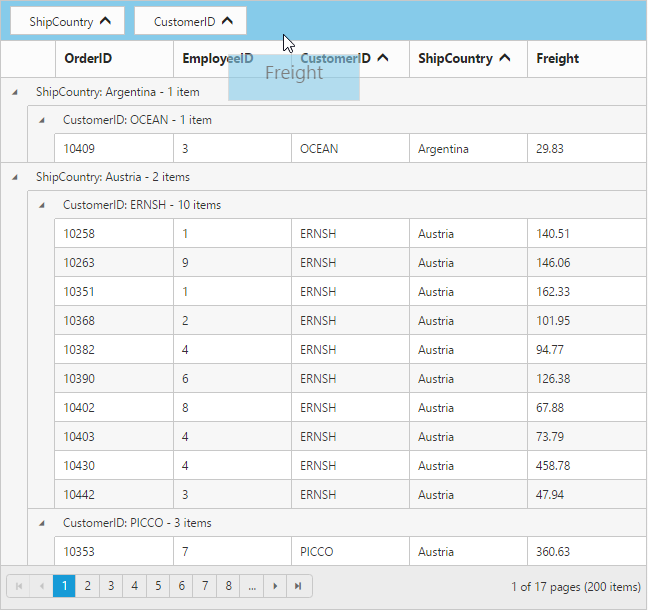

---
layout: post
title: Grouping with Grid widget for Syncfusion Essential Angular-2
description: How to enable grouping and its functionalities
platform: Angular
control: Grid
documentation: ug
api: /api/Angular/grid
--- 
# Grouping

The Grid control has options to group the records based on the required column. When grouping is applied, grouped records are organized into a hierarchical structure to facilitate easier expand and collapse of records. To enable grouping, set [`allowGrouping`](https://help.syncfusion.com/api/angular/ejgrid#members:allowgrouping "allowGrouping") property as `true`.

Columns can be grouped by simply dragging the column header and drop on the group drop area or simply click the group button which is displayed in the column. By default, sorting is done while grouping the column.

The following code example describes the above behavior.



<ej-grid id="Grid" [dataSource]="gridData" [allowPaging]="true" [allowGrouping]="true" > 
    <e-columns>
        <e-column field="OrderID" headerText="OrderID" width="75"></e-column>
        <e-column field="EmployeeID" headerText="EmployeeID"  width="80"></e-column>
        <e-column field="CustomerID" headerText="CustomerID" width="80"></e-column>
        <e-column field="ShipCountry" headerText="ShipCountry" width="90"></e-column>
        <e-column field="Freight" headerText="Freight" width="90" ></e-column>
    </e-columns>
 </ej-grid>
 




import {Component, ViewEncapsulation} from '@angular/core';
    @Component({
      selector: 'ej-app',
      templateUrl: 'app/app.component.html',  //give the path file for Grid control html file.
    })
    export class AppComponent {
        public gridData;
        constructor()
        {
           //The datasource "window.gridData" is referred from 'http://js.syncfusion.com/demos/web/scripts/jsondata.min.js'
           this.gridData = window.gridData;
		}
     }
	 


The following output is displayed as a result of the above code example.

## Initial Grouping

While initializing the grid itself, there is an option to group the column and display it in a hierarchical structure. To enable initial grouping, set array of column's [`field`](https://help.syncfusion.com/api/angular/ejgrid#members:columns-field "field") name to be grouped to [`groupSettings.groupedColumns`](https://help.syncfusion.com/api/angular/ejgrid#members:groupsettings-groupedcolumns "groupSettings.groupedColumns") property. Define the [`field`](https://help.syncfusion.com/api/angular/ejgrid#members:columns-field "field") name in the array format.

The following code example describes the above behavior.



<ej-grid id="Grid" [dataSource]="gridData" [allowPaging]="true" [allowGrouping]="true" [groupSettings]="groupSettings" > 
    <e-columns>
        <e-column field="OrderID" headerText="OrderID" width="75"></e-column>
        <e-column field="EmployeeID" headerText="EmployeeID"  width="80"></e-column>
        <e-column field="CustomerID" headerText="CustomerID" width="80"></e-column>
        <e-column field="ShipCountry" headerText="ShipCountry" width="90"></e-column>
        <e-column field="Freight" headerText="Freight" width="90" ></e-column>
    </e-columns>
 </ej-grid>





import {Component, ViewEncapsulation} from '@angular/core';
    @Component({
      selector: 'ej-app',
      templateUrl: 'app/app.component.html',  //give the path file for Grid control html file.
    })
    export class AppComponent {
        public gridData;
		public groupSettings;
        constructor()
        {
           //The datasource "window.gridData" is referred from 'http://js.syncfusion.com/demos/web/scripts/jsondata.min.js'
           this.gridData = window.gridData;
		   this.groupSettings = { groupedColumns: ["ShipCountry"] };
		}
     }



The following output is displayed as a result of the above code example.

## Multi-Column Grouping

Group multiple columns by simply drag and drop the columns one by one from column header into group drop area.

The following code example describes the above behavior.



<ej-grid id="Grid" [dataSource]="gridData" [allowPaging]="true" [allowGrouping]="true" [groupSettings]="groupSettings" > 
    <e-columns>
        <e-column field="OrderID" headerText="OrderID" width="75"></e-column>
        <e-column field="EmployeeID" headerText="EmployeeID"  width="80"></e-column>
        <e-column field="CustomerID" headerText="CustomerID" width="80"></e-column>
        <e-column field="ShipCountry" headerText="ShipCountry" width="90"></e-column>
        <e-column field="Freight" headerText="Freight" width="90" ></e-column>
    </e-columns>
 </ej-grid>





import {Component, ViewEncapsulation} from '@angular/core';
    @Component({
      selector: 'ej-app',
      templateUrl: 'app/app.component.html',  //give the path file for Grid control html file.
    })
    export class AppComponent {
        public gridData;
		public groupSettings;
        constructor()
        {
           //The datasource "window.gridData" is referred from 'http://js.syncfusion.com/demos/web/scripts/jsondata.min.js'
           this.gridData = window.gridData;
		   this.groupSettings = { groupedColumns: ["ShipCountry","CustomerID"] };
		}
     }



The following output is displayed as a result of the above code example.

## Group buttons

To do grouping easily without doing drag and drop column header by setting [`showToggleButton`](https://help.syncfusion.com/api/angular/ejgrid#members:groupsettings-showtogglebutton "showToggleButton") property of [`groupSettings`](https://help.syncfusion.com/api/angular/ejgrid#members:groupsettings "groupSettings") as `true`.

The following code example describes the above behavior.



<ej-grid id="Grid" [dataSource]="gridData" [allowPaging]="true" [allowGrouping]="true" [groupSettings]="groupSettings" > 
    <e-columns>
        <e-column field="OrderID" headerText="OrderID" width="75"></e-column>
        <e-column field="EmployeeID" headerText="EmployeeID"  width="80"></e-column>
        <e-column field="CustomerID" headerText="CustomerID" width="80"></e-column>
        <e-column field="ShipCountry" headerText="ShipCountry" width="90"></e-column>
        <e-column field="Freight" headerText="Freight" width="90" ></e-column>
    </e-columns>
 </ej-grid>





import {Component, ViewEncapsulation} from '@angular/core';
    @Component({
      selector: 'ej-app',
      templateUrl: 'app/app.component.html',  //give the path file for Grid control html file.
    })
    export class AppComponent {
        public gridData;
		public groupSettings;
        constructor()
        {
           //The datasource "window.gridData" is referred from 'http://js.syncfusion.com/demos/web/scripts/jsondata.min.js'
           this.gridData = window.gridData;
		   this.groupSettings = { showToggleButton: true };
		}
     }



The following output is displayed as a result of the above code example.

## Hide Ungroup button

Hide ungroup button from grouped columns which is in the group drop area by setting the [`showUngroupButton`](https://help.syncfusion.com/api/angular/ejgrid#members:groupsettings-showungroupbutton "showUngroupButton") property of [`groupSettings`](https://help.syncfusion.com/api/angular/ejgrid#members:groupsettings "groupSettings") as `false`.

The following code example describes the above behavior.



<ej-grid id="Grid" [dataSource]="gridData" [allowPaging]="true" [allowGrouping]="true" [groupSettings]="groupSettings" > 
    <e-columns>
        <e-column field="OrderID" headerText="OrderID" width="75"></e-column>
        <e-column field="EmployeeID" headerText="EmployeeID"  width="80"></e-column>
        <e-column field="CustomerID" headerText="CustomerID" width="80"></e-column>
        <e-column field="ShipCountry" headerText="ShipCountry" width="90"></e-column>
        <e-column field="Freight" headerText="Freight" width="90" ></e-column>
    </e-columns>
 </ej-grid>





import {Component, ViewEncapsulation} from '@angular/core';
    @Component({
      selector: 'ej-app',
      templateUrl: 'app/app.component.html',  //give the path file for Grid control html file.
    })
    export class AppComponent {
        public gridData;
		public groupSettings;
        constructor()
        {
           //The datasource "window.gridData" is referred from 'http://js.syncfusion.com/demos/web/scripts/jsondata.min.js'
           this.gridData = window.gridData;
		   this.groupSettings = { showUngroupButton: false };
		}
     }



The following output is displayed as a result of the above code example.

## Hide Grouped Column

While grouping a particular column, there is an option to hide the grouped columns from grid. To enable hide grouped column option, set [`showGroupedColumn`](https://help.syncfusion.com/api/angular/ejgrid#members:groupsettings-showgroupedcolumn "showGroupedColumn") property of [`groupSettings`](https://help.syncfusion.com/api/angular/ejgrid#members:groupsettings "groupSettings") as `false`.

The following code example describes the above behavior.



<ej-grid id="Grid" [dataSource]="gridData" [allowPaging]="true" [allowGrouping]="true" [groupSettings]="groupSettings" > 
    <e-columns>
        <e-column field="OrderID" headerText="OrderID" width="75"></e-column>
        <e-column field="EmployeeID" headerText="EmployeeID"  width="80"></e-column>
        <e-column field="CustomerID" headerText="CustomerID" width="80"></e-column>
        <e-column field="ShipCountry" headerText="ShipCountry" width="90"></e-column>
        <e-column field="Freight" headerText="Freight" width="90" ></e-column>
    </e-columns>
 </ej-grid>





import {Component, ViewEncapsulation} from '@angular/core';
    @Component({
      selector: 'ej-app',
      templateUrl: 'app/app.component.html',  //give the path file for Grid control html file.
    })
    export class AppComponent {
        public gridData;
		public groupSettings;
        constructor()
        {
           //The datasource "window.gridData" is referred from 'http://js.syncfusion.com/demos/web/scripts/jsondata.min.js'
           this.gridData = window.gridData;
		   this.groupSettings = { showGroupedColumn: false };
		}
     }



The following output is displayed as a result of the above code example.

## AutoSize Drop Area

Drag any column header and move it to the group drop area, then its portion expands smoothly. Stop this animation by setting [`enableDropAreaAutoSizing`](https://help.syncfusion.com/api/angular/ejgrid#members:groupsettings-enabledropareaautosizing "enableDropAreaAutoSizing") property of [`groupSettings`](https://help.syncfusion.com/api/angular/ejgrid#members:groupsettings "groupSettings") as `false`.

The following code example describes the above behavior.



<ej-grid id="Grid" [dataSource]="gridData" [allowPaging]="true" [allowGrouping]="true" [groupSettings]="groupSettings" > 
    <e-columns>
        <e-column field="OrderID" headerText="OrderID" width="75"></e-column>
        <e-column field="EmployeeID" headerText="EmployeeID"  width="80"></e-column>
        <e-column field="CustomerID" headerText="CustomerID" width="80"></e-column>
        <e-column field="ShipCountry" headerText="ShipCountry" width="90"></e-column>
        <e-column field="Freight" headerText="Freight" width="90" ></e-column>
    </e-columns>
 </ej-grid>





import {Component, ViewEncapsulation} from '@angular/core';
    @Component({
      selector: 'ej-app',
      templateUrl: 'app/app.component.html',  //give the path file for Grid control html file.
    })
    export class AppComponent {
        public gridData;
		public groupSettings;
        constructor()
        {
           //The datasource "window.gridData" is referred from 'http://js.syncfusion.com/demos/web/scripts/jsondata.min.js'
           this.gridData = window.gridData;
		   this.groupSettings = { enableDropAreaAutoSizing: false };
		}
     }



The following output is displayed as a result of the above code example.

## Hide Drop area

To avoid ungrouping or further grouping of a column after an initial column grouping by setting [`showDropArea`](https://help.syncfusion.com/api/angular/ejgrid#members:groupsettings-showdroparea "showDropArea") property of [`groupSettings`](https://help.syncfusion.com/api/angular/ejgrid#members:groupsettings "groupSettings") as `false`.

The following code example describes the above behavior.



<ej-grid id="Grid" [dataSource]="gridData" [allowPaging]="true" [allowGrouping]="true" [groupSettings]="groupSettings" > 
    <e-columns>
        <e-column field="OrderID" headerText="OrderID" width="75"></e-column>
        <e-column field="EmployeeID" headerText="EmployeeID"  width="80"></e-column>
        <e-column field="CustomerID" headerText="CustomerID" width="80"></e-column>
        <e-column field="ShipCountry" headerText="ShipCountry" width="90"></e-column>
        <e-column field="Freight" headerText="Freight" width="90" ></e-column>
    </e-columns>
 </ej-grid>





import {Component, ViewEncapsulation} from '@angular/core';
    @Component({
      selector: 'ej-app',
      templateUrl: 'app/app.component.html',  //give the path file for Grid control html file.
    })
    export class AppComponent {
        public gridData;
		public groupSettings;
        constructor()
        {
           //The datasource "window.gridData" is referred from 'http://js.syncfusion.com/demos/web/scripts/jsondata.min.js'
           this.gridData = window.gridData;
		   this.groupSettings = { showDropArea: false, groupedColumns: ["ShipCountry"] };
		}
     }



The following output is displayed as a result of the above code example.

## Group Caption Format / Group Caption Template

Using [`captionFormat`](https://help.syncfusion.com/api/angular/ejgrid#members:groupsettings-captionformat "captionFormat") property of [`groupSettings`](https://help.syncfusion.com/api/angular/ejgrid#members:groupsettings "groupSettings") you can render any type of template using ngtemplate with e-groupcaption-template attribute to customize the group caption text. 

The following code example describes the above behavior.



<ej-grid  [allowPaging]="true" [groupSettings]="group" [allowGrouping]="true" [allowSorting]="true" [dataSource]="gridData" >
    <e-columns>
        <e-column field="OrderID"></e-column>
        <e-column field="EmployeeID"></e-column>
        <e-column field="ShipCity"></e-column>
        <e-column field="ShipCountry"></e-column>
        <e-column field="Freight"></e-column>
    </e-columns>

    <ng-template #caption  e-groupcaption-template let-data>
        {{data.field}}: {{data.key}}
        <button id="btn{{data.field}}{{data.key}}" class="btn" (click)="buttonclick($event)">Collapse</button>
    </ng-template>
</ej-grid>





import {Component, ViewEncapsulation} from '@angular/core';
 @Component({
    selector: 'ej-app',
    templateUrl: 'app/app.component.html',  //give the path file for Grid control html file.
  })
  export class AppComponent {
    public gridData: any;
    public group;
    constructor()
    {
        //The datasource "window.gridData" is referred from 'http://js.syncfusion.com/demos/web/scripts/jsondata.min.js'
        this.gridData = (window as any).gridData;
        this.group = { captionFormat: "#caption" };
    }
    buttonclick(e:any) {
         var gridObj = $(".e-grid").ejGrid("instance");
         gridObj.expandCollapse($(e.target).parents("td").prev());
         $(e.target).text() == "Collapse" ?  $(e.target).text("Expand") : $(e.target).text("Collapse");
     }
}



The following output is displayed as a result of the above code example.

## Handling grouped records count in server-side    

When binding remote data to grid with on-demand data loading, only current page data knowledge is available to grid and so grouped records count would be shown based on current Page only. 

This can be rectified when binding data to grid using `UrlAdaptor` of DataManager. The grouped column values should be passed into the `groupDs` property of return object from server-side along with datasource and count.

The following code example describes the above behavior.


 


<ej-grid  [allowPaging]="true" [allowGrouping]="true" [allowSorting]="true" [groupSettings]="groupSettings" [dataSource]="gridData" >
    <e-columns>
       <e-column field="OrderID" headerText="Order ID" textAlign="right"></e-column>
       <e-column field="CustomerID" headerText="Customer ID" textAlign="right"></e-column>
       <e-column field="EmployeeID" headerText="Employee ID" textAlign="right"></e-column>
       <e-column field="Freight" headerText="OrderID" format="{0:C}" textAlign="right"></e-column>
       <e-column field="OrderDate" headerText="Order Date" format="{0:dd/MM/yyyy}" textAlign="right"></e-column>
    </e-columns>
</ej-grid>





import {Component, ViewEncapsulation} from '@angular/core';
 @Component({
    selector: 'ej-app',
    templateUrl: 'app/app.component.html',  //give the path file for Grid control html file.
  })
  export class AppComponent {
    public gridData: any;
    public groupSettings: any;
    constructor()
    {
        this.gridData = ej.DataManager({
                   url:"/Grid/UrlDataSource",
			             adaptor: new ej.UrlAdaptor()
              });
              this.groupSettings = { groupedColumns: ["EmployeeID"] };
    }
}





    namespace MVCSampleBrowser.Controllers
        {
            public class GridController : Controller
              { 
                public ActionResult GridFeatures()
                 {
                   var DataSource = new NorthwindDataContext().OrdersViews.ToList();
                   ViewBag.DataSource = DataSource;
                   return View();
                 }
                public ActionResult UrlDataSource(DataManager value)
                 {
                    IEnumerable DataSource = new NorthwindDataContext().OrdersViews.ToList();
                    int count = DataSource.AsQueryable().Count();
                    IEnumerable GroupDs = new List<object>(); ;
                    DataOperations operations = new DataOperations();
                    List<string> str = new List<string>();
                    if (value.Group != null)
                        GroupDs = operations.PerformSelect(DataSource, value.Group); //Pass grouped column records
                    if (value.Sorted != null)
                        DataSource = operations.PerformSorting(DataSource, value.Sorted);
                    DataSource = operations.PerformSkip(DataSource, value.Skip);
                    DataSource = DataSource.AsQueryable().Take(value.Take);
                    return Json(new {result = DataSource, count = count, groupDs = GroupDs }, JsonRequestBehavior.AllowGet);
                 }  
             }     
        } 
   
  

The following output is displayed as a result of the above code example.

